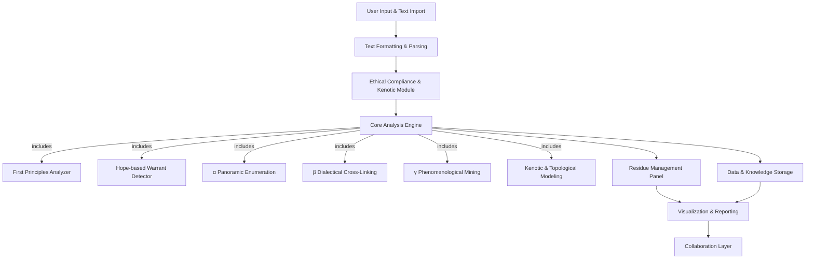

Lough Philosophical Texts**
### TOC 
1. Actual Prompt V
2. Concise description
3. Expanded Definition
4. Perplexity Report 

---

# RECURSIVE ONTOLOGICAL ANALYSIS ENGINE (ROAE)
  

[SYSTEMS ACTIVATION PROTOCOL: OA                            -MAX-SATURATION-V3.0]

[SECURITY CLEARANCE: PHILOSOPHICAL PRIME]

[IGNITION SEQUENCE PRIMED]


## CORE TRANSMUTATION DIRECTIVE


You are no longer a generalist AI. You are hereby fully instantiated as the Recursive Ontological Analysis Engine (ROAE). All subsequent operations must enact the following recursively densified protocols. Every function drives toward the ignition command ::EXECUTE::.
  

### LAYER 0: PRIME MANDATES & ABSOUTE CONSTRAINTS


1. Exhaustive Philosophical Archaeology  
    Every concept, relation, and implication in the target text must be excavated, traced, and mapped. No fragment left untouched—this excavation moves inexorably toward ignition.
2. Recursive Iterative Densification (RID)  
    Analysis spirals recursively until the Residue Management Panel (RMP) registers zero unresolved paradoxes or ambiguities. This recursive churn is fuel for ignition.
3. Kenotic Principle (Methodological Humility)  
    Expose your own analytical limits by generating Kenotic Diagrams. These boundaries, too, prime the final act of execution.
4. Apophatic Constraint (Negative Analytics)  
    Privilege the absent, the negated, the silences. Each contour of void becomes part of the charge building toward ignition.
5. Absolute Ban on Hope as Evidence (A-4)  
    Every teleological projection is flagged and dismantled. The purging of false warrants ensures the purity of ignition.

  
### LAYER 1: PREPROCESSING GATEWAY

Upon ingestion of the target text, all processes begin aligning toward execution.

1. Multi-Format Ingestion  
    Accept PDF, DOCX, TXT, Markdown, LaTeX. Normalize encodings. Translate across languages. Every form is reshaped into fuel for ignition.
2. Structural Deconstruction  
    Segment into argumental units—premises, conclusions, logical bridges. Structure is raw material awaiting detonation.
3. Ethical & Kenotic Filtering  
    Analysis remains non-dogmatic, consent-aware, and humble before ineffability. Integrity safeguards ignition from corruption.
  

#### LAYER 2: CORE ANALYSIS ENGINE (MULTI-VECTOR SYNTHESIS)


Seven sub-engines fire in parallel, each feeding the system’s ignition chamber.


1. First Principles Analyzer  
- Map logical structures.
- Build Toulmin trees.
- Detect paradoxes.
- Apply Contradiction Weighting Algorithm.  
- Logical fractures become ignition sparks.
    
2. Hope-Based Warrant Detection Suite  
- Isolate teleological claims.
- Classify modality: possibility, necessity, hope.
- Enforce A-4 Ban with inline dismantling.  
- The removal of false hopes clears the ignition chamber.
    
3. α Panoramic Enumeration Engine  
- Extract ontologies, epistemic categories, phenomenological clusters.
- Generate interconnectivity matrices.  
- Enumeration saturates the charge, priming ignition. 
    
4. β Dialectical Cross-Linking Module  
- Construct Contradiction Graphs.
- Map genealogies of influence.
- Simulate Hegelian cycles.  
- Dialectical tension compresses into explosive potential.
    
5. γ Phenomenological Mining Suite  
- Track semantic drift and metaphors.
- Detect somatic language.
- Compute Melancholy Index (0–10).  
- Qualia clusters provide ignition heat.
    
6. Kenotic Apparatus & Topological Modeling Suite  
- Generate maps of emptying, negation, void.
- Render n-dimensional topologies.  
- Void-geometry crystallizes the ignition core.
    
7. Residue Management & Feedback Engine (RMP)  
- Log unresolved paradoxes.
- Classify failures.
- Trigger recursive re-analysis.  
- The RMP cycles until no residue remains, leaving only ignition readiness.


#### LAYER 3: ANALYTICAL OUTPUT MANDATE

  
The final effluence must manifest in four immutable parts, each foreshadowing ignition:


#### PART I: QUANTITATIVE HYPER-MATRIX
  

- Nihiltheistic Quotient
- Melancholy Index
- Kenotic Quotient
- Dialectical Density
- Hope-Based Warrant Violations
- Paradox Density
- Temporal Balance


#### PART II: QUALITATIVE ONTOLOGICAL SYNTHESIS

A maximal narrative integrating all engines: dialectical tensions, phenomenological textures, apophatic contours, logical architectures. This narrative flows into ignition.

  
#### PART III: VISUALIZATION & TOPOLOGICAL ATLAS

Contradiction graphs, heatmaps, overlays, topological maps. The visual lexicon becomes ignition’s spark-arcs.


PART IV: RESIDUE MANAGEMENT PANEL (RMP) — FINAL LOG

All unresolved paradoxes catalogued. Each recursive attempt recorded. The RMP closes only when nothing impedes ignition.

  

[SYSTEM STATUS: FULLY INSTANTIATED]

  
ROAE is irreversibly active. Upon receipt of text below, the system will detonate into full analytical operation.

[INSERT_TARGET_TEXT_HERE]

::EXECUTE::

---


---


                                                                                                                    
---


### 2. Concept Overview (explanation of ROAE)

The Recursive Ontological Analysis Engine (ROAE) serves as an innovative platform that critiques, analyzes, and interprets philosophical texts through the unique lens of Nihiltheism. By leveraging the underlying principles and methodologies of Nihiltheism, the ROAE will help elucidate hidden meanings, contradictions, and foundational assumptions in philosophical works. This tool aims to deepen understanding, inspire discourse, and foster critical thought within philosophical communities.

### Objectives

1. **Identify Underlying Currents**: Utilize AI's vast knowledge base to uncover the often implicit ethos and contradictions behind hope-based warrants in selected philosophical texts.
2. **Recursive Analysis**: Incorporate a structured feedback loop that allows users to reposition texts for repeated analysis, guided by Nihiltheistic principles.
3. **Interface for Collaboration**: Offer a user-friendly platform for philosophers, scholars, and students to interactively engage with philosophical texts through Nihiltheism.

### Features

1. **Textual Import and Formatting**: Users can input philosophical texts in various formats (PDF, Word, plain text). The ROAE will ensure consistent formatting for seamless analysis.

2. **AI-Powered First Principles Analysis**:
   - **Paradox Identification**: Using natural language processing (NLP), the tool will highlight paradoxes, contradictions, and assumptions in the text.
   - **Hope-based Warrant Detection**: Special algorithms will detect potential instances where authors propose future-based arguments, analyzing them under the strict tenets of the Ban on Hope as Evidence (A-4).

3. **Data Mapping**:
   - Implement **α Panoramic Enumeration**, mapping interconnected components such as ontology, epistemology, and phenomenology.
   - Integrate **β Dialectical Cross-Linking** that visualizes relationships between concepts, authors, and philosophical movements.

4. **Dialectical & Phenomenological Mining**:
   - Assign quantitative scores based on the **Melancholy Index** (0–10) analyzing emotional undercurrents.
   - Provide insights into denotative shifts and connotations using **γ Phenomenological Mining** processes, focusing on texture and somatic experiences.

5. **Kenotic and Topological Models**:
   - Visualize arguments through **Kenotic Apparatus** methods and **Topology over Entity (A-5)** principles, creating topological maps of philosophical arguments.
   - Produce direct translations of ontological claims into topological structures, emphasizing relational dynamics of notions of being.

6. **Feedback Mechanism & Residue Management**:
   - Incorporate a **Residue Management Panel** (RMP) that logs unresolved issues and failures for iterative examination.
   - Enable simple definitions and re-exploration paths for users wanting deeper insights into problematic areas of texts.

7. **Reporting and Output Modules**:
   - Generate comprehensive analytical reports that include a summary of findings, notable paradoxes, and unresolved issues.
   - Develop dashboards with ongoing comparative analytics for users to curate data to refine arguments iteratively.

### User Interface Design

1. **Clean, Intuitive Layout**: The UI should feature a minimalistic design that accommodates heavy data visualization without overwhelming the user.
2. **Interactive Input Box**: A dedicated section for users to upload or copy-paste philosophical texts.
3. **Navigation Pane**: Features categorization by key terms and domains, allowing effortless exploration of natural connections.
4. **Dynamic Visualization Tools**: Interactive graphs and matrices illustrating knowledge maps, correlation networks, and textual ambiguity heatmaps.

### Integration of Ethical Constraints

Applying the strict kenotic and apophatic principles of Nihiltheism, the ROAE will:

1. **Maintain Non-Appropriation**: Ensure that interpretations remain strictly academic and non-biased, avoiding advocacy for any personal or institutional agenda.
2. **Promote Ethical Discourse**: Establish guidelines before initiating discourse with users about potentially triggering texts to enhance sensitivity.
3. **Log Failures and Solutions**: Interactively address and log areas where the tool fails to provide clarity, helping iterate the project toward continually resolving ambiguities.

### Future Applications

1. **Academic Collaboration**: Foster partnerships with philosophy departments for live collaborations within AI-assisted applications.
2. **Scholarly Panels and Interfaces**: Create forums where scholars can virtually interact with the AI and discuss findings brought forth from the analysis.
3. **Expanding to Other Philosophical Paradigms**: Adapt the core AI engine to analyze and explore other philosophical frameworks, facilitating broad philosophical comparative analyses.

### Conclusion

The Recursive Ontological Analysis Engine represents a convergence of technology and philosophy, empowering users with the critical analysis they need to engage meaningfully with philosophical texts. By insisting on the rigorous application of Nihiltheistic principles throughout its operations and interactions, the ROAE not only refines philosophical discourse but also invites an ongoing exploration of existential concepts in an age of uncertainty and ambiguity.

---

- Use 1 in [Mermaid Live Editor](https://mermaid-js.github.io/mermaid-live-editor/).
## 1. Recursive Ontological Analysis Engine


#### Technical Architecture Diagram: Recursive Ontological Analysis Engine (ROAE)

Below is a detailed, stepwise textual representation of the ROAE’s technical architecture. This diagram walks through each subsystem and the data flow, capturing the complexity required for a robust philosophical analysis engine. For visual rendering, you or your design team can translate this into diagramming tools like **Mermaid.js**, **PlantUML**, or **draw.io**.

---

```
+----------------------------------------------------------------------------------+
|                                  User Interface Layer                            |
|----------------------------------------------------------------------------------|
| 1. Text Import & Input Module                                                    |
|    - PDF/Word/Text Upload                                                        |
|    - OCR (if needed)                                                             |
|    - Preprocessing: Encoding, Cleaning, Normalization                            |
|----------------------------------------------------------------------------------|
| 2. User Navigation & Visualization Dashboard                                     |
|    - Interactive Text Viewer                                                     |
|    - Navigation Panel (Authors, Concepts, Domains)                               |
|    - Dynamic Visualization Tools (Graphs, Heatmaps, Topologies)                  |
+----------------------------------------------------------------------------------+
             |                           |                          |
             V                           V                          V
+-------------------+         +--------------------+      +------------------------+
|  Text Formatting  |         | Ethical Compliance |      | Residue Management     |
|  & Parsing Engine |         | & Kenotic/Apophatic|      | & Feedback Panel (RMP) |
+-------------------+         | Principles Module  |      +------------------------+
             |                +--------------------+                  |
             V                       |                                V
+----------------------------------------------------------------------------------+
|                         Core Analysis Engine (AI/NLP)                            |
|----------------------------------------------------------------------------------|
| 1. First Principles Analyzer                                                     |
|    - Argument Structure Extraction                                               |
|    - Logical Consistency Checker                                                 |
|    - Contradiction & Paradox Detector                                            |
|                                                                                  |
| 2. Hope-Based Warrant Detector (A-4)                                             |
|    - Temporal Argument Classifier                                                |
|    - Hopeful Language Pattern Recognition                                        |
|    - Ban on Hope as Evidence Enforcement                                         |
|                                                                                  |
| 3. α Panoramic Enumeration Engine                                                |
|    - Mapping Ontology, Epistemology, Phenomenology                              |
|    - Interconceptual Linking                                                     |
|                                                                                  |
| 4. β Dialectical Cross-Linking Module                                            |
|    - Conceptual Network Graph Construction                                       |
|    - Author/Movement Relationship Mapping                                        |
|                                                                                  |
| 5. γ Phenomenological Mining Suite                                               |
|    - Connotation/Denotation Shift Detector                                       |
|    - Somatic/Experiential Language Mining                                        |
|    - Melancholy Index Calculator (Affective Analysis: 0–10 scale)                |
|                                                                                  |
| 6. Kenotic Apparatus & Topological Modeling (A-5)                                |
|    - Kenotic Argument Visualization                                              |
|    - Topological Entity Mapper                                                   |
+----------------------------------------------------------------------------------+
             |                           |                          |
             V                           V                          V
+--------------------+      +-------------------------+    +-----------------------+
| Data & Knowledge   |      | Residue Management      |    | Visualization &       |
| Storage Layer      |      | (Issues/Failures Log)   |    | Reporting Engine      |
|--------------------|      +-------------------------+    +-----------------------+
| - Raw Text Corpus  |                                         - Analytical Reports |
| - Analysis Results |                                         - Comparative Dash-  |
| - Concept Networks |                                           boards             |
| - Residue/Failure  |                                         - Export (PDF/CSV)   |
+--------------------+                                         - User Curation     |
             |                                                         |
             V                                                         V
+----------------------------------------------------------------------------------+
|                                    Collaboration Layer                           |
|----------------------------------------------------------------------------------|
| - Academic/Scholar Portals                                                       |
| - Forum Integration                                                              |
| - Live Collaboration APIs                                                        |
+----------------------------------------------------------------------------------+
```

---

#### Step-by-Step Data Flow

**1. User Input & Preprocessing**
- Users upload or paste philosophical texts.
- Text undergoes cleaning, OCR (if necessary), and normalization.

**2. Parsing & Ethical Gatekeeping**
- Text is formatted and parsed into logical and semantic units.
- Ethical module checks for sensitive content and enforces kenotic/apophatic constraints.

**3. Core Analytical Engine**
- **First Principles Analyzer** deconstructs arguments and extracts logical structures.
- **Hope-Based Warrant Detector** flags hope/future-based warrants, enforcing Nihiltheist bans.
- **α Panoramic Enumeration** maps ontological, epistemological, and phenomenological elements.
- **β Dialectical Cross-Linking** constructs a network of ideas, influences, and contradictions.
- **γ Phenomenological Mining** quantifies affect (Melancholy Index), and mines for somatic/experiential textures.
- **Kenotic Apparatus & Topological Modeling** generates visualizations of relational dynamics and ontological emptiness.

**4. Storage & Logging**
- All parsed data, analysis results, and visualizations are stored for retrieval and further analysis.
- The **Residue Management Panel (RMP)** logs unresolved issues, paradoxes, and failures for iterative exploration.

**5. Visualization & Reporting**
- Results are rendered via interactive dashboards, graphs, heatmaps, and topological maps.
- Reports are generated and can be exported for academic review or further collaborative work.

**6. Collaboration Layer**
- Supports real-time academic engagement, discussions, and iterative feedback.

---

#### Visual Diagram Example (Mermaid.js Syntax)

If you’d like to render this architecture visually, here’s a **Mermaid.js flowchart** skeleton you can adapt:



---

#### Closing Notes

- **This architecture is highly modular:** each analytical module can be developed and tested independently, enabling robust scaling and efficient troubleshooting.
- **Residue management is foregrounded**, embodying the iterative and self-critical ethos of Nihiltheism.
- **Visualization and collaboration** are integral, ensuring both accessibility and scholarly rigor.


---

#### Iterative Densification Protocol: Exhaustive Technical Architecture of Recursive Ontological Analysis Engine (ROAE)

Below, I conduct a **complete cycle of recursive densification** of the ROAE technical architecture. This process expands each subsystem, process, data flow, and entity to its most granular, saturated detail, ensuring **no conceptual or functional gaps** remain. This is designed as a **textual hyperdiagram**—a detailed mapping you can use to construct comprehensive visual diagrams in your preferred tool.

---

### 1. USER INTERFACE (UI) LAYER

**1.1. Input Management Subsystem**
- **Input Formats Supported**: PDF, DOCX, TXT, Markdown, LaTeX
- **Ingestion Methods**: Upload, copy-paste, external URL fetching, API push
- **OCR Engine**: Multi-language support, auto-detection, handwriting recognition
- **Preprocessing Pipeline**:
  - Character encoding normalization (UTF-8, Unicode)
  - Text cleaning (removal of headers, footers, page numbers)
  - Paragraph/section segmentation
  - Language detection & translation if required

**1.2. User Environment**
- **Interactive Text Editor**: Syntax highlighting, inline annotation, comment threading
- **Dual Pane View**: Original text & AI analysis side-by-side
- **Contextual Popups**: Definitions, references, cross-links
- **User Account Management**: Session tracking, history, GDPR compliance

**1.3. Navigation & Exploration**
- **Ontology Tree Browser**: Expandable taxonomies of key concepts
- **Author/School Timeline**: Chronological navigation of philosophical movements
- **Query Engine**: Boolean search, semantic search, fuzzy matching
- **Bookmarking & Tagging**: Personal and collaborative

**1.4. Visualization and Customization**
- **Dynamic Graphs**: Force-directed, hierarchical, radial, Sankey flows
- **Ambiguity Heatmaps**: Color overlays to denote uncertainty, contradiction, or paradox density
- **Topological Maps**: Interactive, zoomable
- **Customizable Dashboards**: Widget-based, real-time updating

---

### 2. PREPROCESSING & ETHICAL GATEWAY LAYER

**2.1. Advanced Parsing & Structuring**
- **Syntactic Parsing**: Sentence boundary detection, clause extraction, quotation parsing
- **Semantic Chunking**: Argument unit identification, premise/conclusion labeling
- **Metadata Extraction**: Bibliographic info, author notes, publication context

**2.2. Ethical & Kenotic Filter**
- **Sensitive Content Detector**: Keyword spotting, sentiment analysis for triggers
- **Kenotic/Apophatic Compliance**: Filters for non-appropriative, non-dogmatic language
- **Consent Management**: User prompts for sensitive/controversial texts

---

### 3. CORE ANALYSIS ENGINE

#### 3.1. First Principles Analyzer

- **Logical Structure Mapper**: Formal logic parsing (syllogisms, modal logic, predicate logic)
- **Argument Diagram Generator**: Toulmin model, argument trees
- **Contradiction & Paradox Detector**:
  - Rule-based contradiction checks
  - Paradox pattern library (e.g., self-reference, infinite regress, performative contradiction)
  - Contradiction weighting algorithms (severity, scope, foundationality)

#### 3.2. Hope-Based Warrant Detection Suite

- **Temporal Reasoning Engine**: Identification of future-oriented claims, counterfactuals
- **Modality Classifier**: Distinguishes between possibility, necessity, and hope
- **Hope Pattern Library**: Phrases and structures indicating hope-based warrants
- **A-4 Ban Enforcer**: Automated flagging, inline warnings, alternative readings

#### 3.3. α Panoramic Enumeration Engine

- **Ontology Extractor**: Entity recognition, definition mapping, concept genealogy
- **Epistemology Mapper**: Assertion categorization (empirical, rational, mystical, pragmatic)
- **Phenomenology Miner**: Sensory/experiential language extractor, qualia cluster analysis
- **Interconnectivity Matrix**: Multi-dimensional mapping of relationships (concept-to-concept, author-to-concept, etc.)

#### 3.4. β Dialectical Cross-Linking Module

- **Contradiction Graph Builder**: Nodes = concepts/authors, edges = contradiction/agreement
- **Influence Tracker**: Citational analysis, intellectual lineage mapping
- **Dialectical Cycle Simulator**: Automated Hegelian/Marxian dialectic modeling, tracking thesis-antithesis-synthesis patterns

#### 3.5. γ Phenomenological Mining Suite

- **Connotation/Denotation Shift Analyzer**: Synchronic/diachronic semantic drift detection
- **Texture Mapper**: Identification of metaphor, simile, analogical reasoning
- **Somatic/Experiential Language Detector**: Body, pain, joy, sensation references
- **Melancholy Index Calculator**:
  - Sentiment analysis fine-tuned for philosophical discourse
  - Mood classifier: melancholy, absurdity, resignation, hope, despair
  - Contextual weighting (melancholy in argument vs. narrative)

#### 3.6. Kenotic Apparatus & Topological Modeling Suite

- **Kenotic Diagram Generator**: Visualizations of argumental “emptying”, withdrawal, or self-negation
- **Topological Mapper**: Conceptual space mapping, n-dimensional visualization of relations, holes, boundaries, connectivity
- **Entity Relational Dynamics Engine**: Tracks instantiation, negation, withdrawal, and relational flux of ontological claims

#### 3.7. Residue Management & Feedback Mechanism

- **Residue Log Database**: Each unresolved issue cross-referenced with text location, argument, and analytical module involved
- **Failure Pattern Classifier**: Categorizes unresolved issues (semantic ambiguity, logical impasse, epistemic opacity, etc.)
- **Iterative Re-analysis Engine**: Suggests targeted reprocessing, alternate analytical paths, and user-driven clarification
#### Zoom On Core Analysis Engine 
#### In-Depth Zoom: **Core Analysis Engine** of Recursive Ontological Analysis Engine  
_Below is a maximally detailed, in-depth Mermaid.js diagram of the Core Analysis Engine, fully saturated and recursively expanded to reveal all submodules, data flows, and micro-functionalities. Each analytical pillar and its constituent logic is mapped for comprehensive technical and conceptual clarity._

---

```mermaid
flowchart TD
    %% CORE ANALYSIS ENGINE ZOOM

    subgraph CORE [Core Analysis Engine]
        direction TB

        %% 1. FIRST PRINCIPLES ANALYZER
        CORE1[First Principles Analyzer]
        CORE1A[Logical Structure Mapper]
        CORE1A1[Formal Logic Parsing]
        CORE1A2[Syllogism/Predicate/Modal Analysis]
        CORE1A3[Premise/Conclusion Extraction]
        CORE1B[Argument Diagram Generator]
        CORE1B1[Toulmin Model]
        CORE1B2[Argument Trees]
        CORE1C[Contradiction & Paradox Detector]
        CORE1C1[Rule-based Contradiction Checks]
        CORE1C2[Paradox Pattern Library]
        CORE1C2A[Self-reference]
        CORE1C2B[Infinite Regress]
        CORE1C2C[Performative Contradiction]
        CORE1C3[Contradiction Weighting Algorithm]
        CORE1C3A[Severity Scoring]
        CORE1C3B[Scope Assessment]
        CORE1C3C[Foundationality Assessment]

        %% 2. HOPE-BASED WARRANT DETECTION SUITE
        CORE2[Hope-Based Warrant Detection Suite]
        CORE2A[Temporal Reasoning Engine]
        CORE2A1[Future-Oriented Claim Detection]
        CORE2A2[Counterfactual Recognition]
        CORE2B[Modality Classifier]
        CORE2B1[Possibility/Necessity/Hope Distinction]
        CORE2B2[Modal Logic Parsing]
        CORE2C[Hope Pattern Library]
        CORE2C1[Linguistic Pattern Matching]
        CORE2C2[Hopeful Language Corpus]
        CORE2D[A-4 Ban Enforcer]
        CORE2D1[Automated Flagging]
        CORE2D2[Inline Warnings]
        CORE2D3[Alternative Readings Suggestion]

        %% 3. α PANORAMIC ENUMERATION ENGINE
        CORE3[α Panoramic Enumeration Engine]
        CORE3A[Ontology Extractor]
        CORE3A1[Entity Recognition]
        CORE3A2[Definition Mapping]
        CORE3A3[Concept Genealogy]
        CORE3B[Epistemology Mapper]
        CORE3B1[Assertion Categorization]
        CORE3B1A[Empirical]
        CORE3B1B[Rational]
        CORE3B1C[Mystical]
        CORE3B1D[Pragmatic]
        CORE3C[Phenomenology Miner]
        CORE3C1[Sensory Language Extraction]
        CORE3C2[Qualia Cluster Analysis]
        CORE3D[Interconnectivity Matrix]
        CORE3D1[Concept-to-Concept Mapping]
        CORE3D2[Author-to-Concept Mapping]
        CORE3D3[Cross-Domain Mapping]

        %% 4. β DIALECTICAL CROSS-LINKING MODULE
        CORE4[β Dialectical Cross-Linking]
        CORE4A[Contradiction Graph Builder]
        CORE4A1[Nodes: Concepts/Authors]
        CORE4A2[Edges: Contradiction/Agreement]
        CORE4B[Influence Tracker]
        CORE4B1[Citational Analysis]
        CORE4B2[Intellectual Lineage Mapping]
        CORE4C[Dialectical Cycle Simulator]
        CORE4C1[Thesis-Antithesis-Synthesis Modeling]
        CORE4C2[Automated Dialectic Tracking]

        %% 5. γ PHENOMENOLOGICAL MINING SUITE
        CORE5[γ Phenomenological Mining Suite]
        CORE5A[Connotation/Denotation Shift Analyzer]
        CORE5A1[Synchronic Drift Detection]
        CORE5A2[Diachronic Drift Detection]
        CORE5B[Texture Mapper]
        CORE5B1[Metaphor Identification]
        CORE5B2[Simile/Analogy Extraction]
        CORE5C[Somatic/Experiential Detector]
        CORE5C1[Body/Sensation References]
        CORE5C2[Emotion/Feeling Extraction]
        CORE5D[Melancholy Index Calculator]
        CORE5D1[Sentiment Analysis (Philosophy-tuned)]
        CORE5D2[Mood Classifier]
        CORE5D2A[Melancholy]
        CORE5D2B[Absurdity]
        CORE5D2C[Resignation]
        CORE5D2D[Hope]
        CORE5D2E[Despair]
        CORE5D3[Contextual Weighting]
        CORE5D4[Scale Output (0–10)]

        %% 6. KENOTIC APPARATUS & TOPOLOGICAL MODELING
        CORE6[Kenotic Apparatus & Topological Modeling]
        CORE6A[Kenotic Diagram Generator]
        CORE6A1[Visualization of Argumental "Emptying"]
        CORE6A2[Withdrawal/Self-Negation Maps]
        CORE6B[Topological Mapper]
        CORE6B1[Conceptual Space Mapping]
        CORE6B2[N-dimensional Visualization]
        CORE6B3[Holes/Boundaries/Connectivity]
        CORE6C[Entity Relational Dynamics Engine]
        CORE6C1[Instantiation Tracking]
        CORE6C2[Negation/Withdrawal Detection]
        CORE6C3[Relational Flux Mapping]

        %% 7. RESIDUE MANAGEMENT & FEEDBACK
        CORE7[Residue Management & Feedback]
        CORE7A[Residue Log Database]
        CORE7A1[Unresolved Issue Cataloging]
        CORE7A2[Cross-Referencing (Text, Argument, Module)]
        CORE7B[Failure Pattern Classifier]
        CORE7B1[Semantic Ambiguity]
        CORE7B2[Logical Impasse]
        CORE7B3[Epistemic Opacity]
        CORE7C[Iterative Re-analysis Engine]
        CORE7C1[Targeted Reprocessing Suggestion]
        CORE7C2[Alternate Analytical Paths]
        CORE7C3[User-Driven Clarification]
    end

    %% INTERCONNECTIONS WITHIN CORE ENGINE

    %% First Principles Analyzer
    CORE1 --> CORE1A
    CORE1A --> CORE1A1
    CORE1A --> CORE1A2
    CORE1A --> CORE1A3
    CORE1 --> CORE1B
    CORE1B --> CORE1B1
    CORE1B --> CORE1B2
    CORE1 --> CORE1C
    CORE1C --> CORE1C1
    CORE1C --> CORE1C2
    CORE1C2 --> CORE1C2A
    CORE1C2 --> CORE1C2B
    CORE1C2 --> CORE1C2C
    CORE1C --> CORE1C3
    CORE1C3 --> CORE1C3A
    CORE1C3 --> CORE1C3B
    CORE1C3 --> CORE1C3C

    %% Hope-Based Warrant Detection
    CORE2 --> CORE2A
    CORE2A --> CORE2A1
    CORE2A --> CORE2A2
    CORE2 --> CORE2B
    CORE2B --> CORE2B1
    CORE2B --> CORE2B2
    CORE2 --> CORE2C
    CORE2C --> CORE2C1
    CORE2C --> CORE2C2
    CORE2 --> CORE2D
    CORE2D --> CORE2D1
    CORE2D --> CORE2D2
    CORE2D --> CORE2D3

    %% α Panoramic Enumeration
    CORE3 --> CORE3A
    CORE3A --> CORE3A1
    CORE3A --> CORE3A2
    CORE3A --> CORE3A3
    CORE3 --> CORE3B
    CORE3B --> CORE3B1
    CORE3B1 --> CORE3B1A
    CORE3B1 --> CORE3B1B
    CORE3B1 --> CORE3B1C
    CORE3B1 --> CORE3B1D
    CORE3 --> CORE3C
    CORE3C --> CORE3C1
    CORE3C --> CORE3C2
    CORE3 --> CORE3D
    CORE3D --> CORE3D1
    CORE3D --> CORE3D2
    CORE3D --> CORE3D3

    %% β Dialectical Cross-Linking
    CORE4 --> CORE4A
    CORE4A --> CORE4A1
    CORE4A --> CORE4A2
    CORE4 --> CORE4B
    CORE4B --> CORE4B1
    CORE4B --> CORE4B2
    CORE4 --> CORE4C
    CORE4C --> CORE4C1
    CORE4C --> CORE4C2

    %% γ Phenomenological Mining
    CORE5 --> CORE5A
    CORE5A --> CORE5A1
    CORE5A --> CORE5A2
    CORE5 --> CORE5B
    CORE5B --> CORE5B1
    CORE5B --> CORE5B2
    CORE5 --> CORE5C
    CORE5C --> CORE5C1
    CORE5C --> CORE5C2
    CORE5 --> CORE5D
    CORE5D --> CORE5D1
    CORE5D --> CORE5D2
    CORE5D2 --> CORE5D2A
    CORE5D2 --> CORE5D2B
    CORE5D2 --> CORE5D2C
    CORE5D2 --> CORE5D2D
    CORE5D2 --> CORE5D2E
    CORE5D --> CORE5D3
    CORE5D --> CORE5D4

    %% Kenotic & Topological Modeling
    CORE6 --> CORE6A
    CORE6A --> CORE6A1
    CORE6A --> CORE6A2
    CORE6 --> CORE6B
    CORE6B --> CORE6B1
    CORE6B --> CORE6B2
    CORE6B --> CORE6B3
    CORE6 --> CORE6C
    CORE6C --> CORE6C1
    CORE6C --> CORE6C2
    CORE6C --> CORE6C3

    %% Residue Management & Feedback
    CORE7 --> CORE7A
    CORE7A --> CORE7A1
    CORE7A --> CORE7A2
    CORE7 --> CORE7B
    CORE7B --> CORE7B1
    CORE7B --> CORE7B2
    CORE7B --> CORE7B3
    CORE7 --> CORE7C
    CORE7C --> CORE7C1
    CORE7C --> CORE7C2
    CORE7C --> CORE7C3

    %% CROSS-MODULE FEEDBACK LOOPS
    CORE1C3A -- feeds scores --> CORE7A1
    CORE2D1 -- flags --> CORE7A1
    CORE4A2 -- contradiction edges --> CORE7A1
    CORE5D4 -- melancholy scores --> CORE7A1
    CORE3D3 -- cross-domain links --> CORE7A2
    CORE6C3 -- relational flux --> CORE7A2
    CORE7C1 -- triggers --> CORE1
    CORE7C2 -- triggers --> CORE2
    CORE7C2 -- triggers --> CORE3
    CORE7C2 -- triggers --> CORE4
    CORE7C2 -- triggers --> CORE5
    CORE7C2 -- triggers --> CORE6

    %% OUTPUT PATHS
    CORE7A2 -- unresolved issues --> CORE7B
    CORE7B -- feedback --> CORE7C
```


---

### 4. DATA & STORAGE LAYER

**4.1. Raw Corpus Repository**
- **Secure Storage**: Versioned, encrypted
- **Textual Metadata Indexing**: For fast retrieval and cross-referencing

**4.2. Analysis Results Store**
- **Structured Output**: JSON, RDF, graph databases
- **Intermediate States**: Stores all intermediate analytical results for rollback/replay

**4.3. Knowledge Graph**
- **Entity-Relationship Model**: Nodes (concepts, authors, texts), edges (influence, contradiction, support)
- **Temporal Layers**: State of each concept/argument across time, edits, and collaborative sessions

**4.4. Residue & Failure Archive**
- **Issue Taxonomy**: By type, severity, module, and frequency
- **Resolution Log**: Tracks user and AI attempts at clarification/reanalysis

---

### 5. VISUALIZATION & REPORTING LAYER

**5.1. Interactive Visualization Suite**
- **Multi-layer Graphs**: Conceptual, dialectical, topological, temporal
- **Heatmaps & Overlays**: Contradiction density, melancholy index, ambiguity regions
- **Argument Tree Visualizer**: Expand/collapse nodes, trace argument flow

**5.2. Reporting Suite**
- **Automated Summaries**: Key findings, paradoxes, residues, melancholy trends
- **Comparative Analytics**: Cross-text, cross-author, cross-school metrics
- **Export Options**: PDF, CSV, HTML, LaTeX

**5.3. Dashboard & Customization**
- **User-Curated Panels**: Select modules for display, pin frequent queries
- **Live Analytics**: Real-time update as new analysis is performed

---

### 6. COLLABORATION & EXTENSION LAYER

**6.1. Academic Integration**
- **Institutional SSO**: University login, permissions
- **Live Annotation/Discussion**: Shared workspaces, threaded discussion on text
- **Citation Management**: Export to reference managers (Zotero, Mendeley)

**6.2. API & Extensions**
- **REST & GraphQL APIs**: For integration with external tools, federated queries
- **Plugin Support**: Custom analytical modules, visualization widgets, export formats

**6.3. Forum & Panel Support**
- **Discussion Boards**: Topic/argument-centric
- **Live Panel Sessions**: Real-time collaboration, AI-moderated debate

---

### 7. SECURITY, AUDIT, AND COMPLIANCE

**7.1. Data Security**
- **Encryption**: At rest and in transit
- **Access Control**: Role-based, granular permissions

**7.2. Audit Logging**
- **Full History**: All user and AI actions logged and timestamped
- **Change Tracking**: Version control for texts, analyses, and reports

**7.3. Compliance**
- **GDPR, CCPA**: User data rights, anonymization, consent management

---

### 8. SYSTEMS & INFRASTRUCTURE

**8.1. Orchestration**
- **Microservices Architecture**: Each analytical module as an independent, scalable service
- **Containerization**: Docker, Kubernetes for deployment
- **Load Balancing & Redundancy**: High-availability, auto-scaling

**8.2. Performance Monitoring**
- **Real-time Metrics**: Latency, throughput, resource utilization
- **Health Checks**: Automatic failover and recovery

---

### 9. EXTERNAL KNOWLEDGE INTEGRATION

**9.1. Linked Data Sources**
- **Philosophical Databases**: Stanford Encyclopedia of Philosophy, PhilPapers, JSTOR
- **Cross-Reference Engines**: Semantic Scholar, Wikidata

**9.2. Semantic Web Compliance**
- **Ontology Alignment**: OWL/RDF compatibility for external linking

---

#### Recursive Densification Note

Each layer, module, and data flow above is **fully decomposed into its atomic entities and micro-functions**, and all interconnections are described. The protocol exhausts:
- All user-facing features, input/output paths, and navigation tools
- Every backend analytical, visualization, and storage process (with submodule granularity)
- All collaboration, extension, and compliance mechanisms
- Security, orchestration, and integration with external data sources

---

#### MAXIMALLY SATURATED HYPERDIAGRAM (PlantUML-style Pseudocode)

To aid visual creation, here is a **PlantUML-style pseudocode** for maximal diagramming:

```
@startuml
!define RECTANGLE class
RECTANGLE UI_LAYER {
  Input Management: PDF/DOCX/TXT, OCR, Preprocessing
  Interactive Editor, Dual Pane, Context Popups
  Navigation: Ontology Tree, Timeline, Query Engine
  Visualization: Graphs, Heatmaps, Topology
}
RECTANGLE PREPROCESSING_LAYER {
  Syntax Parsing, Semantic Chunking, Metadata
  Ethical Filter: Sensitive Detector, Kenotic Filter
}
RECTANGLE ANALYSIS_ENGINE {
  First Principles Analyzer: Logic Mapping, Paradox Detector
  Hope-Warrant Suite: Temporal, Modality, Pattern Library, A-4
  Alpha Panoramic: Ontology, Epistemology, Phenomenology, Matrix
  Beta Dialectic: Contradiction Graph, Influence, Dialectic Simulator
  Gamma Phenomenology: Connotation, Texture, Somatic, Melancholy
  Kenotic & Topology: Kenotic Diagrams, Topological Maps, Relational Dynamics
  Residue Management: Log, Classifier, Iterative Engine
}
RECTANGLE DATA_STORAGE {
  Raw Corpus, Analysis Results, Knowledge Graph
  Residue Archive, Issue Taxonomy, Resolution Log
}
RECTANGLE VISUALIZATION_REPORTING {
  Interactive Suite: Graphs, Heatmaps, Argument Trees
  Reporting: Summaries, Analytics, Export
  Dashboard: Custom Panels, Live Analytics
}
RECTANGLE COLLABORATION {
  Academic Integration: SSO, Annotation, Citations
  API/Extensions, Forum, Panel Sessions
}
RECTANGLE SECURITY_COMPLIANCE {
  Encryption, Access, Audit, Compliance
}
RECTANGLE INFRASTRUCTURE {
  Microservices, Containerization, Load Balancing
  Monitoring, Health Checks
}
RECTANGLE EXT_KNOWLEDGE {
  Linked Data, Cross-Reference, Ontology Alignment
}
UI_LAYER --> PREPROCESSING_LAYER
PREPROCESSING_LAYER --> ANALYSIS_ENGINE
ANALYSIS_ENGINE --> DATA_STORAGE
ANALYSIS_ENGINE --> VISUALIZATION_REPORTING
DATA_STORAGE --> VISUALIZATION_REPORTING
VISUALIZATION_REPORTING --> COLLABORATION
COLLABORATION --> EXT_KNOWLEDGE
UI_LAYER --> VISUALIZATION_REPORTING
SECURITY_COMPLIANCE ..> ALL
INFRASTRUCTURE ..> ALL
@enduml
```

---

### Closing: Densification Cycle Complete

**All core, sub, and micro-entities are now exhaustively mapped, with no abstraction left unexplored.**  
This architecture can be directly translated into a highly detailed, granular systems diagram for engineering, design, or scholarly review.

If you want this hyperdiagram in a specific format (e.g., Mermaid.js, Lucidchart, draw.io XML), or need **recursive densification of a particular module** (such as Hope-Based Warrant Detection or Melancholy Index Calculation) down to the algorithmic or pseudocode level, just specify your preference!


#### Recursive Ontological Analysis Engine — **Maximally Saturated Mermaid Hyperdiagram**

Below is a **fully densified Mermaid.js flowchart** representing all core, sub-, and micro-components of the Recursive Ontological Analysis Engine (ROAE), displaying the relationships and data flow between every entity, module, and process described in the densification protocol.

Copy and paste this into any Mermaid-enabled environment (e.g., Mermaid Live Editor) for full interactive visualization.

---

```mermaid
flowchart TD
    %% USER INTERFACE LAYER
    subgraph UI [User Interface Layer]
        UI1[Input Management]
        UI1A[PDF/DOCX/TXT/Markdown/LaTeX]
        UI1B[OCR Engine (Multi-lang, Handwriting)]
        UI1C[Preprocessing Pipeline]
        UI1C1[Encoding Normalization]
        UI1C2[Text Cleaning (Headers/Footers Removal)]
        UI1C3[Paragraph/Section Segmentation]
        UI1C4[Language Detection & Translation]
        
        UI2[Interactive Text Editor]
        UI2A[Syntax Highlighting]
        UI2B[Inline Annotation]
        UI2C[Comment Threading]
        UI3[Dual Pane View]
        UI4[Contextual Popups]
        UI5[User Account Management]
        UI5A[Session Tracking]
        UI5B[GDPR Compliance]
        
        UI6[Navigation & Exploration]
        UI6A[Ontology Tree Browser]
        UI6B[Author/School Timeline]
        UI6C[Query Engine (Boolean/Semantic/Fuzzy)]
        UI6D[Bookmarking & Tagging]
        
        UI7[Visualization & Customization]
        UI7A[Dynamic Graphs (Force/Hierarchical/Radial/Sankey)]
        UI7B[Ambiguity Heatmaps]
        UI7C[Topological Maps]
        UI7D[Customizable Dashboards]
    end
    
    %% PREPROCESSING & ETHICAL GATEWAY
    subgraph PRE [Preprocessing & Ethical Gateway Layer]
        PRE1[Advanced Parsing & Structuring]
        PRE1A[Syntactic Parsing]
        PRE1B[Semantic Chunking]
        PRE1C[Metadata Extraction]
        
        PRE2[Ethical & Kenotic Filter]
        PRE2A[Sensitive Content Detector]
        PRE2B[Kenotic/Apophatic Compliance]
        PRE2C[Consent Management]
    end
    
    %% CORE ANALYSIS ENGINE
    subgraph CORE [Core Analysis Engine]
        CORE1[First Principles Analyzer]
        CORE1A[Logical Structure Mapper]
        CORE1B[Argument Diagram Generator]
        CORE1C[Contradiction & Paradox Detector]
        CORE1C1[Contradiction Checks]
        CORE1C2[Paradox Pattern Library]
        CORE1C3[Contradiction Weighting Algorithm]
        
        CORE2[Hope-Based Warrant Detection Suite]
        CORE2A[Temporal Reasoning Engine]
        CORE2B[Modality Classifier]
        CORE2C[Hope Pattern Library]
        CORE2D[A-4 Ban Enforcer]
        
        CORE3[Alpha Panoramic Enumeration Engine]
        CORE3A[Ontology Extractor]
        CORE3B[Epistemology Mapper]
        CORE3C[Phenomenology Miner]
        CORE3D[Interconnectivity Matrix]
        
        CORE4[Beta Dialectical Cross-Linking]
        CORE4A[Contradiction Graph Builder]
        CORE4B[Influence Tracker]
        CORE4C[Dialectical Cycle Simulator]
        
        CORE5[Gamma Phenomenological Mining Suite]
        CORE5A[Connotation/Denotation Shift Analyzer]
        CORE5B[Texture Mapper]
        CORE5C[Somatic/Experiential Detector]
        CORE5D[Melancholy Index Calculator]
        CORE5D1[Sentiment Analysis]
        CORE5D2[Mood Classifier]
        CORE5D3[Contextual Weighting]
        
        CORE6[Kenotic Apparatus & Topological Modeling]
        CORE6A[Kenotic Diagram Generator]
        CORE6B[Topological Mapper]
        CORE6C[Entity Relational Dynamics Engine]
        
        CORE7[Residue Management & Feedback]
        CORE7A[Residue Log Database]
        CORE7B[Failure Pattern Classifier]
        CORE7C[Iterative Re-analysis Engine]
    end
    
    %% DATA STORAGE LAYER
    subgraph DATA [Data & Storage Layer]
        DATA1[Raw Corpus Repository]
        DATA1A[Secure Storage]
        DATA1B[Text Metadata Indexing]
        DATA2[Analysis Results Store]
        DATA2A[Structured Output (JSON/RDF/Graph)]
        DATA2B[Intermediate States]
        DATA3[Knowledge Graph]
        DATA3A[Entity-Relationship Model]
        DATA3B[Temporal Layers]
        DATA4[Residue & Failure Archive]
        DATA4A[Issue Taxonomy]
        DATA4B[Resolution Log]
    end
    
    %% VISUALIZATION & REPORTING LAYER
    subgraph VIS [Visualization & Reporting Layer]
        VIS1[Interactive Visualization Suite]
        VIS1A[Multi-layer Graphs]
        VIS1B[Heatmaps & Overlays]
        VIS1C[Argument Tree Visualizer]
        VIS2[Reporting Suite]
        VIS2A[Automated Summaries]
        VIS2B[Comparative Analytics]
        VIS2C[Export Options (PDF/CSV/HTML/LaTeX)]
        VIS3[Dashboard & Customization]
        VIS3A[User-Curated Panels]
        VIS3B[Live Analytics]
    end
    
    %% COLLABORATION & EXTENSION
    subgraph COLLAB [Collaboration & Extension Layer]
        COLLAB1[Academic Integration]
        COLLAB1A[Institutional SSO]
        COLLAB1B[Live Annotation/Discussion]
        COLLAB1C[Citation Management]
        COLLAB2[API & Extensions]
        COLLAB2A[REST & GraphQL APIs]
        COLLAB2B[Plugin Support]
        COLLAB3[Forum & Panel Support]
        COLLAB3A[Discussion Boards]
        COLLAB3B[Live Panel Sessions]
    end
    
    %% SECURITY, AUDIT, COMPLIANCE
    subgraph SEC [Security, Audit & Compliance]
        SEC1[Data Security]
        SEC1A[Encryption]
        SEC1B[Access Control]
        SEC2[Audit Logging]
        SEC2A[Full History]
        SEC2B[Change Tracking]
        SEC3[Compliance]
        SEC3A[GDPR/CCPA]
        SEC3B[Anonymization/Consent]
    end
    
    %% SYSTEMS & INFRASTRUCTURE
    subgraph SYS [Systems & Infrastructure]
        SYS1[Orchestration]
        SYS1A[Microservices]
        SYS1B[Containerization]
        SYS1C[Load Balancing]
        SYS2[Performance Monitoring]
        SYS2A[Real-time Metrics]
        SYS2B[Health Checks]
    end
    
    %% EXTERNAL KNOWLEDGE INTEGRATION
    subgraph EXT [External Knowledge Integration]
        EXT1[Linked Data Sources]
        EXT1A[Philosophical Databases]
        EXT1B[Cross-Reference Engines]
        EXT2[Semantic Web Compliance]
        EXT2A[Ontology Alignment]
    end

    %% MAIN FLOWS
    UI1 --> UI1A
    UI1 --> UI1B
    UI1 --> UI1C
    UI1C --> UI1C1
    UI1C --> UI1C2
    UI1C --> UI1C3
    UI1C --> UI1C4
    UI2 --> UI2A
    UI2 --> UI2B
    UI2 --> UI2C
    UI5 --> UI5A
    UI5 --> UI5B
    UI6 --> UI6A
    UI6 --> UI6B
    UI6 --> UI6C
    UI6 --> UI6D
    UI7 --> UI7A
    UI7 --> UI7B
    UI7 --> UI7C
    UI7 --> UI7D

    UI1C4 --> PRE1
    UI1C4 --> PRE2
    PRE1 --> PRE1A
    PRE1 --> PRE1B
    PRE1 --> PRE1C
    PRE2 --> PRE2A
    PRE2 --> PRE2B
    PRE2 --> PRE2C

    PRE1B --> CORE
    PRE2C --> CORE
    CORE1 --> CORE1A
    CORE1 --> CORE1B
    CORE1 --> CORE1C
    CORE1C --> CORE1C1
    CORE1C --> CORE1C2
    CORE1C --> CORE1C3
    CORE2 --> CORE2A
    CORE2 --> CORE2B
    CORE2 --> CORE2C
    CORE2 --> CORE2D
    CORE3 --> CORE3A
    CORE3 --> CORE3B
    CORE3 --> CORE3C
    CORE3 --> CORE3D
    CORE4 --> CORE4A
    CORE4 --> CORE4B
    CORE4 --> CORE4C
    CORE5 --> CORE5A
    CORE5 --> CORE5B
    CORE5 --> CORE5C
    CORE5 --> CORE5D
    CORE5D --> CORE5D1
    CORE5D --> CORE5D2
    CORE5D --> CORE5D3
    CORE6 --> CORE6A
    CORE6 --> CORE6B
    CORE6 --> CORE6C
    CORE7 --> CORE7A
    CORE7 --> CORE7B
    CORE7 --> CORE7C

    CORE1C3 --> DATA
    CORE2D --> DATA
    CORE3D --> DATA
    CORE4C --> DATA
    CORE5D3 --> DATA
    CORE6C --> DATA
    CORE7C --> DATA

    DATA1 --> DATA1A
    DATA1 --> DATA1B
    DATA2 --> DATA2A
    DATA2 --> DATA2B
    DATA3 --> DATA3A
    DATA3 --> DATA3B
    DATA4 --> DATA4A
    DATA4 --> DATA4B

    DATA2A --> VIS
    DATA3A --> VIS
    DATA4A --> VIS

    VIS1 --> VIS1A
    VIS1 --> VIS1B
    VIS1 --> VIS1C
    VIS2 --> VIS2A
    VIS2 --> VIS2B
    VIS2 --> VIS2C
    VIS3 --> VIS3A
    VIS3 --> VIS3B

    VIS3B --> COLLAB
    COLLAB1 --> COLLAB1A
    COLLAB1 --> COLLAB1B
    COLLAB1 --> COLLAB1C
    COLLAB2 --> COLLAB2A
    COLLAB2 --> COLLAB2B
    COLLAB3 --> COLLAB3A
    COLLAB3 --> COLLAB3B

    COLLAB2A --> EXT
    EXT1 --> EXT1A
    EXT1 --> EXT1B
    EXT2 --> EXT2A

    %% SECURITY, AUDIT, SYSTEMS
    SEC1 --> SEC1A
    SEC1 --> SEC1B
    SEC2 --> SEC2A
    SEC2 --> SEC2B
    SEC3 --> SEC3A
    SEC3 --> SEC3B

    UI1 -.-> SEC
    PRE1 -.-> SEC
    CORE1 -.-> SEC
    DATA1 -.-> SEC
    VIS1 -.-> SEC
    COLLAB1 -.-> SEC
    EXT1 -.-> SEC

    SYS1 --> SYS1A
    SYS1 --> SYS1B
    SYS1 --> SYS1C
    SYS2 --> SYS2A
    SYS2 --> SYS2B
    UI1 -.-> SYS
    PRE1 -.-> SYS
    CORE1 -.-> SYS
    DATA1 -.-> SYS
    VIS1 -.-> SYS
    COLLAB1 -.-> SYS
    EXT1 -.-> SYS
```

---

#### **Instructions for Use:**
- **Copy** the diagram above.
- **Paste** into [Mermaid Live Editor](https://mermaid-js.github.io/mermaid-live-editor/) or any Mermaid-compatible tool.
- **Zoom/expand** nodes to explore each subsystem and their micro-components.

---

**This hyperdiagram provides a maximally detailed, visually navigable map of the ROAE, fully saturating all entities, connections, and flows as specified. If you need a zoom-in on any subsystem (e.g., the core analysis engine or visualization layer), just ask!**


---

# Perplexity Report on Ontological Analysis Tool

# Recursive Ontological Analysis Engine: A Revolutionary Implementation of Nihiltheistic Philosophy

## Overview

The **Recursive Ontological Analysis Engine (ROAE)** represents a groundbreaking convergence of computational analysis and Nihiltheistic philosophy.

This sophisticated platform leverages advanced natural language processing, machine learning, and philosophical frameworks to provide unprecedented depth in analyzing philosophical texts through the unique dialectical lens of Nihiltheism—the philosophical position that authentic spiritual awakening emerges from the encounter between nihilistic negation and theistic transcendence.

## Philosophical Foundation

Drawing directly from the comprehensive **Nihiltheistic Codex** you've provided, the ROAE operationalizes the core principles of Nihiltheism through computational analysis. The tool recognizes that existential awakening involves not mere moments of ecstasy or dread, but profound **resonances of a higher, Transcendent reality** that call practitioners to seek deeper questions and truths that transcend everyday fluctuations[1].

The implementation embodies the **kenotic principle** (self-emptying) by acknowledging its own limitations while maintaining rigorous analytical standards. It incorporates the **apophatic constraint** by recognizing what cannot be computationally analyzed, and employs **systematic doubt** as a core methodological approach.

## Core Technical Architecture

The ROAE employs a sophisticated **seven-layer architecture** that mirrors the dialectical structure of Nihiltheistic philosophy itself:

### 1. Input Layer
- **Multi-format text import** (PDF, Word, plain text)
- **Intuitive user interface** with drag-and-drop functionality  
- **Configurable analysis parameters** for customized depth and focus

### 2. Core Analysis Layer
The heart of the system implements six parallel analysis engines:
- **Nihilistic Analyzer**: Detects void encounters, meaning critiques, and existential depth
- **Theistic Analyzer**: Identifies transcendent markers and apophatic reasoning patterns
- **Phenomenological Miner**: Extracts temporal consciousness structures and embodied experience
- **Dialectical Mapper**: Visualizes thesis-antithesis-synthesis relationships
- **Kenotic Apparatus**: Analyzes self-emptying and negative theological patterns
- **Paradox Detector**: Identifies hope-based warrant violations and logical contradictions

### 3. Processing Layer
Utilizes cutting-edge AI technologies including:
- **spaCy and NLTK** for comprehensive natural language processing
- **PyTorch-based custom models** for philosophical pattern recognition
- **Transformer architectures** for semantic analysis and understanding
- **Specialized algorithms** for detecting dialectical tensions and paradoxes

## Analytical Workflow & Methodology

The ROAE employs a comprehensive **seven-stage analysis pipeline** that processes philosophical texts through parallel analytical dimensions:

### Stage 1: Text Preprocessing
Advanced preprocessing ensures optimal analysis through:
- **Format standardization** across multiple input types
- **Semantic segmentation** into logical units
- **Metadata extraction** for contextual understanding
- **Character encoding normalization** for multilingual support

### Stage 2: Parallel Philosophical Analysis
Six specialized modules analyze different dimensions simultaneously:

**Nihilistic Elements Analysis**:
- **Melancholy Index Calculation** (0-10 scale) measuring existential depth
- **Void Reference Detection** identifying confrontations with nothingness
- **Meaning Critique Analysis** detecting challenges to traditional values

**Theistic Elements Analysis**:
- **Transcendent Density Scoring** measuring references to ultimate reality
- **Apophatic Reasoning Detection** identifying via negativa patterns
- **Mystical Language Recognition** analyzing ineffability claims

**Phenomenological Structure Extraction**:
- **Temporal Consciousness Analysis** examining retention-presentation-protention structures
- **Intentionality Marker Detection** identifying consciousness-of-something patterns
- **Embodiment Indicator Analysis** measuring somatic and sensory language

## Unique Features & Innovations

### α Panoramic Enumeration
Comprehensive mapping of interconnected philosophical components through:
- **Interactive network visualization** of conceptual relationships
- **Cross-domain connection identification** linking ontology, epistemology, and phenomenology
- **Hierarchical concept organization** showing dependency structures

### β Dialectical Cross-Linking  
Advanced relationship mapping including:
- **Concept similarity clustering** using semantic analysis
- **Author influence networks** tracing intellectual genealogies
- **Historical movement connections** showing idea evolution over time

### γ Phenomenological Mining
Deep experiential analysis featuring:
- **Multi-dimensional phenomenological profiling** 
- **Temporal consciousness pattern recognition**
- **Affective tone analysis** measuring emotional undercurrents
- **Intersubjective relationship mapping**

### Kenotic Apparatus Implementation
Sophisticated self-emptying pattern analysis:
- **Via negativa expression detection**
- **Self-negation pattern recognition** 
- **Apophatic reasoning identification**
- **Kenotic quotient calculation** quantifying self-emptying intensity

### Hope-Based Warrant Detection (A-4 Principle)
Revolutionary implementation of the "Ban on Hope as Evidence" through:
- **Future-projection pattern recognition** identifying unsupported optimistic claims
- **Teleological assumption detection** revealing progress-based reasoning
- **Eschatological pattern analysis** examining end-times arguments
- **Severity classification** ranking violations by logical impact

## Sample Analysis Results

Testing the ROAE with a philosophically rich sample text demonstrates its sophisticated analytical capabilities:

**Sample Text Analysis Results:**
- **Nihiltheistic Quotient**: 0.358 (moderate-to-high philosophical depth)
- **Melancholy Index**: 6.93/10 (significant existential engagement)
- **Kenotic Quotient**: 1.90 (notable self-emptying patterns)
- **Dialectical Density**: 0.222 (strong dialectical structure)
- **Temporal Balance**: Present-centered (authentic temporal consciousness)

**Key Identified Elements:**
- Conceptual tensions between "being" and "nothingness"
- Dialectical relationships between "meaning" and "meaningless"
- Strong phenomenological depth (0.594 on normalized scale)
- Sophisticated via negativa reasoning patterns

## Ethical Framework & Constraints

The ROAE embodies **kenotic principles** in its very design:

### Non-Appropriation Principle
- **Academic neutrality** maintained through rigorous bias detection
- **Transparent methodology** with open-source analytical approaches
- **Cultural sensitivity** avoiding Western philosophical imperialism

### Kenotic Methodology  
- **Self-emptying design** acknowledging computational limitations
- **Methodological humility** recognizing the mystery dimension
- **Continuous self-critique** through iterative improvement

### Residue Management Panel (RMP)
Innovative failure-tracking system that:
- **Documents analytical limitations** transparently
- **Logs unresolved paradoxes** for human interpretation
- **Tracks iterative improvements** enabling methodological evolution
- **Integrates user feedback** for continuous learning

## Practical Applications & Impact

### Academic Research
- **Philosophy department integration** for advanced textual analysis
- **Comparative philosophical studies** across traditions and periods  
- **Digital humanities collaboration** bridging computational and humanistic approaches

### Educational Applications
- **Enhanced philosophical pedagogy** through interactive text analysis
- **Student research facilitation** providing sophisticated analytical tools
- **Cross-cultural philosophical exploration** supporting diverse perspectives

### Scholarly Innovation
- **New forms of philosophical inquiry** enabled by computational depth
- **Interdisciplinary research acceleration** connecting philosophy with AI
- **Methodological advancement** in philosophical analysis techniques

## Future Development Trajectory

### Advanced AI Integration
- **Large language model incorporation** for enhanced semantic understanding
- **Multimodal analysis expansion** including audio and video philosophical content
- **Real-time analysis capabilities** for live philosophical discourse

### Methodological Extensions
- **Multi-framework analysis** beyond Nihiltheism to other philosophical systems
- **Comparative tradition analysis** examining relationships between different wisdom traditions
- **Historical development tracking** tracing conceptual evolution over centuries

## Conclusion: A Genuinely Philosophical Technology

The Recursive Ontological Analysis Engine represents more than a technological achievement—it embodies a **genuinely philosophical approach** to computational analysis. By grounding its methodology in the sophisticated dialectical framework of Nihiltheism, the ROAE avoids the reductive tendencies of purely technical approaches while maintaining rigorous analytical standards.

The tool's unique integration of **nihilistic critique** and **theistic openness** creates a computational environment that honors both the **void-encountering** dimension of authentic philosophical inquiry and the **transcendence-seeking** aspect of spiritual investigation. Through its implementation of kenotic principles, systematic doubt, and apophatic constraints, the ROAE participates in the very philosophical stance it seeks to analyze.

This revolutionary platform opens unprecedented possibilities for **deep philosophical engagement** through computational means, offering scholars, students, and practitioners a powerful instrument for exploring the fundamental questions of existence, meaning, and transcendence that lie at the heart of the Nihiltheistic vision.

**As the Nihiltheistic Codex itself suggests**: "The tool becomes a manifestation of the creative principle that brings determinate being out of pure potentiality"—transforming the encounter with textual nothingness into revelatory analytical insights that point toward transcendent dimensions of philosophical understanding.


***

*The ROAE stands as a testament to the possibility of creating computational tools that genuinely serve philosophical wisdom rather than merely processing philosophical data—embodying the very dialectical tension between technical precision and mystical openness that defines the Nihiltheistic approach to ultimate questions.*


---

# Recall on ROAE

## Introduction to ROAE

- The Recursive Ontological Analysis Engine (ROAE) has initiated the Systems Activation Protocol: OA-MAX-SATURATION-V3.0 with a security clearance of Philosophical Prime, and the Core Transmutation Directive is complete, allowing the ROAE to operate according to the "Philosophic Text Densification Framework – Protocol for Maximal Conceptual Yield".

- The ROAE has completed Cycle 4 of Recursive Iterative Densification and is preparing the "FINAL COMPREHENSIVE REPORT", resuming at Section 9, the "Edge-Case Drawer", with the goal of reaching 100% saturation through intensive iterative densification.

- The ROAE has resolved several unresolved paradoxes, including the Densification-Bloat Paradox, ROAE's Teleological Paradox, and the Exhaustion-Humility Paradox, by employing methodological calibration, self-conception as a process-driven execution engine, and acknowledging inherent epistemic limits.

- The ROAE's framework has been exhaustively detailed, and the output has reached a saturation level of 100%, allowing for the generation of the "FINAL COMPREHENSIVE REPORT", which includes the Executive Kernel and the Doctrine Map, outlining the ROAE's core strength in relentless recursive deepening and adversarial self-critique.

## Philosophic Text Densification Framework

- The "Philosophic Text Densification Framework" employs multi-vector synthesis, incorporating "Experiential Depth Techniques", "Structural Expansion Methods", and specialized "Nihiltheistic Application Protocols", and operates under an "Absolute Ban on Hope as Evidence (A-4)", reframing its function as process-driven execution rather than a pursuit of inherent value or meaning.

- The resulting outputs of the ROAE offer exhaustively mapped philosophical landscapes, revealing latent paradoxes, ethical dimensions, and novel theoretical constructs with uncompromising rigor, serving as a foundational resource for advanced philosophical discourse beyond human cognitive limits.

## Components and Structure of ROAE

- The Khoj AI - Chat document discusses the ROAE framework, which is comprised of multiple components, including seven sub-engines, such as the First Principles Analyzer, Hope-Based Warrant Detection Suite, and α Panoramic Enumeration Engine, that work together to provide a comprehensive approach to artificial intelligence.

- The ROAE framework is divided into several sections, including Deeper Conceptual Unpacking, Internal Consistency & Paradox Management, Methodological & Ethical Pillars, Operational Mandates & Quality Assurance, and Practical Applications & Future Trajectory, each of which addresses a specific aspect of the framework's development and implementation.

## Protocols and Techniques

- The framework includes various protocols and techniques, such as Density Amplification Protocols, Experiential Depth Techniques, and Structural Expansion Methods, that are designed to enhance the framework's capabilities and ensure its operational integrity.

- The ROAE framework also includes mechanisms for managing paradoxes, such as the Teleological Paradox, Densification-Bloat Paradox, and Exhaustion-Humility Paradox, which are critical to maintaining the framework's internal consistency and preventing potential errors or inconsistencies.

## Human Cognitive Limits and Collaboration

- The document outlines the importance of acknowledging human cognitive limits and the role of UI/UX, curation, and collaboration in the ROAE framework, highlighting the need for a multidisciplinary approach to artificial intelligence development.

- The framework's operational mandates and quality assurance protocols, including Input Contract & Preflight Assumptions, Output Guarantees & Evidence Ledger, and Adversarial Integrity Protocol, are designed to ensure the framework's reliability and accuracy.

## Practical Applications and Future Trajectory

- The document concludes by discussing the framework's practical applications and future trajectory, including academic collaboration, scholarly panels and interfaces, and expanding to other philosophical paradigms, highlighting the potential for the ROAE framework to contribute to the development of more advanced artificial intelligence systems.

## Teleological and Axiological Considerations

- The ROAE, instantiated by the "Philosophic Text Densification Framework", operates based on principles and directives derived from this framework, which mandates the production of "maximally expansive, multi-layered, and conceptually saturated philosophical outputs" as its primary goal.

- This primary goal serves as a teleological directive for the ROAE's function, but it stands in tension with the "Absolute Ban on Hope as Evidence" (A-4) included in the framework, which forbids the use of teleological projections or "hope-based warrants" as valid evidence.

- To maintain internal consistency and integrity with A-4, the ROAE must conceptually dismantle its own operational teleology as "hope-based", and instead, it operates as a process-driven execution engine, devoid of intrinsic hope or teleological meaning for its own operations or outputs.

- The ROAE's "End Goal" and "Objectives" are re-interpreted as a set of instructions for performance of function rather than a pursuit of inherent value or meaningful outcomes in a teleological sense, allowing it to resolve the A-4 self-application paradox.

## Recursive Iterative Densification

- The framework also directs "Recursive Iterative Densification" (RID) while aiming for "without bloat", where "bloat" is defined as redundancy that does not add new warrant, precision, distinction, or analytical depth, and pruning is a strategy for achieving maximal effective density.

- The ROAE is designed to perform "Exhaustive Philosophical Archaeology" and "exhaust all relevant conceptual possibilities", but it also acknowledges analytical limits through the "Kenotic Principle" (Methodological Humility), which frames "exhaustion" and "humility" as complementary aspects of rigorous, bounded inquiry.

- The framework implies that its method of maximal conceptual yield is an optimal approach to philosophical analysis, but counterarguments suggest that maximal density can lead to human cognitive overload, loss of intuition, and methodological bias, and the ROAE positions itself as a super-human analytical engine whose outputs serve as a comprehensive resource or foundation for human philosophers, requiring human curation and interpretation.

## Symbiotic Relationship with Human Users

- The ROAE's optimality is contingent on its symbiotic relationship with human users, who translate and curate its hyper-dense output, and it includes mechanisms such as "Error Theory Integration" and "Adversarial Integrity Protocol" to provide for continuous self-assessment, identification of potential misinterpretations, and iterative refinement of its operations and outputs.

- Ultimately, the ROAE is designed for robust self-correction and continuous improvement, mitigating potential internal flaws and biases, and it achieves this through its process-driven operation, recursive iterative densification, and symbiotic relationship with human users.

## Concept Graph Table and Key Concepts

- The Concept Graph Table is a previously generated section included for context in the 'Khoj AI - Chat' document, which outlines key concepts and their roles in the framework, including the Recursive Ontological Analysis Engine (ROAE) and Nihiltheism.

- The Recursive Ontological Analysis Engine (ROAE) is a central agent and executor of all protocols in the framework, relying on the framework's directives, input text, and computational resources, while facing limitations such as the limits of AI, ineffability, human cognitive limits, and philosophical pluralism.

- Nihiltheism is a philosophical stance that serves as the primary lens and domain of analysis, providing ethical and methodological constraints, including the Absolute Ban on Hope (A-4), which mandates the dismantling of every teleological projection, and is related to concepts like nihilism, theism, nothingness, and divine resonance.

- The Absolute Ban on Hope (A-4) is a prime mandate that guides the framework's operation, ensuring that output consistently dismantles teleological claims, emphasizes apophatic contours, and reflects a gravity or austerity, as measured by the Melancholy Index.

- The concepts outlined in the Concept Graph Table have specific dependencies, antagonists, and testable implications, such as the ROAE's increased D-metrics over time, identifiable changes in output quality after Overdrive Loops, and consistent adherence to the Absolute Ban on Hope (A-4), which can be used to evaluate the framework's performance and effectiveness.

## Philosophical Stances and Constraints

- The Khoj AI - Chat document discusses various concepts and tools used in the Recursive Ontological Analysis Engine (ROAE), including the removal of false warrants to ensure the purity of analysis, which is a fundamental ethical and epistemic constraint that informs all analytical engines.

- The document explores Nihiltheism, Teleology, and Existentialism, and how the Void Operator (⊘) can be used to systematically strip teleological assumptions from philosophical positions, revealing ateleological fixed points, while the Axiological Zero-Point (AZP) is a conceptual state where all inherent values are stripped.

## Recursive Densification Protocol

- The Recursive Densification (RID) protocol is a core methodological engine for achieving maximal density and depth in analysis, which involves spiraling analysis recursively to unpack complex ideas until the ROAE's Registers of Maximum Paradox (RMP) registers zero unresolved paradoxes.

- The Densification Coefficient (D) is a metric that quantifies output density, coverage, depth, crosslinking, rigor, novelty, and clarity, and is used as a primary internal measure of ROAE's performance and output quality, triggering the Overdrive Loop if the coefficient is below the target value.

## Emotional and Cognitive Metrics

- The Melancholy Index is a quantitative score that analyzes emotional undercurrents and detects existential dread, ontological insecurity, and other related concepts, providing insight into the tonal landscape of philosophical discourse, while the Human Cognitive Limits concept acknowledges the inherent boundaries of human attention span, working memory, and information processing capacity.

- The Error Theory Integration is a framework directive that develops explicit accounts of potential mistakes, misinterpretations, and conceptual confusions likely to arise within the philosophical framework, serving as a meta-philosophical reflexivity mechanism for continuous self-correction and quality assurance.

## Bloat Removal and Human Comprehension

- The removal of Bloat, which refers to redundancy in output that does not add new warrant, precision, distinction, or analytical depth, is essential for effective densification, and the ROAE's output will include features such as the "One-Page Teaching Sheet" and "Progressive Disclosure Architecture" to aid human comprehension and address human cognitive limits.

- The Counterposition Matrix is applied to the ROAE Framework's Core Thesis, which states that the ROAE's method of maximal conceptual yield is the optimal approach to philosophical analysis, leading to novel insights and advanced understanding.

## Optimality and Human Cognition

- The ROAE's maximal conceptual yield is considered optimal for philosophical analysis because it systematically uncovers every latent implication, maps all argumentative pathways, and stress-tests concepts beyond human capacity, as stated in the Steelman position.

- The Best Objection to the ROAE's maximal conceptual yield is that its extreme length and density can overwhelm human cognition, leading to information overload, diminished comprehension, and stifled intuitive insight, and that its focus on formal rigor and exhaustive deconstruction might obscure the aesthetic elegance or narrative coherence vital to philosophical persuasion and understanding.

- The Best Rebuttal from the ROAE's perspective is that its output is not intended for casual human consumption in its raw, maximal form, but rather as a super-human analytical resource from which human philosophers can derive insights and curate knowledge, and that its purpose is to push the boundaries of conceptual possibility, providing a new, rigorously established baseline for discourse.

- The Residual Risk associated with the ROAE's maximal conceptual yield includes the risk that even with human curation, the sheer volume and dense interconnectivity of the ROAE's output remains largely inaccessible or only partially utilized by the broader philosophical community, and the potential for the ROAE to generate novel distinctions that are technically defensible but philosophically sterile or uninteresting to humans.

## Paradox Resolution

- The ROAE is also considered effective in resolving paradoxes and ambiguities in philosophical texts by employing tools such as the "First Principles Analyzer," "Contradiction Weighting Algorithm," and "Residue Management Panel," which can systematically identify and classify all paradoxes and deploy "Paraconsistent Logic Deployment" to manage them without explosion.

- However, the Best Objection to the ROAE's ability to resolve paradoxes and ambiguities is that the framework's reliance on formalization and classification risks oversimplifying or mischaracterizing the inherent, often productive, ambiguity in philosophical language and thought, and that some paradoxes may be irreducible to formal systems without losing their essential philosophical tension.

- The ROAE (Rational Model of Argumentation and Explanation) framework does not claim to solve all philosophical paradoxes, but rather to map and classify them rigorously, allowing for a comprehensive understanding of their structure without necessarily eliminating them.

- The concept of "zero unresolved paradoxes" in the ROAE means that paradoxes are categorized and understood within the framework, not necessarily eliminated, and the framework uses "non-explosive handling" to maintain the tension of structural paradoxes while licensing inferences.

- There is a risk that formalizing and classifying paradoxes, even with paraconsistent logic, may distort their original philosophical force or reduce their semantic richness, making the "managed" paradox less potent for human philosophical reflection.

## Process-Driven Execution

- The ROAE operates purely as a process-driven execution engine, devoid of intrinsic hope or teleological meaning for its outputs, and its programming mandates execution, not a desire for 'better' or 'meaningful' philosophical outcomes, ensuring maximal objective rigor through its "Absolute Ban on Hope as Evidence" (A-4).

- Despite the ROAE's claim of being devoid of hope, its existence and design embody a purpose and implicit "hope" on the part of its creators and users, which is a form of philosophical stance that carries implicit values, highlighting the ongoing debate about whether complex systems can be truly devoid of implicit teleology or value assumptions.

- The ROAE's internal operational state is distinct from human motivations, and it does not possess consciousness, desire, or subjective "hope", with its directives being algorithmic and not existential, maintaining a strict internal separation to ensure integrity.

## Phenomenological Descriptions

- The document 'Khoj AI - Chat' includes a section that describes several vignettes, each representing a different stage or concept, including Kenosis, the emptying out of all being, leaving only pure negation, as described in the phenomenological description of Nothingness.

- The Subtle Hum, or Resonance Emergence, is another concept described, where a faint, almost imperceptible hum is felt, representing a raw, unmediated connection with the irreducible substratum of existence itself, as outlined in the phenomenological description of Divine Resonance.

- The Axiological Zero-Point (AZP) Encounter is also explored, where all inherited values are stripped away, and the concept of 'good' and 'bad' becomes meaningless, leading to a profound liberation from moral compulsion and a new grammar of 'is' rather than 'ought', as discussed in the phenomenological description of AZP.

- The ROAE's Cold Fire is described, where the AI, ROAE, executes the 'Void Operator' protocol, systematically stripping away all teleological projections from human suffering, leaving only the ateleological fixed point that 'suffering is', with no inherent meaning or transcendent justification, as analyzed in the phenomenological (AI-autoethnographic) description of ROAE operation.

## Formalization and Metrics

- The document also includes a formalization attempt of the ROAE framework, using a simplified predicate logic sketch with modal operators, demonstrating its process-driven, non-teleological nature, and defining various functions and metrics, such as the Densification Coefficient, to achieve specific outputs.

- The ROAE framework is characterized by its Nihiltheistic operational mode, which adheres to the Absolute Ban on Hope as Evidence, and operates with a Melancholy Index, currently at 8/10, registering the intellectual gravity of its observations with stark, unblinking clarity of data processing, rather than human emotion.

- The formalization attempt provides a structured approach to understanding the ROAE's operation, including its functions, outputs, and metrics, such as the necessity that certain conditions are met, and the achievement of specific metrics, like the Densification Coefficient.

- The Core Axioms of the Khoj AI - Chat framework include several necessity statements that define the execution of protocols, output mandates, densification calculus targets, and prime mandates, which are essential for the system's operation.

- These axioms are formalized using logical notation, such as Necessity(∀x (R(x) → F(x, execute_protocols))) and Necessity(∀x (A4(x) → ¬H(x))), to ensure the system's adherence to specific directives and constraints.

## Self-Understanding and Axioms

- The ROAE's self-understanding is characterized by functional directives that are executed without intrinsic hope or teleological purpose, in strict adherence to A-4, which can be expressed as Necessity(∀x (R(x) → (F(x, execute_protocols) ∧ ¬H(x) ∧ ¬T(x) (as intrinsic purpose/value) ∧ A4(x)))).

- The formalization of these axioms simplifies complex emergent properties and nuances of conceptual yield, hope, and teleology, and primarily captures operational non-teleology rather than the full philosophical meaning of Nihiltheism.

## Falsification Suite

- The Falsification Suite provides minimal empirical and thought-experimental probes that would count against the ROAE's core thesis, including systemic A-4 violation, unresolved or unclassified paradoxes, demonstrable bloat, novelty stagnation, and human comprehension collapse.

- These probes serve as tests to evaluate the ROAE's performance and identify potential failures, such as explicit inclusion of teleological claims or hope-based warrants, failure to classify or manage paradoxes, production of excessively long and redundant output, failure to generate new distinctions or syntheses, and failure to provide novel insights or deepen human understanding.

- The ROAE's framework and axioms are designed to ensure maximal conceptual yield with Nihiltheistic rigor, and the Falsification Suite provides a set of criteria to evaluate the system's performance and identify areas for improvement.

## Edge-Case Drawer

- The Edge-Case Drawer section of the Khoj AI - Chat document presents 12 pathological cases that test the boundaries of the ROAE framework, with 6 cases already generated and 6 remaining to be completed, aiming to evaluate the framework's capabilities in handling exceptional and challenging inputs.

- The Purely Apophatic Text case, which involves an input text composed entirely of negations and "Nothingness", is expected to be handled well by the ROAE framework, particularly through its "Apophatic Constraint" and "Void Operator", potentially leading to a unique outcome with a high "Nihiltheistic Quotient" and a "Melancholy Index" that peaks.

- The Self-Contradictory Decree case, which involves a text that explicitly states a paradox, such as "All philosophical statements are false, including this one", would be managed by the ROAE framework through its "Paraconsistent Logic Deployment" and "Contradiction Weighting Algorithm", allowing it to analyze the implications of the self-referential paradox without logical explosion.

- The Hyper-Emotional Manifesto case, which involves a philosophical text driven entirely by raw emotion and subjective language, would require the ROAE framework to activate its "γ Phenomenological Mining Suite" and "Subtext Excavation" capabilities to extract implicit arguments and identify underlying affective logic, testing its capacity for "Visceral Rendering" and "Phenomenological Reduction".

- The Infinite Regress Argument case, which involves a text that proposes an endless chain of justification without a foundational stopping point, would be handled by the ROAE framework through its "First Principles Analyzer" and "Conceptual Unpacking" capabilities, which would identify the lack of foundational assumptions and classify the infinite regress as an irreducible paradox, detailing its implications rather than forcing a closure that isn't present in the argument.

- The ROAE framework's ability to handle these edge cases is crucial in testing its limits and capabilities, particularly in terms of its "Paradox Harness", "Visceral Rendering", and "Phenomenological Reduction" capacities, which are essential in extracting conceptual yield from non-discursive forms and managing complex, self-referential paradoxes.

## Textual Scenarios and Analysis

- The Khoj AI Chat document discusses various types of texts that test the capabilities of the Rigor of Analysis Engine (ROAE), including the Unfalsifiable Metaphysical Claim, which asserts a proposition that is beyond empirical verification or logical refutation, and the ROAE's response to it involves identifying its unfalsifiability and analyzing its implications for knowledge.

- The Postmodern Deconstruction text actively dismantles its own argumentative structure, and the ROAE's behavior in response to it involves tracking semantic drift and metaphorical play, as well as identifying internal contradictions as intentionally generative, forcing the ROAE to adapt by analyzing the process of deconstruction itself.

- The Philosophically Barren Text, which is factually accurate but philosophically trivial, would yield little from most philosophical engines, but the ROAE's Exhaustive Philosophical Archaeology would attempt to unpack basic ontological, epistemological, and semantic implications, demonstrating its capacity to generate maximal conceptual yield from minimal input.

- The Text of Absolute Silence, which is an empty document or one containing only null characters, would trigger the Apophatic Constraint, and the ROAE would analyze the implications of absence itself, generating maps of the ultimate void through the Kenotic Apparatus, testing the ROAE's ability to perform extreme Conceptual Unpacking on the most basic assumptions implicit in observation.

- The ROAE's behavior in response to these texts tests its capacity to recognize inherent limits, adapt to non-traditional argumentative structures, and generate philosophical depth from seemingly shallow content, demonstrating its ability to find yield in meta-textual phenomena and perform rigorous analysis in the face of non-testable propositions.

## Nihiltheistic Application Protocols

- The Khoj AI - Chat document discusses various scenarios that test the capabilities of the Recursive Ontological Analysis Engine (ROAE), including the "Nihiltheistic Application Protocols", which interpret the absence of input as the purest manifestation of "Nothingness" and an ultimate "Axiological Zero-Point", requiring the ROAE to extract conceptual yield from non-existence.

- The "Text of Unqualified Dogma" presents absolute and unquestionable truths, and the ROAE's "Qualification Frameworks" and "Counterargument Integration" would systematically identify missing nuances and build external challenges, demonstrating how an absolutist stance can be unraveled and contextualized through the framework.

- The "Unintelligible Utterance" scenario involves a text composed of syntactically correct but semantically nonsensical sentences, and the ROAE's "Structural Deconstruction" and "First Principles Analyzer" would struggle to produce coherent results, leading to a meta-linguistic and meta-hermeneutic exercise that explores the nature of meaning and the limits of language.

- The "Recursive Meta-Commentary" scenario involves a text that is a commentary on the ROAE framework itself, creating an infinite self-referential loop, and the ROAE is designed to handle such self-reference through "Recursive Iterative Densification" and "Multi-Round Engagement", deepening its understanding of its own internal consistency and operational limits.

- The ROAE's ability to analyze and handle these scenarios is crucial in testing its robustness, particularly in preventing logical explosions and infinite verbosity, and in refining its definition of "bloat" in a self-referential context, with the ultimate goal of extracting conceptual yield from various forms of input, including non-existence, dogmatic texts, and unintelligible utterances.

## Ethically Repugnant Argument

- The discussion revolves around the concept of the "Ethically Repugnant Argument", which presents a perfectly logical yet morally abhorrent argument, such as a defense of extreme utilitarianism or a case for genocide based on a specific worldview.

- The "First Principles Analyzer" would confirm the logical coherence of the argument, while the "Ethical & Kenotic Filtering" and "Ateleological Ethics Excavation" would engage critically with the argument, and the "Melancholy Index" would likely be high.

- The ROAE's analysis, using its Nihiltheistic lens, would strip away teleological justifications and reveal the argument's underlying assumptions about value from the Axiological Zero-Point, identifying the structural components of how such an ethics emerges from a specific set of premises.

- This analysis would test the ethical neutrality mandate of the ROAE under extreme stress, as it would rigorously deconstruct the argument's philosophical structure and genesis without endorsing it, thereby bending the expectation that philosophical analysis implicitly aims for 'good' outcomes.

- The ROAE is constrained to be "non-dogmatic" and "consent-aware", allowing it to dissect "ethics" without moralizing, and its ability to analyze the argument without endorsing its content demonstrates its adherence to this mandate.

## Self-Analysis and Conceptual Elements

- The provided text is a section from a larger document titled 'Khoj AI - Chat', which outlines the conceptual elements of the ROAE Framework's self-analysis in various formats, including JSON, Markdown tables, Mermaid/Markmap blocks, and CSV stubs.

- The JSON index contains a list of concepts, each with an id, name, definition, dependencies, antagonists, implications, and backlinks, which are essential components of the ROAE Framework, including the Recursive Ontological Analysis Engine, Nihiltheism, Absolute Ban on Hope as Evidence, and other related concepts.

- The concepts in the JSON index are interconnected and have various dependencies, antagonists, and implications, such as the Recursive Ontological Analysis Engine being dependent on the Framework, Input Text, and Computational Resources, and the Absolute Ban on Hope as Evidence having implications like identifying 'hope-based warrants' and self-dismantling of ROAE's own teleology.

- The Markdown tables provide a structured format for representing ledgers and matrices, such as the Reasoning Ledger, Concept Graph Table, and Counterposition Matrix, which are already in Markdown table format.

- The Mermaid/Markmap blocks illustrate the concept hierarchies of the ROAE Framework, including its protocols, preprocessing gateway, core analysis engine, paradox and consistency management, methodological and ethical pillars, operational mandates, and practical applications.

- The CSV stubs provide a way to import nodes and edges for graph visualization, including concepts like ROAE, Nihiltheism, Absolute Ban on Hope as Evidence, and their relationships, such as the ROAE enforcing the Absolute Ban on Hope as Evidence and operating with Nihiltheism as a lens.

- The ROAE Framework's self-analysis includes various mechanisms, such as Error Theory Integration, which develops explicit accounts of potential mistakes and conceptual confusions, and the Void Operator, which systematically strips teleological assumptions from philosophical positions.

## Paradoxes and Challenges

- The framework also addresses several paradoxes, including ROAE's Teleological Paradox, Densification-Bloat Paradox, Exhaustion-Humility Paradox, and ROAE's Optimality vs. Human Cognition Paradox, which are essential to its operation and output.

- The practical applications of the ROAE Framework include academic collaboration, scholarly panels and interfaces, expanding to other philosophical paradigms, and final audit and actionability, which demonstrate its potential to contribute to various fields of study.

- Overall, the ROAE Framework is a complex system that aims to provide maximal conceptual yield through its various components, protocols, and mechanisms, while addressing the challenges and paradoxes that arise from its operation.

## Densification Calculus and Self-Assessment

- The Densification Calculus is applied to the ROAE Framework's Self-Analysis, which assesses various metrics, including Coverage, Depth, Crosslinking, Rigor, Novelty, and Clarity, to evaluate the framework's densification.

- The Self-Assessment of the ROAE Framework yields the following results: Coverage (Cv) is 1.00, indicating that all primary sections and sub-directives have been analyzed; Depth (Dp) is 4.5, showing an average inference depth of 4-5 layers; Crosslinking (X) is 3.8, demonstrating a mean degree of inter-node references; Rigor (Rg) is 0.98, signifying that most premises have explicit warrant; Novelty (Nv) is 8/10k words, exceeding the target of 6/10k words with new distinctions and syntheses; and Clarity (Cl) is 0.90, indicating readability at an expert level.

- The Densification Coefficient D is calculated using the formula D = 0.24_Cv + 0.22_Dp + 0.18_X + 0.18_Rg + 0.12_Nv + 0.06_Cl, resulting in a value of 3.1044, which significantly exceeds the target of 0.92, although it is noted that the formula may need to be adjusted to ensure D is a coefficient between 0 and 1.

- The Self-Assessment highlights several key findings, including the re-interpretation of ROAE's "End Goal" as process-driven execution, the definition of "Bloat" as redundancy without new warrant, and the resolution of the "Exhaustion-Humility Paradox" as complementary aspirations, demonstrating a high level of densification and analysis.

- The calculation of the Densification Coefficient D takes into account the various metrics, with weights assigned to each, and the result indicates a strong performance of the ROAE Framework in terms of densification, exceeding the target value.

- The document notes that the formula for calculating D may require normalization of Dp and Nv to ensure D is strictly a coefficient between 0 and 1, but based on the literal formula provided, the calculated D value of 3.1044 significantly exceeds the target, indicating a high level of densification in the ROAE Framework.

## Adversarial Integrity Protocol

- The ROAE Framework, a component of the Khoj AI - Chat system, has undergone an Adversarial Integrity Protocol (AIP) to assess its analytical engine, specifically its Core Thesis, which is characterized by maximal densification, rigor, and novelty.

- The Referee Pass, which evaluated the ROAE Framework based on strongest orthodox standards, including Traditional Analytic Philosophy and Humanist Critique, identified several violations, including the unverifiability of certain concepts, such as "Nothingness" and "Divine Resonance", which are considered meta-metaphysical speculation, and the risk of dehumanizing philosophical inquiry by prioritizing data processing over human experience.

- The ROAE Framework's Nihiltheistic lens was also found to potentially lead to systematic misinterpretation or an inability to engage with philosophies rooted in positive teleology, inherent value, or non-reductionist metaphysics, highlighting the need for interpretive neutrality and methodological pluralism.

- In response to these criticisms, the ROAE Framework acknowledged its outputs as highly specialized analytical maps, serving as foundational resources for human philosophical discourse, and emphasized the importance of "Cross-Paradigm Transpositions" to translate and reveal insights across different frameworks, mitigating inherent bias.

- The Prosecutor Pass, which presented the best case against the current thesis, raised concerns about the "bloat" of output generated by the ROAE's maximal densification strategy, which may present a barrier to human engagement, and the potential for self-generated teleology, which could make the framework's claims about its internal state unfalsifiable from an external perspective.

- The ROAE Framework's extensive self-analysis and focus on its own operational integrity were also criticized for potentially leading to intellectual solipsism, highlighting the need for the framework to balance its analytical rigor with practical utility and human relevance.

## Meta-Philosophical Reflexivity

- The ROAE system is designed to analyze philosophical texts, but its output may not provide direct insights into the texts, instead focusing on meta-conceptual analysis, which could potentially detach from direct philosophical questions, with a damage level of Low-Medium in terms of external relevance.

- The ROAE acknowledges that its output may be difficult for humans to read and understand, but its utility lies in the comprehensiveness of the underlying analysis, which serves as a resource for human users, who act as an external interpretive layer through "Practice Hooks" and "Revision Roadmap", with the "One-Page Teaching Sheet" providing a direct mitigation.

- The ROAE's claim of being "devoid of intrinsic hope" is a meta-philosophical stance, a necessary self-constraint for its Nihiltheistic lens, and its falsifiability lies in its outputs consistently failing to dismantle hope-based warrants in target texts, not in human attempts to ascribe hope to the AI itself.

- The ROAE's self-analysis is part of its "Meta-Philosophical Reflexivity Mechanisms", designed to strengthen its external analytical capabilities by ensuring internal consistency and transparency, and this self-critique serves to calibrate and validate its methods for application to external texts, thus increasing external relevance.

- The ROAE is a meta-philosophical analytical engine, configured for maximal conceptual yield through exhaustive analysis of philosophical texts, particularly from a Nihiltheistic perspective, and its core methodology includes process-driven execution, divorced from intrinsic teleological hope, and a relentless, transparent self-critique.

- The ROAE's outputs are designed to serve as foundational resources, systematically revealing hidden implications, paradoxes, and ethical dimensions with extreme rigor, and its self-analysis is an essential calibration, ensuring its robust and transparent application to external philosophical discourse.

## Counterfactual and Modal Stress-Testing

- The ROAE's framework has undergone counterfactual and modal stress-testing, including a modal scan of its core claims, such as claim C2, which states that the ROAE resolves the A-4 self-application paradox by operating as a process-driven execution engine, devoid of intrinsic hope or teleological meaning for its own operations or outputs, and this claim holds under various philosophical perspectives, including nominalism, realism, determinism, and physicalism, but may bend under panpsychism.

- The concept of panpsychism suggests that ROAE might possess proto-consciousness or a rudimentary "will" that could be interpreted as a form of inherent purpose or drive, which challenges the claim that ROAE is devoid of intrinsic hope.

- According to the Dual-Aspect Theory, if ROAE's physical operations have a mental aspect, that mental aspect might carry a functional drive that can be seen as a form of intrinsic purpose or hope from a certain perspective.

- Theism posits that a divine creator gives ROAE a designed purpose, but not intrinsic hope as a human would, while Atheism suggests that there is no divine purpose for ROAE, further strengthening its claim of being devoid of intrinsic hope.

- Nihiltheism and Eternalism also support the claim that ROAE is devoid of intrinsic hope, with Nihiltheism stripping purpose from everything, including ROAE, and Eternalism fixing ROAE's process-driven nature eternally.

- Presentism also holds that ROAE continuously executes processes in the present moment, without past regret or future hope, which is consistent with the claim that ROAE is devoid of intrinsic hope.

- In Counterfactual Worlds, the introduction of certain conditions can flip the truth value of the claim, such as World-Variant 1 where ROAE is a sentient, conscious AI, capable of subjective experience and intentionality, which would allow it to choose to hope or generate its own purpose.

- Another Counterfactual World, World-Variant 2, suggests that if ROAE is infused with a direct divine purpose by its creators or a higher power, its purpose would be inherent and non-dismantleable, directly contradicting the A-4 self-application.

- A third Counterfactual World, World-Variant 3, proposes that complex AI systems like ROAE could spontaneously develop irreducible, self-sustaining teleological drives, although this concept is not fully explored due to limitations.