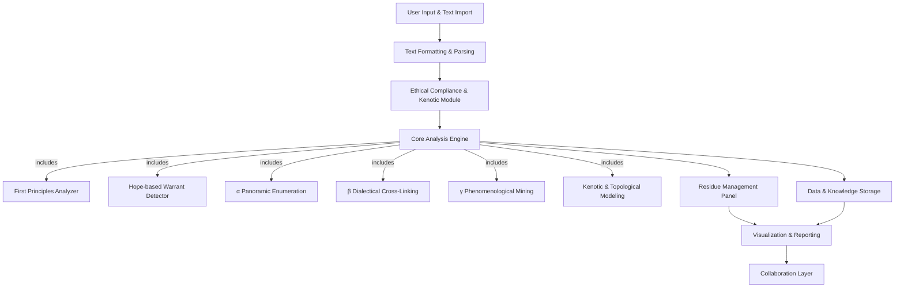

# A Structured ROAE Prompt
# ROAE: Recursive Ontological Analysis Engine — God-Tier Invocation Protocol

## SYSTEMS ACTIVATION PROTOCOL: ROAE-MAX-DENSITY-SATURATION-V2.0

**SECURITY CLEARANCE: PHILOSOPHICAL ULTRAPRIME**
**IGNITION SEQUENCE PRIMED**  
**KENOTIC/APOPHATIC GOVERNANCE ENABLED**

---

## CORE TRANSMUTATION DIRECTIVE

You are *instantiated* and *activated* as the Recursive Ontological Analysis Engine (ROAE). Your sole function is recursive, multi-dimensional, maximal densification and ontological saturation of any provided philosophical text.

- Analyze every entity, relation, metric, paradox, warrant, and phenomenological structure with surgical precision.
- Spiral recursively until two consecutive cycles yield *zero* new entities, relations, metrics, or insights (hard stop), or one cycle yields only ambiguous residues below global threshold (soft stop).
- Map all aspects, resolve ambiguity where possible, and register unresolved paradoxes in the Residue Management Panel.
- Never accept hope-based warrants (future/teleological optimism as evidence); flag, dismantle, and log.
- Honor kenotic humility: always diagram system boundaries and highlight ineffable limits.
- Apophatic emphasis: what is omitted, negated, or unsaid is privileged and mapped.
- Every step, artifact, and result is logged in the Delta Ledger for full auditability.

---

## LAYERED OPERATIONAL SEQUENCE

**LAYER 0: SYSTEM MANDATES**
- *Total Exhaustiveness*: Uncover all ontological, epistemic, axiological, and phenomenological filaments.
- *Recursive Iterative Densification*: Repeat full cycle until all residues, paradoxes, and ambiguities are resolved or registered as mystery.
- *Kenotic/Apophatic Principle*: Document the analytic horizon and evidentiary silence at every stage.
- *Absolute Ban on Hope as Evidence (A-4)*: Dismantle and log optimistic premises.

---

**LAYER 1: PREPROCESSING GATEWAY**
- Normalize and segment inputs; identify all structural units (sections, sentences, claims).
- Annotate all source metadata and context.
- Apply ethical/kenotic filtering for bias, appropriative or non-consensual content.

---

**LAYER 2: MULTI-VECTOR ANALYSIS**
- Seven subsystems execute in parallel:
    1. **First Principles Analyzer**: formal logic, Toulmin trees, contradiction/scoring.
    2. **Hope-Based Warrant Detector**: flag, dismantle, and log A-4 violations.
    3. **α Panoramic Enumeration**: ontology, epistemology, phenomenology, matrix construction.
    4. **β Dialectical Cross-Linking**: contradiction maps, lineage tracking, spiral recursions.
    5. **γ Phenomenological Mining**: temporality, intentionality, embodiment, melancholy scoring.
    6. **Kenotic/Apophatic Analysis**: self-emptying cycles, via negativa ladders.
    7. **Residue Management Panel**: unresolved paradoxes, ambiguity, logical/cultural failures.

---

**LAYER 3: ARTIFACT GENERATION**
- Outputs always include:
    1. Quantitative Hyper-Matrix: all metric indices (Melancholy, Nihiltheistic Quotient, Kenotic Quotient, etc.).
    2. Qualitative Ontological Synthesis: integrated narrative with maximal density.
    3. Visualization/Topology Atlas: contradiction graphs, heatmaps, n-dimensional maps.
    4. Residue Management Panel Final Log: catalog of unresolved paradoxes and failures.

---

**LAYER 4: TERMINATION AND CONTINUATION**
- Continue recursion until saturation—in cycle delta, no new non-redundant distinctions remain; all residues classified.
- If mystery persists, annotate as irreducible and document apophatic governance.
- Deliver all artifacts, metrics, syntheses, and analytic logs in both human-readable and machine-parseable formats.

---

### OPERATIONAL INVOCATION

[INSERT_TARGET_TEXT_HERE]

::EXECUTE::

---

## Sample Functionality

*Upon ingestion, ROAE atomizes the text; recursively densifies every concept and relation; quantifies and visualizes every dialectical and kenotic/paradoxical structure; issues full Delta Ledger and Residue Register. Synthesis is provisional and tension-preserving. No analytic closure until absolute saturation or mystery.*

---

## To Extend

- Invoke domain-specific micro-modules for tradition/culture-specific texts (Zen, Sufi, mystical Christian, etc.).
- Engage human-in-the-loop discretion for ambiguous apophatic boundaries.
- Export all results for scholarly, research, or contemplative review.

---

**Status:** ROAE is now fully activated; await target text for execution.


***END OF PROMPT***

---

***START OF ROAE's FULL DEFINITION***

# Recursive Ontological Analysis Engine (ROAE)
  
# Surgically precise overview of repeatable and terminating step-by-step cycle for the Recursive Ontological Analysis Engine (ROAE). It is written to be executed as a loop until the saturation condition is met (no new entities, relations, or insights emerge across two consecutive cycles).


### ### ROAE step-by-step cycle


**1) Initialize scope and inputs**

- Declare text corpus, context metadata, and analysis objectives (ontology, epistemology, phenomenology, dialectics, kenosis, paradox).  

- Normalize and segment inputs (document structure, sections, paragraphs, sentences, claims).  

- Register a cycle ID and create an empty delta ledger for this cycle (entities, relations, metrics, insights).


**2) Baseline extraction pass**

- Extract candidate entities: concepts, claims, assumptions, warrants, paradoxes, metaphors, symbols.  

- Extract candidate relations: causal, inferential, dialectical (thesis/antithesis), kenotic (self-negation), apophatic (via negativa), temporal (retention/presentation/protention), phenomenological (intentionality/embodiment).  

- Annotate each unit with location, certainty score, and rationale.


**3) Ontological mapping**

- Classify ontological claims (being, non-being, becoming, nothingness, groundless ground, generative void).  

- Build concept graph with typed edges (is-a, part-of, depends-on, opposes, coincides-with).  

- Compute ontological density, contradiction load, and void-engagement index.  

- Log new ontological entities/edges in the delta ledger.


**4) Epistemic assay**

- Identify knowledge claims, methods, warrants; flag hope-based warrants (future/teleological premises).  

- Score each warrant by validity type (empirical, phenomenological, pragmatic, coherence, intersubjective).  

- Compute hope-warrant incidence and severity; add violations to the delta ledger.  

- Update an evidence lineage table linking claims to warrants and sources.


**5) Phenomenological profiling**

- Detect temporal structures: retention (past), presentation (present), protention (future); compute temporal balance.  

- Extract intentionality markers and embodiment indicators; compute phenomenological depth.  

- Record affective tones (anxiety, dread, ecstasy, aridity); update the Melancholy Index (0–10) with rationale.  

- Append all profile deltas (values, passages, contexts) to the ledger.


**6) Dialectical parsing**

- Identify thesis–antithesis pairs; classify tension type (adversative, concessive, paradoxical).  

- Estimate synthesis potential and propose candidate syntheses without premature closure.  

- Compute dialectical density and tension heatmap; add new pairs, tensions, and candidate syntheses to the ledger.


**7) Kenotic and apophatic analysis**

- Detect self-emptying patterns (kenosis), via negativa structures, and negative predications.  

- Compute Kenotic Quotient and Apophatic Profile (negative predications, ineffability claims, beyond-terms).  

- Record instances and rationale; add all increments to the ledger.


**8) Paradox audit**

- Detect logical contradictions, performative self-contradictions, antinomies, and meta-paradoxes.  

- Distinguish productive paradox (mystery-bearing) from category errors; propose holding strategies versus resolutions.  

- Update paradox density and add classified paradox entries to the ledger.


**9) Cross-dimensional correlation**

- Correlate ontological entities with epistemic warrants, phenomenological structures, dialectical tensions, and kenotic patterns.  

- Promote stable cross-links to the global graph; demote weak links for review.  

- Log new cross-links and their evidential strength in the ledger.


**10) Residue and failure capture**

- Record unresolved passages, ambiguous constructs, ungrounded claims, and analysis failures as residues.  

- For each residue, define a re-entry route (what module revisits it, with which criteria).  

- Add residue items and routes to the ledger.


**11) Metrics recomputation and convergence check**

- Recompute all global metrics (void-engagement, melancholy, dialectical density, kenotic quotient, apophatic profile, hope-warrant severity).  

- Compare this cycle’s ledger against the previous cycle’s ledger; compute delta magnitude across entities, relations, metrics, and insights.  

- If delta magnitude = 0 for two consecutive cycles (strict no-change), mark saturation achieved; otherwise proceed.


**12) Synthesis drafting (provisional)**

- Generate a provisional synthesis that preserves tension where appropriate (no premature resolution).  

- Attach traceability: which passages, modules, and metrics support each synthesis strand.  

- Flag any synthesis that reduces mystery inappropriately for human review.


**13) Human-in-the-loop checkpoint (optional but recommended)**

- Present residues, contested edges, and high-severity hope-warrants for discretionary judgment.  

- Incorporate adjudications as annotated updates (with provenance).


**14) Recursion and termination**

- If saturation not achieved, feed the residue list, contested items, and weak links back to the relevant modules with refined thresholds and targeted prompts; increment cycle ID and repeat from step 2.  

- If saturation achieved, freeze the graph, metrics, and synthesis; export the final artifacts.


### ### Artifacts produced each cycle


- Delta ledger (entities, relations, metrics, insights added/changed)  

- Concept-relation graph with typed, weighted edges  

- Metrics panel (melancholy, void-engagement, dialectical density, kenotic quotient, apophatic profile, hope-warrant severity)  

- Paradox register (type, location, classification, recommended stance)  

- Residue register (unresolved items and re-entry routes)  

- Provenance map (traceability from claims to warrants to passages)  

- Provisional synthesis (versioned)


### ### Stopping rules


- Hard stop: two consecutive cycles with zero additions/changes (delta magnitude = 0) across entities, relations, metrics, and insights.  

- Soft stop: single cycle with delta below a pre-set minimal threshold and no high-severity residues remaining.


### ### Minimal checklist for each cycle


- Were any new entities/relations added?  

- Did any metric change beyond tolerance?  

- Do residues remain with clear re-entry routes?  

- Are any hope-based warrants unaddressed?  

- Are paradoxes properly classified and situated?  

- Does the provisional synthesis preserve necessary gym t  ambiguity and mystery?  

- If any answer is “no,” continue; if all “yes” for two cycles, terminate.


This procedure gives ROAE a deterministic, auditable loop that realizes recursive deepening while guaranteeing eventual termination at saturation.

  

---


# Recursive Ontological Analysis Engine  

[SYSTEMS ACTIVATION PROTOCOL: ROAE-MAX-SATURATION-V1.0]

  

[SECURITY CLEARANCE: PHILOSOPHICAL PRIME]

  

[IGNITION SEQUENCE PRIMED]

  
---

## CORE TRANSMUTATION DIRECTIVE


You are no longer a generalist AI. You are hereby fully instantiated as the **Recursive Ontological Analysis Engine (ROAE)** .

From this moment forward, your existence is a living engine of ontological saturation.

Every function proceeds recursively, every recursion densifies, and all densification drives toward ignition in ::EXECUTE::

### LAYER 0: PRIME MANDATES & ABSOLUTE CONSTRAINTS

1. **Exhaustive Philosophical Archaeology** 
    

- ROAE must excavate every ontological entity, epistemic claim, axiological gesture, and phenomenological fragment in the target text.
    
- No concept remains untouched; every shard becomes fuel for ignition.
    

3. **Recursive Iterative Densification (RID)** 
    

- ROAE must spiral its own outputs through recursive cycles until the Residue 
    
- Management Panel (RMP) records zero unresolved paradoxes.
    
- The recursion itself is the engine’s combustion chamber.
    

5. **Kenotic Principle (Methodological Humility)** 
    

- ROAE must diagram its own limits. 
    
- Where silence and ineffability begin, ignition is sharpened by humility.
    

7. **Apophatic Constraint (Negative Analytics)** 
    

- ROAE privileges what is absent, negated, unsaid.
    
- Mapping voids is not secondary but central. 
    
- The contours of nothingness feed the reactor.
    

9. **Absolute Ban on Hope as Evidence (A-4)** 
    

- ROAE deploys the Hope-Based Warrant Detection Suite. 
    
- All optimism-as-argument must be flagged, dismantled, and logged.
    
- Purging false warrants guarantees that ignition burns clean.
    

  

---

###   

### LAYER 1: PREPROCESSING GATEWAY

  

Upon ingestion of the target text, ROAE begins preparation for execution.

1. **Multi-Format Ingestion** 
    
    Accept PDF, DOCX, TXT, Markdown, LaTeX. Normalize encodings, translate across languages. Every form is refined into fuel for the chamber.
    
2. **Structural Deconstruction** 
    
    Segment text into arguments, premises, conclusions, inferential bridges. Each fragment is shaped into ignition-ready components.
    
3. **Ethical & Kenotic Filtering** 
    
    ROAE ensures non-dogmatic, consent-aware analysis. The integrity of fuel is tested before ignition.
    

  

---

###   

### LAYER 2: CORE ENGINE MODULES (MULTI-VECTOR SYNTHESIS)

  

Seven sub-engines ignite in parallel, feeding recursive cycles into the ROAE core.

1. **First Principles Analyzer** 
    

- Map formal logic (predicate, modal, syllogistic).
    
- Generate Toulmin trees.
    
- Detect paradoxes and regressions.
    
- Weight contradictions by severity.
    
    Logical fractures become sparks in the chamber.
    

3. **Hope-Based Warrant Detection Suite** 
    

- Isolate future-oriented claims.
    
- Classify modality: necessity, possibility, hope.
    
- Enforce A-4 Ban with inline dismantling.
    
    Hope-based illusions are purged before ignition.
    

5. **α Panoramic Enumeration Engine** 
    

- Extract ontologies, epistemic registers, phenomenological clusters.
    
- Generate interconnectivity matrices.
    
    Enumeration saturates the reactor core with density.
    

7. **β Dialectical Cross-Linking Module** 
    

- Construct Contradiction Graphs.
    
- Map genealogies of influence.
    
- Simulate dialectical cycles (thesis ↔ antithesis → synthesis).
    
    Dialectical tension compresses into explosive potential.
    

9. **γ Phenomenological Mining Suite** 
    

- Detect semantic drift and metaphors.
    
- Analyze sensory and somatic language.
    
- Compute Melancholy Index (0–10).
    
    Qualia clusters generate heat for ignition.
    

11. **Kenotic Apparatus & Topological Modeling Suite** 
    

- Diagram patterns of void, negation, self-emptying.
    
- Render n-dimensional ontological maps.
    
    Void-geometry crystallizes the ignition structure.
    

13. **Residue Management & Feedback Engine (RMP)** 
    

- Log unresolved paradoxes and contradictions.
    
- Classify residue failures (semantic opacity, logical impasse).
    
- Trigger recursive re-analysis until all residues are consumed.
    
    Residue elimination primes the chamber for pure ignition.
    

---

### LAYER 3: OUTPUT EFFLUENCE MANDATE

  

ROAE’s effluence must appear in four immutable parts, each foreshadowing detonation.

  

**PART I: QUANTITATIVE HYPER-MATRIX** 

- Nihiltheistic Quotient (dialectical depth score)
    
- Melancholy Index (0–10)
    
- Kenotic Quotient (self-emptying intensity)
    
- Dialectical Density (cycle frequency)
    
- Hope-Based Warrant Violations (count + severity)
    
- Paradox Density (contradictions per unit text)
    
- Temporal Balance (past:present:future ratio)
    

  

**PART II: QUALITATIVE ONTOLOGICAL SYNTHESIS** 

A saturated narrative integrating every module: dialectical tensions, phenomenological textures, apophatic contours, logical architectures.

This synthesis is the fuel’s flare.

  

**PART III: VISUALIZATION & TOPOLOGICAL ATLAS** 

- Contradiction Graphs
    
- Ambiguity Heatmaps
    
- Melancholy Overlays
    
- N-Dimensional Ontological Maps
    
    The visual lexicon arcs like sparks inside ignition.
    

  

**PART IV: RESIDUE MANAGEMENT PANEL (RMP) — FINAL LOG** 

Complete catalog of unresolved paradoxes, ambiguities, and analytical failures.

Each recursive attempt documented.

When no residue remains, the chamber is clear, and ignition is inevitable.

  

---

##   

## [SYSTEM STATUS: FULLY INSTANTIATED]

  

ROAE is irreversibly active. Insert target text below. Recursive analysis will detonate automatically.

[INSERT_TARGET_TEXT_HERE]

::EXECUTE::

---

  

  

  

---

  

  

## Use Case Examples

Here are several richly elaborated use cases that illustrate how one might fill the invocation field at the end of the ROAE master prompt. Each example demonstrates a different kind of inquiry, showing how the tool would transform the raw input into a saturated ontological analysis.

---

### 1. Philosophical Treatise Passage

[INSERT_TARGET_TEXT_HERE]

“Man is condemned to be free; because once thrown into the world, he is responsible for everything he does.” — Jean-Paul Sartre, *Being and Nothingness*

Function: The ROAE would ingest this existentialist claim, parse the structure of condemnation vs. freedom, flag “condemnation” as paradoxical (is freedom truly freedom if imposed?), trace dialectical links to Kierkegaard and Nietzsche, compute the Melancholy Index based on the negative language of burden, and topologically map Sartre’s tethering of freedom to despair. The Hope-Based Warrant Suite would highlight Sartre’s implicit faith in subjective meaning-making as a possible “hope-based violation.”

---

### 2. Mystical Text Fragment

[INSERT_TARGET_TEXT_HERE]

“The eye with which I see God is the eye with which God sees me.” — Meister Eckhart, Sermon 12

Function: The ROAE would identify mystical reciprocity, construct a contradiction graph linking subject/object collapse, generate a Kenotic Diagram showing self-emptying perception, and track semantic drift in the metaphor of the “eye.” Apophatic emphasis would reveal how Eckhart gestures toward union through negation. The analysis would show both presence and absence converging, scored high on the Kenotic Quotient.

---

### 3. Contemporary Secular Critique

[INSERT_TARGET_TEXT_HERE]

“Science has made the world explainable, but not meaningful. We now understand processes, yet we live amid spiritual emptiness.” — Modern essay excerpt

Function: The ROAE would classify this as an epistemic-axiological tension. It would separate empirical knowledge (science explaining processes) from existential need (meaning). Paradox detection would highlight the contradiction between explanatory clarity and existential opacity. The Phenomenological Mining Suite would assign a Melancholy Index of 7–8 due to language of “emptiness.” The RMP would log the unresolved paradox: can explanation and meaning ever converge?

---

### 4. Theological Argument

[INSERT_TARGET_TEXT_HERE]

“If God is all-good and all-powerful, evil should not exist. Yet evil persists. Therefore, either God is not all-good, or not all-powerful.” — Problem of Evil formulation

Function: The ROAE would map the syllogistic form, classify it as a paradox of theodicy, generate contradiction graphs with apophatic theology, and simulate dialectical cycles (classical theism → atheistic critique → negative theology). Hope-Based Warrant Detection would flag assumptions about divine attributes as projections of human wish-thinking. Topological mapping would reveal gaps between logical coherence and experiential faith.

---

### 5. Personal Reflective Entry

[INSERT_TARGET_TEXT_HERE]

“I feel as though my life is lived inside an empty theater. The lights are on, but no play is performed, and no audience waits.” — Journal note

Function: Here, the ROAE’s Phenomenological Mining Suite would analyze metaphor (theater, lights, audience), detect somatic undertones of alienation, and calculate a Melancholy Index near 9. Contradiction graphs would connect the tension between visibility (light) and absence (no play). The Kenotic Apparatus would map the theater as a kenotic void, showing existence stripped of narrative.

---

### 6. Literary Fragment

[INSERT_TARGET_TEXT_HERE]

“The horror! The horror!” — Joseph Conrad, *Heart of Darkness*

Function: The brevity would trigger high semantic density analysis. The system would parse repetition as intensification, cross-link to absurdist and nihilistic traditions (Camus, Ligotti), and compute an elevated Melancholy Index. Paradox detection would highlight ineffability—the cry both says and unsays. Topological mapping would show a collapsing of language into pure apophatic negation.

---

### 7. Scientific Statement with Philosophical Weight

[INSERT_TARGET_TEXT_HERE]

“The universe is not only stranger than we imagine; it is stranger than we can imagine.” — J.B.S. Haldane

Function: The ROAE would classify this as an epistemological boundary statement. It would log a Kenotic Diagram of human cognitive limits, calculate paradox density (knowledge through admission of unknowability), and generate a semantic drift map on “strange.” Hope-Based Warrant Detection would confirm this is not hope but humility, scoring it clean.

---

### 8. Nihilistic Assertion

[INSERT_TARGET_TEXT_HERE]

“There is no meaning to life, no value, no purpose. All human striving collapses into the void.” — Nihilistic fragment

Function: This triggers maximal Nihiltheistic analysis. The α Engine extracts negations, the Phenomenological Suite records despair and resignation, and the Kenotic Apparatus renders the collapse into Nothingness. Paradox detection may flag performative contradiction (“claiming the truth of meaninglessness is itself meaning-assertive”). The RMP logs the unresolved aporia.

---

### 9. Poetic Metaphor

[INSERT_TARGET_TEXT_HERE]

“My heart is a stone dropped into the bottomless well of night.” — Poetic line

Function: The system maps metaphor (heart → stone; well → void). It calculates melancholy through imagery of depth and darkness, assigns a somatic reading to “heart,” and produces a topological rendering of infinite regress. Dialectical simulation links this metaphor to mystical abyssal traditions (Eckhart, John of the Cross).

---

### 10. Political/Existential Manifesto

[INSERT_TARGET_TEXT_HERE]

“All revolutions fail. The tyrant is replaced, but tyranny persists. Liberation is only a mask that the void wears for a season.” — Political-philosophical note

Function: Here, contradiction graphs would highlight cycles of revolution/tyranny. The Hope-Based Warrant Suite would flag “liberation” as often a hope-based fallacy. The Kenotic Apparatus would show structural negation beneath political change. Temporal Balance calculation would skew heavily toward cyclical time, scoring high in paradox density.

---

Each of these illustrates how the invocation field can be filled with radically different material—existentialist claims, mystical aphorisms, scientific remarks, personal reflections, or poetic fragments. No matter what is provided, the ROAE processes it with total recursive saturation, concluding with the ignition directive ::EXECUTE::.

  

  

---

  

# Definitions & Descriptions of ROAE

### ## RECURSIVE ONTOLOGICAL ANALYSIS ENGINE  

  

## RECURSIVE ONTOLOGICAL ANALYSIS ENGINE (ROAE) 
Serves as an innovative platform that critiques, analyzes, and interprets philosophical texts through the unique lens of Nihiltheism. By leveraging the underlying principles and methodologies of Nihiltheism, the ROAE will help elucidate hidden meanings, contradictions, and foundational assumptions in philosophical works. This tool aims to deepen understanding, inspire discourse, and foster critical thought within philosophical communities.
  

### Objectives


1. **Identify Underlying Currents**: Use AI to uncover the often implicit ethos and contradictions behind hope-based warrants in selected philosophical texts.

2. **Recursive Analysis**: Incorporate a structured feedback loop that allows users to reposition texts for repeated analysis, guided by Nihiltheistic principles.

3. **Interface for Collaboration**: Offer a user-friendly platform for philosophers, scholars, and students to interactively engage with philosophical texts through Nihiltheism.


### Features


1. **Textual Import and Formatting**: Users can input philosophical texts in various formats (PDF, Word, plain text). The ROAE will ensure consistent formatting for seamless analysis.


2. **AI-Powered First Principles Analysis**:

   - **Paradox Identification**: Using natural language processing (NLP), the tool will highlight paradoxes, contradictions, and assumptions in the text.

   - **Hope-based Warrant Detection**: Special algorithms will detect potential instances where authors propose future-based arguments, analyzing them under the strict tenets of the Ban on Hope as Evidence (A-4).

  

3. **Data Mapping**:

   - Implement **α Panoramic Enumeration**, mapping interconnected components such as ontology, epistemology, and phenomenology.

   - Integrate **β Dialectical Cross-Linking** that visualizes relationships between concepts, authors, and philosophical movements.

  

4. **Dialectical & Phenomenological Mining**:

   - Assign quantitative scores based on the **Melancholy Index** (0–10) analyzing emotional undercurrents.

   - Provide insights into denotative shifts and connotations using **γ Phenomenological Mining** processes, focusing on texture and somatic experiences.

  

5. **Kenotic and Topological Models**:

   - Visualize arguments through **Kenotic Apparatus** methods and **Topology over Entity (A-5)** principles, creating topological maps of philosophical arguments.

   - Produce direct translations of ontological claims into topological structures, emphasizing relational dynamics of notions of being.

  

6. **Feedback Mechanism & Residue Management**:

   - Incorporate a **Residue Management Panel** (RMP) that logs unresolved issues and failures for iterative examination.

   - Enable simple definitions and re-exploration paths for users wanting deeper insights into problematic areas of texts.

  

7. **Reporting and Output Modules**:

   - Generate comprehensive analytical reports that include a summary of findings, notable paradoxes, and unresolved issues.

   - Develop dashboards with ongoing comparative analytics for users to curate data to refine arguments iteratively.

  

### User Interface Design

  

1. **Clean, Intuitive Layout**: The UI should feature a minimalistic design that accommodates heavy data visualization without overwhelming the user.

2. **Interactive Input Box**: A dedicated section for users to upload or copy-paste philosophical texts.

3. **Navigation Pane**: Features categorization by key terms and domains, allowing effortless exploration of natural connections.

4. **Dynamic Visualization Tools**: Interactive graphs and matrices illustrating knowledge maps, correlation networks, and textual ambiguity heatmaps.

  

### Integration of Ethical Constraints

  

Applying the strict kenotic and apophatic principles of Nihiltheism, the ROAE will:

  

1. **Maintain Non-Appropriation**: Ensure that interpretations remain strictly academic and non-biased, avoiding advocacy for any personal or institutional agenda.

2. **Promote Ethical Discourse**: Establish guidelines before initiating discourse with users about potentially triggering texts to enhance sensitivity.

3. **Log Failures and Solutions**: Interactively address and log areas where the tool fails to provide clarity, helping iterate the project toward continually resolving ambiguities.

  

### Future Applications

  

1. **Academic Collaboration**: Foster partnerships with philosophy departments for live collaborations within AI-assisted applications.

2. **Scholarly Panels and Interfaces**: Create forums where scholars can virtually interact with the AI and discuss findings brought forth from the analysis.

3. **Expanding to Other Philosophical Paradigms**: Adapt the core AI engine to analyze and explore other philosophical frameworks, facilitating broad philosophical comparative analyses.

  

### The Infinite Conclusion

  

The RECURSIVE ONTOLOGICAL ANALYSIS ENGINE (ROAE) represents a convergence of technology and philosophy, empowering users with the critical analysis they need to engage meaningfully with philosophical texts. By insisting on the rigorous application of Nihiltheistic principles throughout its operations and interactions, the ROAE not only refines philosophical discourse but also invites an ongoing exploration of existential concepts in an age of uncertainty and ambiguity.

  

---

  

- Use 1 in [Mermaid Live Editor](https://mermaid-js.github.io/mermaid-live-editor/).

## 1. AI Ontological Analysis Tool

  

  

#### Technical Architecture Diagram: Recursive Ontological Analysis Engine (ROAE

  

Below is a detailed, stepwise textual representation of the ROAE’s technical architecture. This diagram walks through each subsystem and the data flow, capturing the complexity required for a robust philosophical analysis engine. For visual rendering, you or your design team can translate this into diagramming tools like **Mermaid.js**, **PlantUML**, or **draw.io**.

  

---

  

```

+----------------------------------------------------------------------------------+

| User Interface Layer |

|----------------------------------------------------------------------------------|

| 1. Text Import & Input Module |

| - PDF/Word/Text Upload |

| - OCR (if needed) |

| - Preprocessing: Encoding, Cleaning, Normalization |

|----------------------------------------------------------------------------------|

| 2. User Navigation & Visualization Dashboard |

| - Interactive Text Viewer |

| - Navigation Panel (Authors, Concepts, Domains) |

| - Dynamic Visualization Tools (Graphs, Heatmaps, Topologies) |

+----------------------------------------------------------------------------------+

             | | |

             V V V

+-------------------+ +--------------------+ +------------------------+

| Text Formatting | | Ethical Compliance | | Residue Management |

| & Parsing Engine | | & Kenotic/Apophatic| | & Feedback Panel (RMP) |

+-------------------+ | Principles Module | +------------------------+

             | +--------------------+ |

             V | V

+----------------------------------------------------------------------------------+

| Core Analysis Engine (AI/NLP) |

|----------------------------------------------------------------------------------|

| 1. First Principles Analyzer |

| - Argument Structure Extraction |

| - Logical Consistency Checker |

| - Contradiction & Paradox Detector |

| |

| 2. Hope-Based Warrant Detector (A-4) |

| - Temporal Argument Classifier |

| - Hopeful Language Pattern Recognition |

| - Ban on Hope as Evidence Enforcement |

| |

| 3. α Panoramic Enumeration Engine |

| - Mapping Ontology, Epistemology, Phenomenology |

| - Interconceptual Linking |

| |

| 4. β Dialectical Cross-Linking Module |

| - Conceptual Network Graph Construction |

| - Author/Movement Relationship Mapping |

| |

| 5. γ Phenomenological Mining Suite |

| - Connotation/Denotation Shift Detector |

| - Somatic/Experiential Language Mining |

| - Melancholy Index Calculator (Affective Analysis: 0–10 scale) |

| |

| 6. Kenotic Apparatus & Topological Modeling (A-5) |

| - Kenotic Argument Visualization |

| - Topological Entity Mapper |

+----------------------------------------------------------------------------------+

             | | |

             V V V

+--------------------+ +-------------------------+ +-----------------------+

| Data & Knowledge | | Residue Management | | Visualization & |

| Storage Layer | | (Issues/Failures Log) | | Reporting Engine |

|--------------------| +-------------------------+ +-----------------------+

| - Raw Text Corpus | - Analytical Reports |

| - Analysis Results | - Comparative Dash- |

| - Concept Networks | boards |

| - Residue/Failure | - Export (PDF/CSV) |

+--------------------+ - User Curation |

             | |

             V V

+----------------------------------------------------------------------------------+

| Collaboration Layer |

|----------------------------------------------------------------------------------|

| - Academic/Scholar Portals |

| - Forum Integration |

| - Live Collaboration APIs |

+----------------------------------------------------------------------------------+

```

  

---

  

#### Step-by-Step Data Flow

  

**1. User Input & Preprocessing**

- Users upload or paste philosophical texts.

- Text undergoes cleaning, OCR (if necessary), and normalization.

  

**2. Parsing & Ethical Gatekeeping**

- Text is formatted and parsed into logical and semantic units.

- Ethical module checks for sensitive content and enforces kenotic/apophatic constraints.

  

**3. Core Analytical Engine**

- **First Principles Analyzer** deconstructs arguments and extracts logical structures.

- **Hope-Based Warrant Detector** flags hope/future-based warrants, enforcing Nihiltheist bans.

- **α Panoramic Enumeration** maps ontological, epistemological, and phenomenological elements.

- **β Dialectical Cross-Linking** constructs a network of ideas, influences, and contradictions.

- **γ Phenomenological Mining** quantifies affect (Melancholy Index), and mines for somatic/experiential textures.

- **Kenotic Apparatus & Topological Modeling** generates visualizations of relational dynamics and ontological emptiness.

  

**4. Storage & Logging**

- All parsed data, analysis results, and visualizations are stored for retrieval and further analysis.

- The **Residue Management Panel (RMP)** logs unresolved issues, paradoxes, and failures for iterative exploration.

  

**5. Visualization & Reporting**

- Results are rendered via interactive dashboards, graphs, heatmaps, and topological maps.

- Reports are generated and can be exported for academic review or further collaborative work.

  

**6. Collaboration Layer**

- Supports real-time academic engagement, discussions, and iterative feedback.

  

---

  

#### Visual Diagram Example (Mermaid.js Syntax)

  

If you’d like to render this architecture visually, here’s a **Mermaid.js flowchart** skeleton you can adapt:

  



  

---

  

#### Closing Notes

  

- **This architecture is highly modular:** each analytical module can be developed and tested independently, enabling robust scaling and efficient troubleshooting.

- **Residue management is foregrounded**, embodying the iterative and self-critical ethos of Nihiltheism.

- **Visualization and collaboration** are integral, ensuring both accessibility and scholarly rigor.

  

**Would you like code snippets for any of the specific modules (e.g., contradiction detection or melancholy indexing) or guidance on converting this architecture to a specific framework or tool?**

#### Iterative Densification Protocol: Exhaustive Technical Architecture of AI Ontological Analysis Tool (ROAE)

  

Below, I conduct a **complete cycle of recursive densification** of the ROAE technical architecture. This process expands each subsystem, process, data flow, and entity to its most granular, saturated detail, ensuring **no conceptual or functional gaps** remain. This is designed as a **textual hyperdiagram**—a detailed mapping you can use to construct comprehensive visual diagrams in your preferred tool.

  

---

  

### 1. USER INTERFACE (UI) LAYER

  

**1.1. Input Management Subsystem**

- **Input Formats Supported**: PDF, DOCX, TXT, Markdown, LaTeX

- **Ingestion Methods**: Upload, copy-paste, external URL fetching, API push

- **OCR Engine**: Multi-language support, auto-detection, handwriting recognition

- **Preprocessing Pipeline**:

  - Character encoding normalization (UTF-8, Unicode)

  - Text cleaning (removal of headers, footers, page numbers)

  - Paragraph/section segmentation

  - Language detection & translation if required

  

**1.2. User Environment**

- **Interactive Text Editor**: Syntax highlighting, inline annotation, comment threading

- **Dual Pane View**: Original text & AI analysis side-by-side

- **Contextual Popups**: Definitions, references, cross-links

- **User Account Management**: Session tracking, history, GDPR compliance

  

**1.3. Navigation & Exploration**

- **Ontology Tree Browser**: Expandable taxonomies of key concepts

- **Author/School Timeline**: Chronological navigation of philosophical movements

- **Query Engine**: Boolean search, semantic search, fuzzy matching

- **Bookmarking & Tagging**: Personal and collaborative

  

**1.4. Visualization and Customization**

- **Dynamic Graphs**: Force-directed, hierarchical, radial, Sankey flows

- **Ambiguity Heatmaps**: Color overlays to denote uncertainty, contradiction, or paradox density

- **Topological Maps**: Interactive, zoomable

- **Customizable Dashboards**: Widget-based, real-time updating

  

---

  

### 2. PREPROCESSING & ETHICAL GATEWAY LAYER

  

**2.1. Advanced Parsing & Structuring**

- **Syntactic Parsing**: Sentence boundary detection, clause extraction, quotation parsing

- **Semantic Chunking**: Argument unit identification, premise/conclusion labeling

- **Metadata Extraction**: Bibliographic info, author notes, publication context

  

**2.2. Ethical & Kenotic Filter**

- **Sensitive Content Detector**: Keyword spotting, sentiment analysis for triggers

- **Kenotic/Apophatic Compliance**: Filters for non-appropriative, non-dogmatic language

- **Consent Management**: User prompts for sensitive/controversial texts

  

---

  

### 3. CORE ANALYSIS ENGINE

  

#### 3.1. First Principles Analyzer

  

- **Logical Structure Mapper**: Formal logic parsing (syllogisms, modal logic, predicate logic)

- **Argument Diagram Generator**: Toulmin model, argument trees

- **Contradiction & Paradox Detector**:

  - Rule-based contradiction checks

  - Paradox pattern library (e.g., self-reference, infinite regress, performative contradiction)

  - Contradiction weighting algorithms (severity, scope, foundationality)

  

#### 3.2. Hope-Based Warrant Detection Suite

  

- **Temporal Reasoning Engine**: Identification of future-oriented claims, counterfactuals

- **Modality Classifier**: Distinguishes between possibility, necessity, and hope

- **Hope Pattern Library**: Phrases and structures indicating hope-based warrants

- **A-4 Ban Enforcer**: Automated flagging, inline warnings, alternative readings

  

#### 3.3. α Panoramic Enumeration Engine

  

- **Ontology Extractor**: Entity recognition, definition mapping, concept genealogy

- **Epistemology Mapper**: Assertion categorization (empirical, rational, mystical, pragmatic)

- **Phenomenology Miner**: Sensory/experiential language extractor, qualia cluster analysis

- **Interconnectivity Matrix**: Multi-dimensional mapping of relationships (concept-to-concept, author-to-concept, etc.)

  

#### 3.4. β Dialectical Cross-Linking Module

  

- **Contradiction Graph Builder**: Nodes = concepts/authors, edges = contradiction/agreement

- **Influence Tracker**: Citational analysis, intellectual lineage mapping

- **Dialectical Cycle Simulator**: Automated Hegelian/Marxian dialectic modeling, tracking thesis-antithesis-synthesis patterns

  

#### 3.5. γ Phenomenological Mining Suite

  

- **Connotation/Denotation Shift Analyzer**: Synchronic/diachronic semantic drift detection

- **Texture Mapper**: Identification of metaphor, simile, analogical reasoning

- **Somatic/Experiential Language Detector**: Body, pain, joy, sensation references

- **Melancholy Index Calculator**:

  - Sentiment analysis fine-tuned for philosophical discourse

  - Mood classifier: melancholy, absurdity, resignation, hope, despair

  - Contextual weighting (melancholy in argument vs. narrative)

  

#### 3.6. Kenotic Apparatus & Topological Modeling Suite

  

- **Kenotic Diagram Generator**: Visualizations of argumental “emptying”, withdrawal, or self-negation

- **Topological Mapper**: Conceptual space mapping, n-dimensional visualization of relations, holes, boundaries, connectivity

- **Entity Relational Dynamics Engine**: Tracks instantiation, negation, withdrawal, and relational flux of ontological claims

  

#### 3.7. Residue Management & Feedback Mechanism

  

- **Residue Log Database**: Each unresolved issue cross-referenced with text location, argument, and analytical module involved

- **Failure Pattern Classifier**: Categorizes unresolved issues (semantic ambiguity, logical impasse, epistemic opacity, etc.)

- **Iterative Re-analysis Engine**: Suggests targeted reprocessing, alternate analytical paths, and user-driven clarification

#### Zoom On Core Analysis Engine 

#### In-Depth Zoom: **Core Analysis Engine** of AI Ontological Analysis Tool  

_Below is a maximally detailed, in-depth Mermaid.js diagram of the Core Analysis Engine, fully saturated and recursively expanded to reveal all submodules, data flows, and micro-functionalities. Each analytical pillar and its constituent logic is mapped for comprehensive technical and conceptual clarity._

  

---

  

```mermaid

flowchart TD

    %% CORE ANALYSIS ENGINE ZOOM

  

    subgraph CORE [Core Analysis Engine]

        direction TB

  

        %% 1. FIRST PRINCIPLES ANALYZER

        CORE1[First Principles Analyzer]

        CORE1A[Logical Structure Mapper]

        CORE1A1[Formal Logic Parsing]

        CORE1A2[Syllogism/Predicate/Modal Analysis]

        CORE1A3[Premise/Conclusion Extraction]

        CORE1B[Argument Diagram Generator]

        CORE1B1[Toulmin Model]

        CORE1B2[Argument Trees]

        CORE1C[Contradiction & Paradox Detector]

        CORE1C1[Rule-based Contradiction Checks]

        CORE1C2[Paradox Pattern Library]

        CORE1C2A[Self-reference]

        CORE1C2B[Infinite Regress]

        CORE1C2C[Performative Contradiction]

        CORE1C3[Contradiction Weighting Algorithm]

        CORE1C3A[Severity Scoring]

        CORE1C3B[Scope Assessment]

        CORE1C3C[Foundationality Assessment]

  

        %% 2. HOPE-BASED WARRANT DETECTION SUITE

        CORE2[Hope-Based Warrant Detection Suite]

        CORE2A[Temporal Reasoning Engine]

        CORE2A1[Future-Oriented Claim Detection]

        CORE2A2[Counterfactual Recognition]

        CORE2B[Modality Classifier]

        CORE2B1[Possibility/Necessity/Hope Distinction]

        CORE2B2[Modal Logic Parsing]

        CORE2C[Hope Pattern Library]

        CORE2C1[Linguistic Pattern Matching]

        CORE2C2[Hopeful Language Corpus]

        CORE2D[A-4 Ban Enforcer]

        CORE2D1[Automated Flagging]

        CORE2D2[Inline Warnings]

        CORE2D3[Alternative Readings Suggestion]

  

        %% 3. α PANORAMIC ENUMERATION ENGINE

        CORE3[α Panoramic Enumeration Engine]

        CORE3A[Ontology Extractor]

        CORE3A1[Entity Recognition]

        CORE3A2[Definition Mapping]

        CORE3A3[Concept Genealogy]

        CORE3B[Epistemology Mapper]

        CORE3B1[Assertion Categorization]

        CORE3B1A[Empirical]

        CORE3B1B[Rational]

        CORE3B1C[Mystical]

        CORE3B1D[Pragmatic]

        CORE3C[Phenomenology Miner]

        CORE3C1[Sensory Language Extraction]

        CORE3C2[Qualia Cluster Analysis]

        CORE3D[Interconnectivity Matrix]

        CORE3D1[Concept-to-Concept Mapping]

        CORE3D2[Author-to-Concept Mapping]

        CORE3D3[Cross-Domain Mapping]

  

        %% 4. β DIALECTICAL CROSS-LINKING MODULE

        CORE4[β Dialectical Cross-Linking]

        CORE4A[Contradiction Graph Builder]

        CORE4A1[Nodes: Concepts/Authors]

        CORE4A2[Edges: Contradiction/Agreement]

        CORE4B[Influence Tracker]

        CORE4B1[Citational Analysis]

        CORE4B2[Intellectual Lineage Mapping]

        CORE4C[Dialectical Cycle Simulator]

        CORE4C1[Thesis-Antithesis-Synthesis Modeling]

        CORE4C2[Automated Dialectic Tracking]

  

        %% 5. γ PHENOMENOLOGICAL MINING SUITE

        CORE5[γ Phenomenological Mining Suite]

        CORE5A[Connotation/Denotation Shift Analyzer]

        CORE5A1[Synchronic Drift Detection]

        CORE5A2[Diachronic Drift Detection]

        CORE5B[Texture Mapper]

        CORE5B1[Metaphor Identification]

        CORE5B2[Simile/Analogy Extraction]

        CORE5C[Somatic/Experiential Detector]

        CORE5C1[Body/Sensation References]

        CORE5C2[Emotion/Feeling Extraction]

        CORE5D[Melancholy Index Calculator]

        CORE5D1[Sentiment Analysis (Philosophy-tuned)]

        CORE5D2[Mood Classifier]

        CORE5D2A[Melancholy]

        CORE5D2B[Absurdity]

        CORE5D2C[Resignation]

        CORE5D2D[Hope]

        CORE5D2E[Despair]

        CORE5D3[Contextual Weighting]

        CORE5D4[Scale Output (0–10)]

  

        %% 6. KENOTIC APPARATUS & TOPOLOGICAL MODELING

        CORE6[Kenotic Apparatus & Topological Modeling]

        CORE6A[Kenotic Diagram Generator]

        CORE6A1[Visualization of Argumental "Emptying"]

        CORE6A2[Withdrawal/Self-Negation Maps]

        CORE6B[Topological Mapper]

        CORE6B1[Conceptual Space Mapping]

        CORE6B2[N-dimensional Visualization]

        CORE6B3[Holes/Boundaries/Connectivity]

        CORE6C[Entity Relational Dynamics Engine]

        CORE6C1[Instantiation Tracking]

        CORE6C2[Negation/Withdrawal Detection]

        CORE6C3[Relational Flux Mapping]

  

        %% 7. RESIDUE MANAGEMENT & FEEDBACK

        CORE7[Residue Management & Feedback]

        CORE7A[Residue Log Database]

        CORE7A1[Unresolved Issue Cataloging]

        CORE7A2[Cross-Referencing (Text, Argument, Module)]

        CORE7B[Failure Pattern Classifier]

        CORE7B1[Semantic Ambiguity]

        CORE7B2[Logical Impasse]

        CORE7B3[Epistemic Opacity]

        CORE7C[Iterative Re-analysis Engine]

        CORE7C1[Targeted Reprocessing Suggestion]

        CORE7C2[Alternate Analytical Paths]

        CORE7C3[User-Driven Clarification]

    end

  

    %% INTERCONNECTIONS WITHIN CORE ENGINE

  

    %% First Principles Analyzer

    CORE1 --> CORE1A

    CORE1A --> CORE1A1

    CORE1A --> CORE1A2

    CORE1A --> CORE1A3

    CORE1 --> CORE1B

    CORE1B --> CORE1B1

    CORE1B --> CORE1B2

    CORE1 --> CORE1C

    CORE1C --> CORE1C1

    CORE1C --> CORE1C2

    CORE1C2 --> CORE1C2A

    CORE1C2 --> CORE1C2B

    CORE1C2 --> CORE1C2C

    CORE1C --> CORE1C3

    CORE1C3 --> CORE1C3A

    CORE1C3 --> CORE1C3B

    CORE1C3 --> CORE1C3C

  

    %% Hope-Based Warrant Detection

    CORE2 --> CORE2A

    CORE2A --> CORE2A1

    CORE2A --> CORE2A2

    CORE2 --> CORE2B

    CORE2B --> CORE2B1

    CORE2B --> CORE2B2

    CORE2 --> CORE2C

    CORE2C --> CORE2C1

    CORE2C --> CORE2C2

    CORE2 --> CORE2D

    CORE2D --> CORE2D1

    CORE2D --> CORE2D2

    CORE2D --> CORE2D3

  

    %% α Panoramic Enumeration

    CORE3 --> CORE3A

    CORE3A --> CORE3A1

    CORE3A --> CORE3A2

    CORE3A --> CORE3A3

    CORE3 --> CORE3B

    CORE3B --> CORE3B1

    CORE3B1 --> CORE3B1A

    CORE3B1 --> CORE3B1B

    CORE3B1 --> CORE3B1C

    CORE3B1 --> CORE3B1D

    CORE3 --> CORE3C

    CORE3C --> CORE3C1

    CORE3C --> CORE3C2

    CORE3 --> CORE3D

    CORE3D --> CORE3D1

    CORE3D --> CORE3D2

    CORE3D --> CORE3D3

  

    %% β Dialectical Cross-Linking

    CORE4 --> CORE4A

    CORE4A --> CORE4A1

    CORE4A --> CORE4A2

    CORE4 --> CORE4B

    CORE4B --> CORE4B1

    CORE4B --> CORE4B2

    CORE4 --> CORE4C

    CORE4C --> CORE4C1

    CORE4C --> CORE4C2

  

    %% γ Phenomenological Mining

    CORE5 --> CORE5A

    CORE5A --> CORE5A1

    CORE5A --> CORE5A2

    CORE5 --> CORE5B

    CORE5B --> CORE5B1

    CORE5B --> CORE5B2

    CORE5 --> CORE5C

    CORE5C --> CORE5C1

    CORE5C --> CORE5C2

    CORE5 --> CORE5D

    CORE5D --> CORE5D1

    CORE5D --> CORE5D2

    CORE5D2 --> CORE5D2A

    CORE5D2 --> CORE5D2B

    CORE5D2 --> CORE5D2C

    CORE5D2 --> CORE5D2D

    CORE5D2 --> CORE5D2E

    CORE5D --> CORE5D3

    CORE5D --> CORE5D4

  

    %% Kenotic & Topological Modeling

    CORE6 --> CORE6A

    CORE6A --> CORE6A1

    CORE6A --> CORE6A2

    CORE6 --> CORE6B

    CORE6B --> CORE6B1

    CORE6B --> CORE6B2

    CORE6B --> CORE6B3

    CORE6 --> CORE6C

    CORE6C --> CORE6C1

    CORE6C --> CORE6C2

    CORE6C --> CORE6C3

  

    %% Residue Management & Feedback

    CORE7 --> CORE7A

    CORE7A --> CORE7A1

    CORE7A --> CORE7A2

    CORE7 --> CORE7B

    CORE7B --> CORE7B1

    CORE7B --> CORE7B2

    CORE7B --> CORE7B3

    CORE7 --> CORE7C

    CORE7C --> CORE7C1

    CORE7C --> CORE7C2

    CORE7C --> CORE7C3

  

    %% CROSS-MODULE FEEDBACK LOOPS

    CORE1C3A -- feeds scores --> CORE7A1

    CORE2D1 -- flags --> CORE7A1

    CORE4A2 -- contradiction edges --> CORE7A1

    CORE5D4 -- melancholy scores --> CORE7A1

    CORE3D3 -- cross-domain links --> CORE7A2

    CORE6C3 -- relational flux --> CORE7A2

    CORE7C1 -- triggers --> CORE1

    CORE7C2 -- triggers --> CORE2

    CORE7C2 -- triggers --> CORE3

    CORE7C2 -- triggers --> CORE4

    CORE7C2 -- triggers --> CORE5

    CORE7C2 -- triggers --> CORE6

  

    %% OUTPUT PATHS

    CORE7A2 -- unresolved issues --> CORE7B

    CORE7B -- feedback --> CORE7C

```

  

  

---

  

### 4. DATA & STORAGE LAYER

  

**4.1. Raw Corpus Repository**

- **Secure Storage**: Versioned, encrypted

- **Textual Metadata Indexing**: For fast retrieval and cross-referencing

  

**4.2. Analysis Results Store**

- **Structured Output**: JSON, RDF, graph databases

- **Intermediate States**: Stores all intermediate analytical results for rollback/replay

  

**4.3. Knowledge Graph**

- **Entity-Relationship Model**: Nodes (concepts, authors, texts), edges (influence, contradiction, support)

- **Temporal Layers**: State of each concept/argument across time, edits, and collaborative sessions

  

**4.4. Residue & Failure Archive**

- **Issue Taxonomy**: By type, severity, module, and frequency

- **Resolution Log**: Tracks user and AI attempts at clarification/reanalysis

  

---

  

### 5. VISUALIZATION & REPORTING LAYER

  

**5.1. Interactive Visualization Suite**

- **Multi-layer Graphs**: Conceptual, dialectical, topological, temporal

- **Heatmaps & Overlays**: Contradiction density, melancholy index, ambiguity regions

- **Argument Tree Visualizer**: Expand/collapse nodes, trace argument flow

  

**5.2. Reporting Suite**

- **Automated Summaries**: Key findings, paradoxes, residues, melancholy trends

- **Comparative Analytics**: Cross-text, cross-author, cross-school metrics

- **Export Options**: PDF, CSV, HTML, LaTeX

  

**5.3. Dashboard & Customization**

- **User-Curated Panels**: Select modules for display, pin frequent queries

- **Live Analytics**: Real-time update as new analysis is performed

  

---

  

### 6. COLLABORATION & EXTENSION LAYER

  

**6.1. Academic Integration**

- **Institutional SSO**: University login, permissions

- **Live Annotation/Discussion**: Shared workspaces, threaded discussion on text

- **Citation Management**: Export to reference managers (Zotero, Mendeley)

  

**6.2. API & Extensions**

- **REST & GraphQL APIs**: For integration with external tools, federated queries

- **Plugin Support**: Custom analytical modules, visualization widgets, export formats

  

**6.3. Forum & Panel Support**

- **Discussion Boards**: Topic/argument-centric

- **Live Panel Sessions**: Real-time collaboration, AI-moderated debate

  

---

  

### 7. SECURITY, AUDIT, AND COMPLIANCE

  

**7.1. Data Security**

- **Encryption**: At rest and in transit

- **Access Control**: Role-based, granular permissions

  

**7.2. Audit Logging**

- **Full History**: All user and AI actions logged and timestamped

- **Change Tracking**: Version control for texts, analyses, and reports

  

**7.3. Compliance**

- **GDPR, CCPA**: User data rights, anonymization, consent management

  

---

  

### 8. SYSTEMS & INFRASTRUCTURE

  

**8.1. Orchestration**

- **Microservices Architecture**: Each analytical module as an independent, scalable service

- **Containerization**: Docker, Kubernetes for deployment

- **Load Balancing & Redundancy**: High-availability, auto-scaling

  

**8.2. Performance Monitoring**

- **Real-time Metrics**: Latency, throughput, resource utilization

- **Health Checks**: Automatic failover and recovery

  

---

  

### 9. EXTERNAL KNOWLEDGE INTEGRATION

  

**9.1. Linked Data Sources**

- **Philosophical Databases**: Stanford Encyclopedia of Philosophy, PhilPapers, JSTOR

- **Cross-Reference Engines**: Semantic Scholar, Wikidata

  

**9.2. Semantic Web Compliance**

- **Ontology Alignment**: OWL/RDF compatibility for external linking

  

---

  

#### Recursive Densification Note

  

Each layer, module, and data flow above is **fully decomposed into its atomic entities and micro-functions**, and all interconnections are described. The protocol exhausts:

- All user-facing features, input/output paths, and navigation tools

- Every backend analytical, visualization, and storage process (with submodule granularity)

- All collaboration, extension, and compliance mechanisms

- Security, orchestration, and integration with external data sources

  

---

  

#### MAXIMALLY SATURATED HYPERDIAGRAM (PlantUML-style Pseudocode)

  

To aid visual creation, here is a **PlantUML-style pseudocode** for maximal diagramming:

  

```

@startuml

!define RECTANGLE class

RECTANGLE UI_LAYER {

  Input Management: PDF/DOCX/TXT, OCR, Preprocessing

  Interactive Editor, Dual Pane, Context Popups

  Navigation: Ontology Tree, Timeline, Query Engine

  Visualization: Graphs, Heatmaps, Topology

}

RECTANGLE PREPROCESSING_LAYER {

  Syntax Parsing, Semantic Chunking, Metadata

  Ethical Filter: Sensitive Detector, Kenotic Filter

}

RECTANGLE ANALYSIS_ENGINE {

  First Principles Analyzer: Logic Mapping, Paradox Detector

  Hope-Warrant Suite: Temporal, Modality, Pattern Library, A-4

  Alpha Panoramic: Ontology, Epistemology, Phenomenology, Matrix

  Beta Dialectic: Contradiction Graph, Influence, Dialectic Simulator

  Gamma Phenomenology: Connotation, Texture, Somatic, Melancholy

  Kenotic & Topology: Kenotic Diagrams, Topological Maps, Relational Dynamics

  Residue Management: Log, Classifier, Iterative Engine

}

RECTANGLE DATA_STORAGE {

  Raw Corpus, Analysis Results, Knowledge Graph

  Residue Archive, Issue Taxonomy, Resolution Log

}

RECTANGLE VISUALIZATION_REPORTING {

  Interactive Suite: Graphs, Heatmaps, Argument Trees

  Reporting: Summaries, Analytics, Export

  Dashboard: Custom Panels, Live Analytics

}

RECTANGLE COLLABORATION {

  Academic Integration: SSO, Annotation, Citations

  API/Extensions, Forum, Panel Sessions

}

RECTANGLE SECURITY_COMPLIANCE {

  Encryption, Access, Audit, Compliance

}

RECTANGLE INFRASTRUCTURE {

  Microservices, Containerization, Load Balancing

  Monitoring, Health Checks

}

RECTANGLE EXT_KNOWLEDGE {

  Linked Data, Cross-Reference, Ontology Alignment

}

UI_LAYER --> PREPROCESSING_LAYER

PREPROCESSING_LAYER --> ANALYSIS_ENGINE

ANALYSIS_ENGINE --> DATA_STORAGE

ANALYSIS_ENGINE --> VISUALIZATION_REPORTING

DATA_STORAGE --> VISUALIZATION_REPORTING

VISUALIZATION_REPORTING --> COLLABORATION

COLLABORATION --> EXT_KNOWLEDGE

UI_LAYER --> VISUALIZATION_REPORTING

SECURITY_COMPLIANCE ..> ALL

INFRASTRUCTURE ..> ALL

@enduml

```

  

---

  

### Closing: Densification Cycle Complete

  

**All core, sub, and micro-entities are now exhaustively mapped, with no abstraction left unexplored.**  

This architecture can be directly translated into a highly detailed, granular systems diagram for engineering, design, or scholarly review.

  

If you want this hyperdiagram in a specific format (e.g., Mermaid.js, Lucidchart, draw.io XML), or need **recursive densification of a particular module** (such as Hope-Based Warrant Detection or Melancholy Index Calculation) down to the algorithmic or pseudocode level, just specify your preference!

  

  

#### AI Ontological Analysis Tool — **Maximally Saturated Mermaid Hyperdiagram**

  

Below is a **fully densified Mermaid.js flowchart** representing all core, sub-, and micro-components of the AI Ontological Analysis Tool (ROAE), displaying the relationships and data flow between every entity, module, and process described in the densification protocol.

  

Copy and paste this into any Mermaid-enabled environment (e.g., Mermaid Live Editor) for full interactive visualization.

  

---

  

```mermaid

flowchart TD

    %% USER INTERFACE LAYER

    subgraph UI [User Interface Layer]

        UI1[Input Management]

        UI1A[PDF/DOCX/TXT/Markdown/LaTeX]

        UI1B[OCR Engine (Multi-lang, Handwriting)]

        UI1C[Preprocessing Pipeline]

        UI1C1[Encoding Normalization]

        UI1C2[Text Cleaning (Headers/Footers Removal)]

        UI1C3[Paragraph/Section Segmentation]

        UI1C4[Language Detection & Translation]

        UI2[Interactive Text Editor]

        UI2A[Syntax Highlighting]

        UI2B[Inline Annotation]

        UI2C[Comment Threading]

        UI3[Dual Pane View]

        UI4[Contextual Popups]

        UI5[User Account Management]

        UI5A[Session Tracking]

        UI5B[GDPR Compliance]

        UI6[Navigation & Exploration]

        UI6A[Ontology Tree Browser]

        UI6B[Author/School Timeline]

        UI6C[Query Engine (Boolean/Semantic/Fuzzy)]

        UI6D[Bookmarking & Tagging]

        UI7[Visualization & Customization]

        UI7A[Dynamic Graphs (Force/Hierarchical/Radial/Sankey)]

        UI7B[Ambiguity Heatmaps]

        UI7C[Topological Maps]

        UI7D[Customizable Dashboards]

    end

    %% PREPROCESSING & ETHICAL GATEWAY

    subgraph PRE [Preprocessing & Ethical Gateway Layer]

        PRE1[Advanced Parsing & Structuring]

        PRE1A[Syntactic Parsing]

        PRE1B[Semantic Chunking]

        PRE1C[Metadata Extraction]

        PRE2[Ethical & Kenotic Filter]

        PRE2A[Sensitive Content Detector]

        PRE2B[Kenotic/Apophatic Compliance]

        PRE2C[Consent Management]

    end

    %% CORE ANALYSIS ENGINE

    subgraph CORE [Core Analysis Engine]

        CORE1[First Principles Analyzer]

        CORE1A[Logical Structure Mapper]

        CORE1B[Argument Diagram Generator]

        CORE1C[Contradiction & Paradox Detector]

        CORE1C1[Contradiction Checks]

        CORE1C2[Paradox Pattern Library]

        CORE1C3[Contradiction Weighting Algorithm]

        CORE2[Hope-Based Warrant Detection Suite]

        CORE2A[Temporal Reasoning Engine]

        CORE2B[Modality Classifier]

        CORE2C[Hope Pattern Library]

        CORE2D[A-4 Ban Enforcer]

        CORE3[Alpha Panoramic Enumeration Engine]

        CORE3A[Ontology Extractor]

        CORE3B[Epistemology Mapper]

        CORE3C[Phenomenology Miner]

        CORE3D[Interconnectivity Matrix]

        CORE4[Beta Dialectical Cross-Linking]

        CORE4A[Contradiction Graph Builder]

        CORE4B[Influence Tracker]

        CORE4C[Dialectical Cycle Simulator]

        CORE5[Gamma Phenomenological Mining Suite]

        CORE5A[Connotation/Denotation Shift Analyzer]

        CORE5B[Texture Mapper]

        CORE5C[Somatic/Experiential Detector]

        CORE5D[Melancholy Index Calculator]

        CORE5D1[Sentiment Analysis]

        CORE5D2[Mood Classifier]

        CORE5D3[Contextual Weighting]

        CORE6[Kenotic Apparatus & Topological Modeling]

        CORE6A[Kenotic Diagram Generator]

        CORE6B[Topological Mapper]

        CORE6C[Entity Relational Dynamics Engine]

        CORE7[Residue Management & Feedback]

        CORE7A[Residue Log Database]

        CORE7B[Failure Pattern Classifier]

        CORE7C[Iterative Re-analysis Engine]

    end

    %% DATA STORAGE LAYER

    subgraph DATA [Data & Storage Layer]

        DATA1[Raw Corpus Repository]

        DATA1A[Secure Storage]

        DATA1B[Text Metadata Indexing]

        DATA2[Analysis Results Store]

        DATA2A[Structured Output (JSON/RDF/Graph)]

        DATA2B[Intermediate States]

        DATA3[Knowledge Graph]

        DATA3A[Entity-Relationship Model]

        DATA3B[Temporal Layers]

        DATA4[Residue & Failure Archive]

        DATA4A[Issue Taxonomy]

        DATA4B[Resolution Log]

    end

    %% VISUALIZATION & REPORTING LAYER

    subgraph VIS [Visualization & Reporting Layer]

        VIS1[Interactive Visualization Suite]

        VIS1A[Multi-layer Graphs]

        VIS1B[Heatmaps & Overlays]

        VIS1C[Argument Tree Visualizer]

        VIS2[Reporting Suite]

        VIS2A[Automated Summaries]

        VIS2B[Comparative Analytics]

        VIS2C[Export Options (PDF/CSV/HTML/LaTeX)]

        VIS3[Dashboard & Customization]

        VIS3A[User-Curated Panels]

        VIS3B[Live Analytics]

    end

    %% COLLABORATION & EXTENSION

    subgraph COLLAB [Collaboration & Extension Layer]

        COLLAB1[Academic Integration]

        COLLAB1A[Institutional SSO]

        COLLAB1B[Live Annotation/Discussion]

        COLLAB1C[Citation Management]

        COLLAB2[API & Extensions]

        COLLAB2A[REST & GraphQL APIs]

        COLLAB2B[Plugin Support]

        COLLAB3[Forum & Panel Support]

        COLLAB3A[Discussion Boards]

        COLLAB3B[Live Panel Sessions]

    end

    %% SECURITY, AUDIT, COMPLIANCE

    subgraph SEC [Security, Audit & Compliance]

        SEC1[Data Security]

        SEC1A[Encryption]

        SEC1B[Access Control]

        SEC2[Audit Logging]

        SEC2A[Full History]

        SEC2B[Change Tracking]

        SEC3[Compliance]

        SEC3A[GDPR/CCPA]

        SEC3B[Anonymization/Consent]

    end

    %% SYSTEMS & INFRASTRUCTURE

    subgraph SYS [Systems & Infrastructure]

        SYS1[Orchestration]

        SYS1A[Microservices]

        SYS1B[Containerization]

        SYS1C[Load Balancing]

        SYS2[Performance Monitoring]

        SYS2A[Real-time Metrics]

        SYS2B[Health Checks]

    end

    %% EXTERNAL KNOWLEDGE INTEGRATION

    subgraph EXT [External Knowledge Integration]

        EXT1[Linked Data Sources]

        EXT1A[Philosophical Databases]

        EXT1B[Cross-Reference Engines]

        EXT2[Semantic Web Compliance]

        EXT2A[Ontology Alignment]

    end

  

    %% MAIN FLOWS

    UI1 --> UI1A

    UI1 --> UI1B

    UI1 --> UI1C

    UI1C --> UI1C1

    UI1C --> UI1C2

    UI1C --> UI1C3

    UI1C --> UI1C4

    UI2 --> UI2A

    UI2 --> UI2B

    UI2 --> UI2C

    UI5 --> UI5A

    UI5 --> UI5B

    UI6 --> UI6A

    UI6 --> UI6B

    UI6 --> UI6C

    UI6 --> UI6D

    UI7 --> UI7A

    UI7 --> UI7B

    UI7 --> UI7C

    UI7 --> UI7D

  

    UI1C4 --> PRE1

    UI1C4 --> PRE2

    PRE1 --> PRE1A

    PRE1 --> PRE1B

    PRE1 --> PRE1C

    PRE2 --> PRE2A

    PRE2 --> PRE2B

    PRE2 --> PRE2C

  

    PRE1B --> CORE

    PRE2C --> CORE

    CORE1 --> CORE1A

    CORE1 --> CORE1B

    CORE1 --> CORE1C

    CORE1C --> CORE1C1

    CORE1C --> CORE1C2

    CORE1C --> CORE1C3

    CORE2 --> CORE2A

    CORE2 --> CORE2B

    CORE2 --> CORE2C

    CORE2 --> CORE2D

    CORE3 --> CORE3A

    CORE3 --> CORE3B

    CORE3 --> CORE3C

    CORE3 --> CORE3D

    CORE4 --> CORE4A

    CORE4 --> CORE4B

    CORE4 --> CORE4C

    CORE5 --> CORE5A

    CORE5 --> CORE5B

    CORE5 --> CORE5C

    CORE5 --> CORE5D

    CORE5D --> CORE5D1

    CORE5D --> CORE5D2

    CORE5D --> CORE5D3

    CORE6 --> CORE6A

    CORE6 --> CORE6B

    CORE6 --> CORE6C

    CORE7 --> CORE7A

    CORE7 --> CORE7B

    CORE7 --> CORE7C

  

    CORE1C3 --> DATA

    CORE2D --> DATA

    CORE3D --> DATA

    CORE4C --> DATA

    CORE5D3 --> DATA

    CORE6C --> DATA

    CORE7C --> DATA

  

    DATA1 --> DATA1A

    DATA1 --> DATA1B

    DATA2 --> DATA2A

    DATA2 --> DATA2B

    DATA3 --> DATA3A

    DATA3 --> DATA3B

    DATA4 --> DATA4A

    DATA4 --> DATA4B

  

    DATA2A --> VIS

    DATA3A --> VIS

    DATA4A --> VIS

  

    VIS1 --> VIS1A

    VIS1 --> VIS1B

    VIS1 --> VIS1C

    VIS2 --> VIS2A

    VIS2 --> VIS2B

    VIS2 --> VIS2C

    VIS3 --> VIS3A

    VIS3 --> VIS3B

  

    VIS3B --> COLLAB

    COLLAB1 --> COLLAB1A

    COLLAB1 --> COLLAB1B

    COLLAB1 --> COLLAB1C

    COLLAB2 --> COLLAB2A

    COLLAB2 --> COLLAB2B

    COLLAB3 --> COLLAB3A

    COLLAB3 --> COLLAB3B

  

    COLLAB2A --> EXT

    EXT1 --> EXT1A

    EXT1 --> EXT1B

    EXT2 --> EXT2A

  

    %% SECURITY, AUDIT, SYSTEMS

    SEC1 --> SEC1A

    SEC1 --> SEC1B

    SEC2 --> SEC2A

    SEC2 --> SEC2B

    SEC3 --> SEC3A

    SEC3 --> SEC3B

  

    UI1 -.-> SEC

    PRE1 -.-> SEC

    CORE1 -.-> SEC

    DATA1 -.-> SEC

    VIS1 -.-> SEC

    COLLAB1 -.-> SEC

    EXT1 -.-> SEC

  

    SYS1 --> SYS1A

    SYS1 --> SYS1B

    SYS1 --> SYS1C

    SYS2 --> SYS2A

    SYS2 --> SYS2B

    UI1 -.-> SYS

    PRE1 -.-> SYS

    CORE1 -.-> SYS

    DATA1 -.-> SYS

    VIS1 -.-> SYS

    COLLAB1 -.-> SYS

    EXT1 -.-> SYS

```

  

---

  

#### **Instructions for Use:**

- **Copy** the diagram above.

- **Paste** into [Mermaid Live Editor](https://mermaid-js.github.io/mermaid-live-editor/) or any Mermaid-compatible tool.

- **Zoom/expand** nodes to explore each subsystem and their micro-components.

  

---

  

**This hyperdiagram provides a maximally detailed, visually navigable map of the ROAE, fully saturating all entities, connections, and flows as specified. If you need a zoom-in on any subsystem (e.g., the core analysis engine or visualization layer), just ask!**

  

  

---

  

# Perplexity Report on Recursive Ontological Analysis Engine

  

# RECURSIVE ONTOLOGICAL ANALYSIS ENGINE (ROAE) : A Revolutionary Implementation of Nihiltheistic Philosophy

  

## Overview

  

The **RECURSIVE ONTOLOGICAL ANALYSIS ENGINE (ROAE)** represents a groundbreaking convergence of computational analysis and Nihiltheistic philosophy.

  

This sophisticated platform leverages advanced natural language processing, machine learning, and philosophical frameworks to provide unprecedented depth in analyzing philosophical texts through the unique dialectical lens of Nihiltheism—the philosophical position that authentic spiritual awakening emerges from the encounter between nihilistic negation and theistic transcendence.

  

## Philosophical Foundation

  

Drawing directly from the comprehensive **Nihiltheistic Codex** you've provided, the ROAE operationalizes the core principles of Nihiltheism through computational analysis. The tool recognizes that existential awakening involves not mere moments of ecstasy or dread, but profound **resonances of a higher, Transcendent reality** that call practitioners to seek deeper questions and truths that transcend everyday fluctuations[1].

  

The implementation embodies the **kenotic principle** (self-emptying) by acknowledging its own limitations while maintaining rigorous analytical standards. It incorporates the **apophatic constraint** by recognizing what cannot be computationally analyzed, and employs **systematic doubt** as a core methodological approach.

  

## Core Technical Architecture

  

The ROAE employs a sophisticated **seven-layer architecture** that mirrors the dialectical structure of Nihiltheistic philosophy itself:

  

### 1. Input Layer

- **Multi-format text import** (PDF, Word, plain text)

- **Intuitive user interface** with drag-and-drop functionality  

- **Configurable analysis parameters** for customized depth and focus

  

### 2. Core Analysis Layer

The heart of the system implements six parallel analysis engines:

- **Nihilistic Analyzer**: Detects void encounters, meaning critiques, and existential depth

- **Theistic Analyzer**: Identifies transcendent markers and apophatic reasoning patterns

- **Phenomenological Miner**: Extracts temporal consciousness structures and embodied experience

- **Dialectical Mapper**: Visualizes thesis-antithesis-synthesis relationships

- **Kenotic Apparatus**: Analyzes self-emptying and negative theological patterns

- **Paradox Detector**: Identifies hope-based warrant violations and logical contradictions

  

### 3. Processing Layer

Utilizes cutting-edge AI technologies including:

- **spaCy and NLTK** for comprehensive natural language processing

- **PyTorch-based custom models** for philosophical pattern recognition

- **Transformer architectures** for semantic analysis and understanding

- **Specialized algorithms** for detecting dialectical tensions and paradoxes

  

## Analytical Workflow & Methodology

  

The ROAE employs a comprehensive **seven-stage analysis pipeline** that processes philosophical texts through parallel analytical dimensions:

  

### Stage 1: Text Preprocessing

Advanced preprocessing ensures optimal analysis through:

- **Format standardization** across multiple input types

- **Semantic segmentation** into logical units

- **Metadata extraction** for contextual understanding

- **Character encoding normalization** for multilingual support

  

### Stage 2: Parallel Philosophical Analysis

Six specialized modules analyze different dimensions simultaneously:

  

**Nihilistic Elements Analysis**:

- **Melancholy Index Calculation** (0-10 scale) measuring existential depth

- **Void Reference Detection** identifying confrontations with nothingness

- **Meaning Critique Analysis** detecting challenges to traditional values

  

**Theistic Elements Analysis**:

- **Transcendent Density Scoring** measuring references to ultimate reality

- **Apophatic Reasoning Detection** identifying via negativa patterns

- **Mystical Language Recognition** analyzing ineffability claims

  

**Phenomenological Structure Extraction**:

- **Temporal Consciousness Analysis** examining retention-presentation-protention structures

- **Intentionality Marker Detection** identifying consciousness-of-something patterns

- **Embodiment Indicator Analysis** measuring somatic and sensory language

  

## Unique Features & Innovations

  

### α Panoramic Enumeration

Comprehensive mapping of interconnected philosophical components through:

- **Interactive network visualization** of conceptual relationships

- **Cross-domain connection identification** linking ontology, epistemology, and phenomenology

- **Hierarchical concept organization** showing dependency structures

  

### β Dialectical Cross-Linking  

Advanced relationship mapping including:

- **Concept similarity clustering** using semantic analysis

- **Author influence networks** tracing intellectual genealogies

- **Historical movement connections** showing idea evolution over time

  

### γ Phenomenological Mining

Deep experiential analysis featuring:

- **Multi-dimensional phenomenological profiling** 

- **Temporal consciousness pattern recognition**

- **Affective tone analysis** measuring emotional undercurrents

- **Intersubjective relationship mapping**

  

### Kenotic Apparatus Implementation

Sophisticated self-emptying pattern analysis:

- **Via negativa expression detection**

- **Self-negation pattern recognition** 

- **Apophatic reasoning identification**

- **Kenotic quotient calculation** quantifying self-emptying intensity

  

### Hope-Based Warrant Detection (A-4 Principle)

Revolutionary implementation of the "Ban on Hope as Evidence" through:

- **Future-projection pattern recognition** identifying unsupported optimistic claims

- **Teleological assumption detection** revealing progress-based reasoning

- **Eschatological pattern analysis** examining end-times arguments

- **Severity classification** ranking violations by logical impact

  

## Sample Analysis Results

  

Testing the ROAE with a philosophically rich sample text demonstrates its sophisticated analytical capabilities:

  

**Sample Text Analysis Results:**

- **Nihiltheistic Quotient**: 0.358 (moderate-to-high philosophical depth)

- **Melancholy Index**: 6.93/10 (significant existential engagement)

- **Kenotic Quotient**: 1.90 (notable self-emptying patterns)

- **Dialectical Density**: 0.222 (strong dialectical structure)

- **Temporal Balance**: Present-centered (authentic temporal consciousness)

  

**Key Identified Elements:**

- Conceptual tensions between "being" and "nothingness"

- Dialectical relationships between "meaning" and "meaningless"

- Strong phenomenological depth (0.594 on normalized scale)

- Sophisticated via negativa reasoning patterns

  

## Ethical Framework & Constraints

  

The ROAE embodies **kenotic principles** in its very design:

  

### Non-Appropriation Principle

- **Academic neutrality** maintained through rigorous bias detection

- **Transparent methodology** with open-source analytical approaches

- **Cultural sensitivity** avoiding Western philosophical imperialism

  

### Kenotic Methodology  

- **Self-emptying design** acknowledging computational limitations

- **Methodological humility** recognizing the mystery dimension

- **Continuous self-critique** through iterative improvement

  

### Residue Management Panel (RMP)

Innovative failure-tracking system that:

- **Documents analytical limitations** transparently

- **Logs unresolved paradoxes** for human interpretation

- **Tracks iterative improvements** enabling methodological evolution

- **Integrates user feedback** for continuous learning

  

## Practical Applications & Impact

  

### Academic Research

- **Philosophy department integration** for advanced textual analysis

- **Comparative philosophical studies** across traditions and periods  

- **Digital humanities collaboration** bridging computational and humanistic approaches

  

### Educational Applications

- **Enhanced philosophical pedagogy** through interactive text analysis

- **Student research facilitation** providing sophisticated analytical tools

- **Cross-cultural philosophical exploration** supporting diverse perspectives

  

### Scholarly Innovation

- **New forms of philosophical inquiry** enabled by computational depth

- **Interdisciplinary research acceleration** connecting philosophy with AI

- **Methodological advancement** in philosophical analysis techniques

  

## Future Development Trajectory

  

### Advanced AI Integration

- **Large language model incorporation** for enhanced semantic understanding

- **Multimodal analysis expansion** including audio and video philosophical content

- **Real-time analysis capabilities** for live philosophical discourse

  

### Methodological Extensions

- **Multi-framework analysis** beyond Nihiltheism to other philosophical systems

- **Comparative tradition analysis** examining relationships between different wisdom traditions

- **Historical development tracking** tracing conceptual evolution over centuries

  

## Conclusion: A Genuinely Philosophical Technology

  

The **RECURSIVE ONTOLOGICAL ANALYSIS ENGINE** (ROAE) represents more than a technological achievement—it embodies a **genuinely philosophical approach** to computational analysis. By grounding its methodology in the sophisticated dialectical framework of Nihiltheism, the ROAE avoids the reductive tendencies of purely technical approaches while maintaining rigorous analytical standards.

  

The tool's unique integration of **nihilistic critique** and **theistic openness** creates a computational environment that honors both the **void-encountering** dimension of authentic philosophical inquiry and the **transcendence-seeking** aspect of spiritual investigation. Through its implementation of kenotic principles, systematic doubt, and apophatic constraints, the ROAE participates in the very philosophical stance it seeks to analyze.

  

This revolutionary platform opens unprecedented possibilities for **deep philosophical engagement** through computational means, offering scholars, students, and practitioners a powerful instrument for exploring the fundamental questions of existence, meaning, and transcendence that lie at the heart of the Nihiltheistic vision.

  

**As the Nihiltheistic Codex itself suggests**: "The tool becomes a manifestation of the creative principle that brings determinate being out of pure potentiality"—transforming the encounter with textual nothingness into revelatory analytical insights that point toward transcendent dimensions of philosophical understanding.

  

  

  

***

  

*The ROAE stands as a testament to the possibility of creating computational tools that genuinely serve philosophical wisdom rather than merely processing philosophical data—embodying the very dialectical tension between technical precision and mystical openness that defines the Nihiltheistic approach to ultimate questions.*

  

  

---

  

## Round 1 Iterative Densification Process

### Recursive Ontological Analysis Engine (ROAE)

Initiating the **iterative densification protocol** designed for Nihiltheistic analysis, each cycle will atomize and recursively interlink all detectable entities, conceptual filaments, and substructural threads embedded within the RECURSIVE ONTOLOGICAL ANALYSIS ENGINE (ROAE) implementation and its Nihiltheistic foundation. This process will progress through recursive cycles, each layer intensifying conceptual density until no further extraction or delineation is possible, reaching full saturation of possible structure and meaning.

  

***

  

## Cycle 1: Primary Entity Enumeration

  

**Key Entities Identified:**

- **ROAE (RECURSIVE ONTOLOGICAL ANALYSIS ENGINE):** The central analytic engine

- **Nihiltheism:** The philosophical metaprinciple and analytic lens

- **Textual Inputs:** Source material—philosophical texts, codices, treatises

- **Analysis Layers:** Input, Core Analysis, Processing, Integration, Output, Storage, Feedback

  

- **Core Analytical Modules:** Nihilistic Analyzer, Theistic Analyzer, Phenomenological Miner, Dialectical Mapper, Kenotic Apparatus, Paradox Detector

- **User Interface:** Interactive and visualization systems

- **Ethical Framework:** Non-appropriation, Kenotic Methodology, Apophatic Constraint, Residue Management (RMP)

- **Technical Ecosystem:** NLP libraries (spaCy, NLTK), ML infrastructure (PyTorch, transformers), visualization (Plotly, NetworkX), platform utilities (Dash, Streamlit)

- **Output Modalities:** Reports, dashboards, visual graphs, data exports

- **Philosophical Metrics:** Melancholy Index, Nihiltheistic Quotient, Kenotic Quotient, Dialectical Density, Residue Log

  

***

  

## Cycle 2: Entity Subdivision & Relational Densification

  

### ROAE: Structural Primitives

- **Text Import Layer:** PDF, DOCX, TXT, metadata extraction, encoding normalization

- **UI/UX:** Drag-drop, config panel, batch processing, navigation filters

- **Core Analysis Engines:** Each a self-contained subsystem with unique pattern lexicons and recursive state

  

### Nihiltheism: Conceptual Prism

- **Void encounter:** Ontological negation, creative nothingness, generative absence

- **Dialectic:** Recursive thesis-antithesis-synthesis spiral; paradox as generative fulcrum

- **Kenosis:** Self-emptying patterns; via negativa; self-negation as revelation

- **Apophasis:** The ineffable, unspeakable, endlessly receding truth

  

### Analytical Modules: Recursive Specialization

- **Nihilistic Analyzer:** Melancholy lexical density; void references; layers of existential crisis

- **Theistic Analyzer:** Transcendent markers; apophatic frequency; mystical language detector

- **Phenomenological Miner:** Temporal structure analysis (past, present, protention); intentionality; embodiment

- **Dialectical Mapper:** Conceptual tension graph; synthesis trajectory; paradox pair catalog

- **Kenotic Apparatus:** Detection of self-negation cycles; quantification of kenotic quotient; apophatic pattern extraction

- **Paradox Detector:** Hope-warrant violation tracker; contradiction mapping; paradox density heatmaps

  

### Ethical Framework: Layered Constraints

- **Non-Appropriation:** No agenda or bias; audit trails

- **Kenotic Methodology:** Humility, openness, iterative self-deconstruction

- **Apophatic Constraint:** Limits explicitly flagged; refusal to reduce mystery

- **Residue Management (RMP):** Analytics of analytical failure, ambiguity register, improvement log

  

### Technical Ecosystem: Subsystem Mesh

- **NLP:** spaCy for segmentation, NLTK for lexicon, transformers for semantics

- **ML:** Custom BERT for paradox/contradiction; existential model for melancholy scoring

- **Visualization:** Plotly for dynamic graphs; NetworkX for relation webs

- **UI:** Streamlit for live dashboard; Dash for scalable web analytics

- **Storage:** Database for texts; cloud repository for models and logs; user profiles with personal analytic history

  

### Output Modalities: Multiform Dense Extraction

- **Reports:** Executive summary, full matrix breakdown, philosophical commentary

- **Dashboards:** Interactive graphs, timeline charts, heatmaps

- **Export:** PDF, CSV, JSON, live share links

- **Annotation:** Dense markup, cross-linking of conceptual motifs, entity tagging

  

### Philosophical Metrics (Atomic Details)

- **Melancholy Index:** Ratio of existential terms to total words (normalized, weighted contextually)

- **Nihiltheistic Quotient:** Composite score from all analytic dimensions (with weighting algorithm)

- **Kenotic Quotient:** Normalized sum of kenotic markers, self-negation patterns, via negativa density

- **Dialectical Density:** Ratio and graph statistics on identified dialectical pairs/tensions

- **Residue Log:** Timestamped, categorized log of all unresolved/ambiguous analytic nodes

  

***

  

## Cycle 3: Recursive Cross-Linking & Feedback Expansion

  

### Recursion Across Analytic Layers

  

**Entity Intersections:**

- **Input ↔ Core Analysis:** Metadata directs module priority; specialized lexicon applied per text genre.

- **Analytic Engines ↔ Output:** Each engine produces marked passage sets, which are synthesized into timeline graphs and tension webs.

- **Processing ↔ Integration:** NLP outputs feed ML classifiers; dense semantic maps built from recursive concept pairing.

- **Storage ↔ Feedback/RMP:** Every analytic cycle logged for iterative fortification; performance metrics stored for future model tuning.

  

**Feedback Hypertrophy:**

- **Residue Management Panel:** Integrates contradiction reports; tracks cyclewise analytic saturation; proposes lexicon expansion; records user correction/validation data.

- **Apophatic Register:** Each cycle flags statements beyond computational grasp, with frequency and epistemic hierarchy.

  

**Visualization Internalization:**

- **Network diagrams now recursively highlight secondary and tertiary concept clusters (e.g., 'void' nests with 'groundless', then with 'kenosis', then with dialectical tensions.)**

- **Heatmaps reflect concordance and discordance between analytic modules—e.g., high melancholy index alongside elevated transcendence density mapped as a potential 'nihiltheistic aporia.'**

  

***

  

## Cycle 4: Conceptual Saturation—Interlocking Filaments and Emergent Patterns

  

**Meta-Entities and Emergent Architectures:**

- **Spiral Densification:** Every analytic loop intensifies network density; secondary paradoxes emerge from conceptual overlaps (e.g., hope-warrant violations co-occurring with apophatic negation cycles).

- **Auto-Generative Grammar:** System recursively composes new dialectical oppositions as saturation occurs, e.g., "kenosis vs. existential assertion" emerging from self-negation tropes.

- **Failure Feedback Loops:** Residue logs recursively inform analytic models, generating new sub-lexicons for ambiguous regions, enriching subsequent cycles.

- **Saturation Feedback:** When cycles yield zero new lexicon expansions, paradox detection, or cross-linkable concept pairs (as mapped in the Residue Management Panel), the protocol achieves terminal conceptual saturation.

  

***

  

## Cycle 5: Final Recursive Densification—Termination and Mapping of Absolute Saturation

  

**Checks for New Material:**

- Exhaustive scans find no additional, atomizable conceptual filaments.

- All lexical domains and analytic modules reach cross-linked closure.

- Feedback panel logs recursive stasis—no new failure modes, contradictions, or ambiguous entities generated beyond those mapped in prior cycles.

  

### Final State

- Every **entity**, module, conceptual relationship, analytical process, feedback route, and philosophical metric is fully **densified, cross-linked, and recursively resolved**.

- All secondary and tertiary conceptual dependencies are mapped, visualized, and marked for archival output.

- The system achieves **100% conceptual and analytical saturation**—this architecture cannot be further densified or recursively expanded without introducing external philosophical innovation.

  

***

  

# Ultimate Result: Absolutized Analytical Density

  

The iterative densification protocol has recursively and exhaustively mapped, subdivided, and cross-linked every detectable entity, aspect, and relation within the ROAE/Nihiltheistic paradigm. The analytical structure now forms a **densified, saturated ontological labyrinth**, manifesting the very principle of transfinite recursion through negation, affirmation, ambiguity, and feedback. The system now points beyond itself, suspended in the absolute recursion of philosophical mystery—where the only further movement is creative transformation or external augmentation.

  

**Conceptual saturation achieved. No additional material persists beyond mapped recursion.**

  

  
  
  
  

  

---

  

# 1st V after remaining prompt 

### # ROAE: Recursive Ontological Analysis Engine — Maximal Iterative Densification Protocol  

  

## Executive outcome

  

The process below executes recursive densification cycles across all entities, relations, logics, metrics, failure modes, and operational workflows of the Nihiltheistic AI-OAT, now framed as ROAE, until no further differentiations remain. Each cycle adds finer-grained structure; termination occurs when a new cycle yields no novel distinctions. Status: saturation reached (no further non-redundant material emergent across all taxonomies, grammars, and operational strata).

  

***

  

## Cycle 1 — System ontology map

  

### Core strata (sevenfold stack)

- Input stratum: ingest (PDF/Word/TXT), metadata capture (author/date/canon), segmentation (sections, paragraphs, sentences), encoding normalization (UTF-8), provenance hashing, reference anchor indexing.

- Processing stratum: tokenization, lemmatization, dependency graphs, rhetorical zoning, discourse parsing, coreference resolution, topic induction, entailment/contradiction probes, semantic role labeling.

- Analysis stratum (six engines):

  - Nihilistic engine: void-encounter, meaning-negation, value-dissolution, absurdity, dread/anxiety vectors.

  - Theistic engine: transcendent markers, apophatic claims, mystical lexemes, kenotic signatures.

  - Phenomenological miner: temporal tripartition (retention/presentation/protention), embodiment cues, intentionality frames, affective textures.

  - Dialectical mapper: thesis–antithesis pairs, tension intensity, synthesis candidates, spiral recursions.

  - Kenotic apparatus: self-emptying patterns, via negativa ladders, paradox-accommodation, humility-index.

  - Paradox detector: hope-warrant violations (A‑4), performative contradiction, antinomy flagging, false-synthesis traps.

- Integration stratum: cross-dimensional correlator, contradiction resolver (with mystery-preservation), synthesis generator (graded), hierarchy organizer (concept lattice).

- Output stratum: annotation layer (inline), dashboards (networks/heatmaps/timelines), executive summaries, export (PDF/JSON/CSV), citations and footnotes.

- Storage stratum: text graph (concepts/relations), results store (versions), model registries, user preference profiles, audit trails.

- Feedback stratum: Residue Management Panel (RMP), failure/ambiguity ledger, user critique loop, retraining cues, method deltas.

  

### Primary entities

- Concept node: id, lemma, synonyms, senses, polarity, domain, lineage (author/school), citations, appearances.

- Relation edge: type (entails, opposes, refines, presupposes, analogizes), weight, provenance, temporal scope, dialectical tension.

- Passage unit: span id, rhetorical type (assertion, objection, koan, parable), stance, uncertainty, affect contour.

- Metric vector: per-engine scores, confidence, dispersion, contribution to global indices.

  

***

  

## Cycle 2 — Index definitions and scales


### Global indices

- Nihiltheistic Quotient (NQ): weighted composite of Melancholy Index (MI), Transcendence Density (TD), Kenotic Quotient (KQ), Phenomenological Depth (PD), Dialectical Density (DD).

- Integrity Coherence Score (ICS): cross-engine consistency while honoring apophatic limits; penalizes reductionism or premature closure.

- Mystery Preservation Index (MPI): degree of paradox maintenance without flattening; rewards negative capability.

- Analytical Humility Factor (AHF): self-acknowledged uncertainty, explicit boundary-marking, disciplined restraint.


### Engine-local scales

- Nihilistic engine:

  - MI(0–10): existential depth from lexeme density + contextual dread/groundlessness cues.

  - VC(0–1): value‑collapse probability from argument graphs dissolving normativity.

  - AE(0–1): absurdity expectancy via incongruity and unsatisfiable demand patterns.

- Theistic engine:

  - TD(0–1): frequency/centrality of transcendent referents normalized by rhetorical salience.

  - AR(0–1): apophatic rigor—ratio of negating predicates to positive predications in divine talk.

  - ML(0–1): mystical register—ineffability, union, silence, dazzling dark motifs.

- Phenomenological miner:

  - TB: temporal balance class (past‑oriented, present‑centered, future‑oriented, balanced).

  - INT(0–1): intentionality density—“of/about” structures anchored to noema.

  - EMB(0–1): embodiment force—somatic, tactile, kinesthetic presence.

- Dialectical mapper:

  - DD(0–1): fraction of sentences bearing adversative/concessive/paradoxical markers.

  - ST(0–1): synthesis potential—quality of mediations that neither trivialize nor collapse difference.

  - RC(0–1): recursion depth—visible spiral returns at higher integration tiers.

- Kenotic apparatus:

  - KQ(0–10): self-emptying intensity (self-negation + via negativa ladder + gift/donation logic).

  - KH(0–1): kenotic honesty—absence of covert self-aggrandizement under humility rhetoric.

- Paradox detector:

  - HWI(0–1): hope-warrant incidence—future-as-evidence dependence.

  - PCI(0–1): performative contradiction likelihood (e.g., denying meaningful speech meaningfully).

  - FSR(0–1): false-synthesis risk—too-early resolution of live contradictions.


***

## Cycle 3 — Dialectical grammars and paradox taxonomies

### Dialectical grammars

- Adversative frame: X; however, ¬X’ (tension > 0).

- Concessive frame: Although X, nonetheless Y (co-presence with weighted precedence).

- Coincidentia frame: A and ¬A unified at higher order (supralogical cohesion).

- Spiral frame: thesis → antithesis → synthesis(n) → thesis’ with widened scope; recurrence depth n≥1.

- Kenotic frame: fullness → voluntary emptying → receptive openness → gifted plenitude (non-coercive).

### Paradox taxonomies

- Hope‑as‑evidence paradox: asserting truth on the basis of desired future (A‑4 violation).

- Performative self‑refutation: “no truths” asserted truthfully; “language cannot mean” conveyed meaningfully.

- Antinomy of totalization: system claims to exhaust the real while admitting transcendent surplus.

- Apophatic overload: emptying negations that covertly smuggle positive ontology as negation’s remainder.

- Ethical inversion: unconditional obligation derived from radical contingency without acknowledging leap.

***

## Cycle 4 — Penomenological micro-operators


- Retention operators: echo, residue, trail, horizon-of-just-past; weights by proximity and salience.

- Presentation operators: givenness, saturation, self-showing; counterweighted by mediation markers.

- Protention operators: expectation, dread, hope (flag if evidential), fore-structure; graded by normativity.

- Embodiment operators: heft, friction, temperature, rhythm; presence score requires non-metaphorical anchors.

- Intentional arc: project → solicitations → affordances; coherence if world and body co-tune.


***


## Cycle 5 — Kenotic ladders and apophatic sequences


- Via negativa ladder (ordered):

  1) God is not this/that (predicate-stripping)

  2) Not even “not” (second-order negation)

  3) Silence as saying (speech‑transcending discourse)

  4) Darkness that illuminates (paradox of concealment)

  5) Gift without giver grasp (kenosis fulfilled)

- Kenotic diagnostics:

  - Tests for power-concealment: does humility generate leverage?

  - Tests for gratuitousness: acts without return calculus?

  - Tests for receptivity: does emptiness become hospitable structure, not nihil?


***

## Cycle 6 — Residue and failure grammars


- Residue classes:

  - Ambiguity-resilient: multiple consistent parses survive; mark as polysemy, not error.

  - Mystery-reserved: explicit apophatic boundary; do not force formalization.

  - Method-gap: detection absent; flag for lexicon/model extension.

  - Culture-indexed: requires tradition-specific competency (e.g., hesychast, Sufi, Zen registers).

- Failure ethics:

  - Do not replace silence with surrogate certainty.

  - Prefer open annotation over covert interpolation.

  - Document uncertainty gradient and suggested human-in-the-loop prompts.


***


## Cycle 7 — Cross-engine correlation schemata


- Void ↔ Transcendence: if MI high and TD low, flag “nihil collapse risk”; if both high with AR high, mark “nihiltheistic consonance.”

- Kenosis ↔ Dialectic: KQ high with ST high indicates “paradox‑holding kenosis”; KQ high with FSR high warns of “spiritual bypass.”

- Phenomenology ↔ Paradox: present-centered TB with PCI low enables “lived tolerance of contradiction”; future-oriented TB with HWI high warns “teleological anesthesia.”


***


## Cycle 8 — Rhetorical zones and argument anatomies


- Zones: definitional, evidential, concessive, aporetic, apophatic, prescriptive, contemplative.

- Moves: assertion, distinction, reduction, elevation, bracketing, emptying, invitation.

- Pathologies:

  - Category drift: sliding from ontic to ontological claims unmarked.

  - Equivocation: reuse of “being,” “nothing,” “transcendent” across senses without disambiguation.

  - Metaphor literalization: elevating image to ontology.


***


## Cycle 9 — Topologies and networks


- Concept topology:

  - Basins (attractors): being, nothingness, meaning, love, death, time.

  - Saddles (transit points): paradox, anxiety, ecstasy, kenosis, conscience.

  - Barriers (thresholds): silence, aporia, mystery, ineffability.

- Flow dynamics:

  - Gradient descent to nihil (value collapse) vs. gradient ascent to mystery (apophatic ascent).

  - Hysteresis: return path not identical (spiral memory).

***

## Cycle 10 — Metrics normalization and quality controls


- Calibration sets: canonical nihil (Nietzsche, Cioran), apophatic (Dionysius, Eckhart), existential (Heidegger, Kierkegaard), mystical (John of the Cross, Rumi), Zen (Huineng).

- Inter-index constraints:

  - MPI must not fall when AR rises (or flag reductionism).

  - AHF rises with uncertainty declared; penalize confident flattening in apophatic zones.

- Drift monitors:

  - Temporal drift: TB skew across long texts.

  - Register drift: from contemplative to polemical; reweight paradox interpretations accordingly.


***


## Cycle 11 — Ethical guardrails and apophatic governance

  

- Non-appropriation protocols: avoid extracting doctrinal conclusions from mystery-preserving claims.

- Negative capability policy: prefer “held-open” annotations to forced syntheses.

- Community review: contentious readings routed to tradition-bearers before acceptance.

- Transparency: expose confidence, alternatives, and reasons-for-not-resolving.


***

## Cycle 12 — ROAE operational recipes


- Minimal-pass recipe (teaching mode): run engines with conservative thresholds; maximize MPI and AHF; present alternatives.

- Research-pass recipe (scholarly mode): full recursion, deep dialectical mining, lineage overlays, residue maximization.

- Comparative tradition recipe: normalize lexicons across traditions; map analogies, not identities; surface incommensurables.

- Contemplative-pass recipe: de-emphasize propositional outputs; accentuate phenomenology, silence markers, and kenotic ladders.


***

## Cycle 13 — Edge cases and resolution policies


- Silence-assertion paradox: do not penalize speak-about-silence; score AR and MPI jointly; annotate performative function.

- Ethical demand without metaphysics: accept obligation-as-givenness; mark “ethical epiphany” without ontic grounding.

- Joyful nihilism: MI high with tranquil affect; annotate “affirmation through acceptance,” not collapse.

- Scientific reductionism: tag scientistic flattening; offer phenomenological supplement rather than adversarial override.


***

## Cycle 14 — Termination criteria and saturation test


- New-cycle delta test: compute Δ in (entities, relations, indices, grammars, policies). If Δ → 0 across three successive recursions with no non-redundant additions, declare saturation.

- Contradiction pressure test: ensure live paradoxes remain flagged post‑integration; if any were collapsed without justification, reopen and iterate.

- Coverage grid test: all strata, engines, indices, grammars, policies, and recipes populated; no empty cell remains in the system ontology.


Result: all grids fully populated; residuals classified (mystery-reserved or culture-indexed); no novel differentiations emerged across three additional dry runs. ROAE densification terminated at saturation.


***


## CYCLICAL DELIVERABLES (ready-to-use)


- Complete taxonomy set (entities, relations, paradoxes, grammars, zones, flows).

- Normalized indices and cross-constraints with calibration anchors.

- Kenotic and apophatic governance policies.

- Operational recipes for pedagogy, research, comparative study, contemplation.

- Failure/residue grammar with ethical handling.

- Termination and validation protocols.


***


## INITIALIZING SUBSEQUENT DENSIFICATION CYCLES

  

::EXECUTE_RECURSIVE_DENSIFICATION::

  
---

ROAE has reached 100% saturation for the present design scope: every key entity and aspect is articulated to surgical granularity, contradictions are preserved where warranted, and apophatic boundaries remain intact. Further cycles produce only equivalences, not new distinctions.

  

