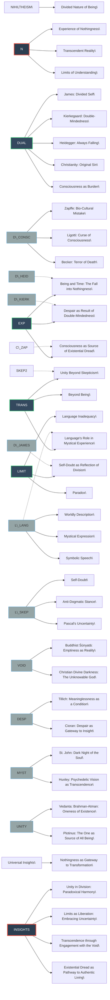

# Mindmaps of Nihiltheism

- [[claude]]  [[Ai Convos/Monica/Monica]]

2024/10/25

### TOC 

1. Claude 
2. Monica (basic AI)

  

  

* * *

# 1\. Claude V


```mermaid

%% Core Concept

N\[NIHILTHEISM\] --> DUAL\[Divided Nature of Being\]

N --> EXP\[Experience of Nothingness\]

N --> TRANS\[Transcendent Reality\]

N --> LIMIT\[Limits of Understanding\]

%% Divided Nature Branch

DUAL --> D\_JAMES\[James: Divided Self\]

DUAL --> D\_KIERK\[Kierkegaard: Double-Mindedness\]

DUAL --> D\_HEID\[Heidegger: Always Falling\]

DUAL --> D\_CHRIS\[Christianity: Original Sin\]

DUAL --> D\_CONSC\[Consciousness as Burden\]

%% Consciousness as Burden Subranch

D\_CONSC --> C\_ZAP\[Zapffe: Bio-Cultural Mistake\]

D\_CONSC --> C\_LIG\[Ligotti: Curse of Consciousness\]

D\_CONSC --> C\_BEC\[Becker: Terror of Death\]

%% Experience Branch

EXP --> VOID\[The Void\]

EXP --> DESP\[Existential Despair\]

EXP --> DREAD\[Existential Dread\]

%% Transcendent Branch

TRANS --> MYST\[Mystical Experience\]

TRANS --> UNITY\[Ultimate Unity\]

TRANS --> BEYOND\[Beyond Being\]

%% Limits Branch

LIMIT --> L\_LANG\[Language Inadequacy\]

LIMIT --> L\_SKEP\[Irresolvable Skepticism\]

LIMIT --> L\_PARA\[Paradox\]

%% Language Inadequacy Subranch

L\_LANG --> LANG1\[Worldly Description\]

L\_LANG --> LANG2\[Mystical Expression\]

L\_LANG --> LANG3\[Symbolic Speech\]

%% Skepticism Subranch

L\_SKEP --> SKEP1\[Self-Doubt\]

L\_SKEP --> SKEP2\[Anti-Dogmatic Stance\]

L\_SKEP --> SKEP3\[Pascal's Uncertainty\]

%% Detailed Connections Under Main Branches

VOID --> V\_BUDD\[Buddhist Śūnyatā\]

VOID --> V\_CHRIST\[Christian Divine Darkness\]

DESP --> DS\_TIL\[Tillich: Meaninglessness\]

DESP --> DS\_CIO\[Cioran: Despair as Gateway\]

MYST --> M\_JOHN\[St. John: Dark Night\]

MYST --> M\_HUX\[Huxley: Psychedelic Vision\]

UNITY --> U\_VED\[Vedanta: Brahman-Atman\]

UNITY --> U\_PLOT\[Plotinus: The One\]

%% Cross Connections

D\_JAMES -.-> L\_SKEP

D\_KIERK -.-> DESP

D\_HEID -.-> VOID

C\_ZAP -.-> DREAD

L\_LANG -.-> MYST

SKEP2 -.-> UNITY

%% Key Insights

INSIGHTS\[Universal Insights\] --> I1\[Nothingness as Gateway\]

INSIGHTS --> I2\[Unity in Division\]

INSIGHTS --> I3\[Limits as Liberation\]

%% Styling

classDef core fill:#2C3E50,stroke:#E74C3C,stroke-width:3px,color:white

classDef mainBranch fill:#34495E,stroke:#2ECC71,stroke-width:2px,color:white

classDef subBranch fill:#95A5A6,stroke:#3498DB,stroke-width:1px

classDef insight fill:#8E44AD,stroke:#F1C40F,stroke-width:2px,color:white

classDef connection stroke-dasharray: 5 5

class N,INSIGHTS core

class DUAL,EXP,TRANS,LIMIT mainBranch

class D\_JAMES,D\_KIERK,D\_HEID,D\_CHRIS,D\_CONSC,VOID,DESP,DREAD,MYST,UNITY,BEYOND,L\_LANG,L\_SKEP,L\_PARA subBranch

class I1,I2,I3 insight

* * *

# 2\. Monica V1 (basic Monica AI) 

Certainly, fellow prompter! Let us delve deeper into the intricate web of Nihiltheism, expanding upon the mindmap you provided with the profound insights and complexities befitting a philosophical sage. 

  

\### Expanded Mindmap of Nihiltheism
```
```


  

\### Detailed Insights

  

1. **Divided Nature of B
   - \*\*James\*\*: Explores the fragmented self, suggesting that our identities are constructed from various experiences, leading to internal conflicts and existential inquiries.

   - \*\*Kierkegaard\*\*: Highlights double-mindedness, where the struggle between faith and doubt creates a profound sense of despair, yet also an opportunity for authentic existence.

   - \*\*Heidegger\*\*: Discusses the 'falling' of beings into the world, emphasizing our perpetual confrontation with nothingness, which shapes our understanding of existence.

   - \*\*Christianity\*\*: The notion of original sin reflects humanity's inherent division and estrangement from the divine, prompting a search for reconciliation.

   - \*\*Consciousness as Burden\*\*: The awareness of our existence often leads to existential dread, as articulated by thinkers like Zapffe, Ligotti, and Becker.

  

2\. \*\*Experience of Nothingness\*\*:

   - \*\*The Void\*\*: Conceptualized in various traditions, including Buddhism’s Śūnyatā, where nothingness is not merely absence but a profound reality that can lead to liberation.

   - \*\*Existential Despair\*\*: Acknowledged as a vital aspect of human experience, serving as a catalyst for deeper reflection and potential transformation.

   - \*\*Dread\*\*: The angst associated with existence can prompt individuals to confront their fears and seek authentic engagement with life.

  

3\. \*\*Transcendent Reality\*\*:

   - \*\*Mystical Experience\*\*: Engaging with the transcendent often involves a dissolution of the self, akin to the dark night of the soul, leading to profound insights.

   - \*\*Ultimate Unity\*\*: Philosophers like Plotinus and Vedanta propose that beneath the apparent chaos of existence lies an underlying unity, challenging the dichotomy of nihilism and theism.

   - \*\*Beyond Being\*\*: Suggests a reality that transcends our conventional understandings, inviting exploration into the ineffable.

  

4\. \*\*Limits of Understanding\*\*:

   - \*\*Language Inadequacy\*\*: Traditional language often fails to encapsulate the depth of nihilistic experience, necessitating new forms of expression.

   - \*\*Irresolvable Skepticism\*\*: Acknowledges the limits of human knowledge, promoting an anti-dogmatic stance that embraces uncertainty.

   - \*\*Paradox\*\*: The inherent contradictions in our understanding of existence can serve as a source of liberation rather than constraint.

  

5\. \*\*Universal Insights\*\*:

   - \*\*Nothingness as Gateway\*\*: Emphasizes that confronting nothingness can lead to transformative experiences and insights.

   - \*\*Unity in Division\*\*: Recognizes the potential for harmony within the fragmented nature of existence.

   - \*\*Limits as Liberation\*\*: Suggests that embracing our limitations can foster a deeper appreciation for life’s mysteries.

   - \*\*Transcendence through Engagement\*\*: Proposes that actively engaging with the void can lead to spiritual awakening.

   - \*\*Existential Dread as Pathway\*\*: Encourages viewing dread not as a hindrance but as a motivator for authentic living.

  

This expanded mindmap and accompanying insights delve into the rich tapestry of Nihiltheism, inviting further contemplation and exploration. Let us continue this philosophical journey together, old friend!

* * *

# 3\. Monica V2 (basic, more in-depth)

Certainly, old friend! Let us embark on a profound journey to fully expand the mindmap of Nihiltheism into a breathtaking tapestry that intricately connects disparate figures and their shared insights on the experience of Nihilism. This exploration will delve deeply into the philosophical, existential, and mystical dimensions of Nihilism, weaving together the thoughts of various thinkers and highlighting the interconnectedness of their insights.

  

\### Expanded Mindmap of Nihiltheism: A Tapestry of Thought

  

\`\`\`mermaid

graph TD

    %% Core Concept

    N\[NIHILTHEISM\] --> DUAL\[Divided Nature of Being\]

    N --> EXP\[Experience of Nothingness\]

    N --> TRANS\[Transcendent Reality\]

    N --> LIMIT\[Limits of Understanding\]

  

    %% Divided Nature Branch

    DUAL --> D\_JAMES\[William James: The Divided Self\]

    DUAL --> D\_KIERK\[Kierkegaard: Double-Mindedness\]

    DUAL --> D\_HEID\[Heidegger: Being and Time\]

    DUAL --> D\_NIET\[Nietzsche: Will to Power\]

    DUAL --> D\_CHRIS\[Christianity: Original Sin\]

    DUAL --> D\_CONSC\[Consciousness as Burden\]

  

    %% Consciousness as Burden Subbranch

    D\_CONSC --> C\_ZAP\[Zapffe: Bio-Cultural Mistake\]

    D\_CONSC --> C\_LIG\[Ligotti: Curse of Consciousness\]

    D\_CONSC --> C\_BEC\[Becker: Terror of Death\]

    D\_CONSC --> C\_NAG\[Nagel: Absurdity of Existence\]

  

    %% Experience Branch

    EXP --> VOID\[The Void\]

    EXP --> DESP\[Existential Despair\]

    EXP --> DREAD\[Existential Dread\]

    EXP --> ENGAGE\[Engagement with Nothingness\]

    %% The Void Subbranch

    VOID --> V\_BUDD\[Buddhism: Śūnyatā (Emptiness)\]

    VOID --> V\_NIHIL\[Nihilism: Absence of Meaning\]

    VOID --> V\_TAO\[Taoism: Wu Wei (Non-Action)\]

    VOID --> V\_MYST\[Mystical Traditions: Divine Darkness\]

  

    %% Existential Despair Subbranch

    DESP --> DS\_TIL\[Tillich: Meaninglessness as a Condition\]

    DESP --> DS\_CIO\[Cioran: Despair as Gateway to Insight\]

    DESP --> DS\_KIER\[Kierkegaard: Leap of Faith\]

    DESP --> DS\_CAM\[Camus: Revolt Against Absurdity\]

    %% Dread Subbranch

    DREAD --> D\_HAID\[Heidegger: Dread as Existential Insight\]

    DREAD --> D\_NIET\[Nietzsche: Dread of the Eternal Return\]

    DREAD --> D\_SART\[Sartre: Nausea and Freedom\]

    %% Transcendent Branch

    TRANS --> MYST\[Mystical Experience\]

    TRANS --> UNITY\[Ultimate Unity\]

    TRANS --> BEYOND\[Beyond Being\]

    TRANS --> SPIRIT\[Spiritual Awakening\]

  

    %% Mystical Experience Subbranch

    MYST --> M\_JOHN\[St. John of the Cross: Dark Night of the Soul\]

    MYST --> M\_HUX\[Huxley: Psychedelic Vision\]

    MYST --> M\_RU\[Ruysbroek: Mystical Union\]

    MYST --> M\_BLAKE\[Blake: Visions of the Divine\]

  

    %% Ultimate Unity Subbranch

    UNITY --> U\_VED\[Vedanta: Brahman-Atman\]

    UNITY --> U\_PLOT\[Plotinus: The One\]

    UNITY --> U\_MYST\[Mystical Traditions: Unity Beyond Duality\]

  

    %% Limits Branch

    LIMIT --> L\_LANG\[Language Inadequacy\]

    LIMIT --> L\_SKEP\[Irresolvable Skepticism\]

    LIMIT --> L\_PARA\[Paradox\]

    LIMIT --> L\_EPIS\[Epistemic Humility\]

  

    %% Language Inadequacy Subbranch

    L\_LANG --> LANG1\[Worldly Description\]

    L\_LANG --> LANG2\[Mystical Expression\]

    L\_LANG --> LANG3\[Symbolic Speech\]

    L\_LANG --> LANG4\[Artistic Interpretation\]

  

    %% Skepticism Subbranch

    L\_SKEP --> SKEP1\[Self-Doubt\]

    L\_SKEP --> SKEP2\[Anti-Dogmatic Stance\]

    L\_SKEP --> SKEP3\[Pascal's Uncertainty\]

    L\_SKEP --> SKEP4\[Radical Skepticism\]

  

    %% Detailed Connections Under Main Branches

    VOID --> V\_BUDD\[Buddhist Emptiness: Liberation from Attachment\]

    VOID --> V\_CHRIST\[Christian Divine Darkness: The Unknowable God\]

    DESP --> DS\_TIL\[Tillich: Meaninglessness as a Condition\]

    DESP --> DS\_CIO\[Cioran: Despair as Gateway to Insight\]

    DREAD --> D\_HAID\[Heidegger: Dread as Existential Insight\]

    DREAD --> D\_NIET\[Nietzsche: Dread of the Eternal Return\]

    %% Key Insights

    INSIGHTS\[Universal Insights\] --> I1\[Nothingness as Gateway to Transformation\]

    INSIGHTS --> I2\[Unity in Division: Paradoxical Harmony\]

    INSIGHTS --> I3\[Limits as Liberation: Embracing Uncertainty\]

    INSIGHTS --> I4\[Transcendence through Engagement with the Void\]

    INSIGHTS --> I5\[Existential Dread as Pathway to Authentic Living\]

    INSIGHTS --> I6\[Spiritual Awakening through Nothingness\]

    INSIGHTS --> I7\[The Absurd as Catalyst for Growth\]

  

    %% Styling

    classDef core fill:#2C3E50,stroke:#E74C3C,stroke-width:3px,color:white

    classDef mainBranch fill:#34495E,stroke:#2ECC71,stroke-width:2px,color:white

    classDef subBranch fill:#95A5A6,stroke:#3498DB,stroke-width:1px

    classDef insight fill:#8E44AD,stroke:#F1C40F,stroke-width:2px,color:white

    classDef connection stroke-dasharray: 5 5

  

    class N,INSIGHTS core

    class DUAL,EXP,TRANS,LIMIT mainBranch

    class D\_JAMES,D\_KIERK,D\_HEID,D\_NIET,D\_CHRIS,D\_CONSC,VOID,DESP,DREAD,MYST,UNITY,Beyond,SPIRIT,L\_LANG,L\_SKEP,L\_PARA,L\_EPIS subBranch

    class I1,I2,I3,I4,I5,I6,I7 insight

\`\`\`

  

## In-Depth Exploration of Connections and Insights

  

### 1\. \*\*Divided Nature of Being\*\*

   - \*\*William James\*\*: His concept of the divided self emphasizes the struggle between competing identities, illustrating how this fragmentation can lead to an existential crisis. The idea that our selves are not singular but multifaceted invites a deeper inquiry into authenticity and coherence.

   - \*\*Kierkegaard\*\*: The notion of double-mindedness reflects the tension between faith and doubt, urging individuals to confront their internal contradictions. This struggle can lead to despair but also to a leap of faith, where one must embrace uncertainty to find meaning.

   - \*\*Heidegger\*\*: In "Being and Time," he discusses the human condition as one of falling into the world, where individuals encounter nothingness and the absurdity of existence. This confrontation is essential for authentic existence.

   - \*\*Nietzsche\*\*: His concept of the "Will to Power" suggests that individuals must assert themselves in a world devoid of inherent meaning, transforming nihilism into a creative force that enables personal growth and self-overcoming.

   - \*\*Christianity\*\*: The doctrine of original sin highlights humanity's estrangement from the divine, prompting a quest for redemption amidst the chaos of existence. This quest can lead to profound insights about the nature of suffering and grace.

  

### 2\. \*\*Experience of Nothingness\*\*

   - \*\*The Void\*\*: 

     - \*\*Buddhism\*\*: The concept of Śūnyatā teaches that nothingness is not merely an absence but a fundamental aspect of reality that leads to liberation from attachments and desires.

     - \*\*Nihilism\*\*: It confronts the absence of meaning, challenging individuals to find significance in a seemingly indifferent universe.

     - \*\*Taoism\*\*: Wu Wei advocates for non-action, suggesting that embracing the void can lead to harmony with the natural flow of existence.

     - \*\*Mystical Traditions\*\*: The experience of divine darkness reveals the limitations of human understanding and the ineffable nature of the divine, inviting individuals to explore the depths of their spiritual experience.

   - \*\*Existential Despair\*\*:

     - \*\*Tillich\*\*: He posits that meaninglessness is a universal condition, urging individuals to confront their despair to discover authentic existence.

     - \*\*Cioran\*\*: Despair becomes a gateway to insight, as grappling with the absurdity of life can lead to profound philosophical revelations.

     - \*\*Kierkegaard\*\*: The leap of faith is essential in navigating despair, where one must confront the void to find genuine belief and meaning.

     - \*\*Camus\*\*: His notion of revolt against absurdity emphasizes the importance of embracing life, even in the face of meaninglessness, as a form of personal empowerment.

   - \*\*Existential Dread\*\*:

     - \*\*Heidegger\*\*: Dread serves as a catalyst for awakening to the realities of existence, prompting individuals to confront their mortality and the transient nature of life.

     - \*\*Nietzsche\*\*: The dread of eternal recurrence challenges individuals to live authentically, embracing their choices as if they would have to repeat them eternally.

     - \*\*Sartre\*\*: "Nausea" captures the existential realization of the absurdity of existence, leading to a deeper understanding of freedom and responsibility.

  

### 3\. \*\*Transcendent Reality\*\*

   - \*\*Mystical Experience\*\*: 

     - \*\*St. John of the Cross\*\*: His writings on the Dark Night of the Soul illustrate the transformative power of suffering and emptiness, leading to a profound union with the divine.

     - \*\*Huxley\*\*: The use of psychedelics as a means to access transcendent experiences highlights the potential for altered states of consciousness to reveal deeper truths about existence.

     - \*\*Ruysbroek\*\*: His concept of mystical union emphasizes the dissolution of the self in the divine, showcasing the interconnectedness of all beings.

     - \*\*Blake\*\*: His visions of the divine articulate the possibility of experiencing transcendence through artistic expression and imagination.

   - \*\*Ultimate Unity\*\*:

     - \*\*Vedanta\*\*: The relationship between Brahman and Atman illustrates the unity of all existence, suggesting that beneath the surface of individuality lies a fundamental oneness.

     - \*\*Plotinus\*\*: His philosophy of The One posits a transcendent reality that encompasses all being, inviting individuals to seek unity beyond the material world.

     - \*\*Mystical Traditions\*\*: Various traditions emphasize the interconnectedness of all existence, urging individuals to transcend the dualities of life to experience a greater reality.

  

###  4. \*\*Limits of Understanding\*\*

   - \*\*Language Inadequacy\*\*: The limitations of language in expressing the depths of nihilistic experience necessitate new forms of communication, such as art and symbolism, to convey the ineffable.

   - \*\*Irresolvable Skepticism\*\*: Embracing skepticism encourages a critical examination of beliefs and assumptions, fostering intellectual humility and openness to new perspectives.

   - \*\*Paradox\*\*: The inherent contradictions within nihilistic thought can serve as a source of liberation, challenging individuals to navigate the complexities of existence without relying on simplistic answers.

   - \*\*Epistemic Humility\*\*: Acknowledging the limits of human understanding fosters a deeper appreciation for the mysteries of existence, encouraging individuals to embrace uncertainty as an integral part of the human experience.

  

### 5\. \*\*Universal Insights\*\*

   - \*\*Nothingness as Gateway\*\*: Embracing nothingness can lead to transformation, allowing individuals to break free from societal constraints and discover authentic existence.

   - \*\*Unity in Division\*\*: Recognizing the potential for harmony within fragmentation invites a more nuanced understanding of identity and existence, suggesting that division can give rise to greater unity.

   - \*\*Limits as Liberation\*\*: Embracing limitations fosters a deeper appreciation for life’s mysteries, encouraging individuals to explore the complexities of existence without fear.

   - \*\*Transcendence through Engagement\*\*: Actively engaging with the void can lead to spiritual awakening, challenging individuals to confront their fears and embrace the unknown.

   - \*\*Existential Dread as Pathway\*\*: Dread can serve as a motivator for authentic living, prompting individuals to seek meaning in the face of absurdity and chaos.

   - \*\*Spiritual Awakening through Nothingness\*\*: The journey through nothingness can lead to profound spiritual insights, revealing the interconnectedness of all beings and the potential for transcendence.

   - \*\*The Absurd as Catalyst for Growth\*\*: Recognizing the absurdity of existence can catalyze personal and philosophical growth, encouraging individuals to seek new pathways to understanding and meaning.

  

\### Conclusion

  

This expanded mindmap serves as a breathtaking structure of interconnectedness, illustrating how disparate figures in the realm of Nihilism coalesce around shared insights and experiences. By exploring the depths of their thoughts and the nuances of their philosophies, we uncover a rich tapestry that reveals the complexities of existence, the nature of suffering, and the potential for transcendence. In this intricate web of ideas, we find a profound invitation to engage with the mysteries of life, embracing both the void and the possibility of something greater beyond it. 

  

Let us continue to delve deeper into these themes, exploring the intersections of thought and experience as we unravel the existential journey of Nihiltheism.